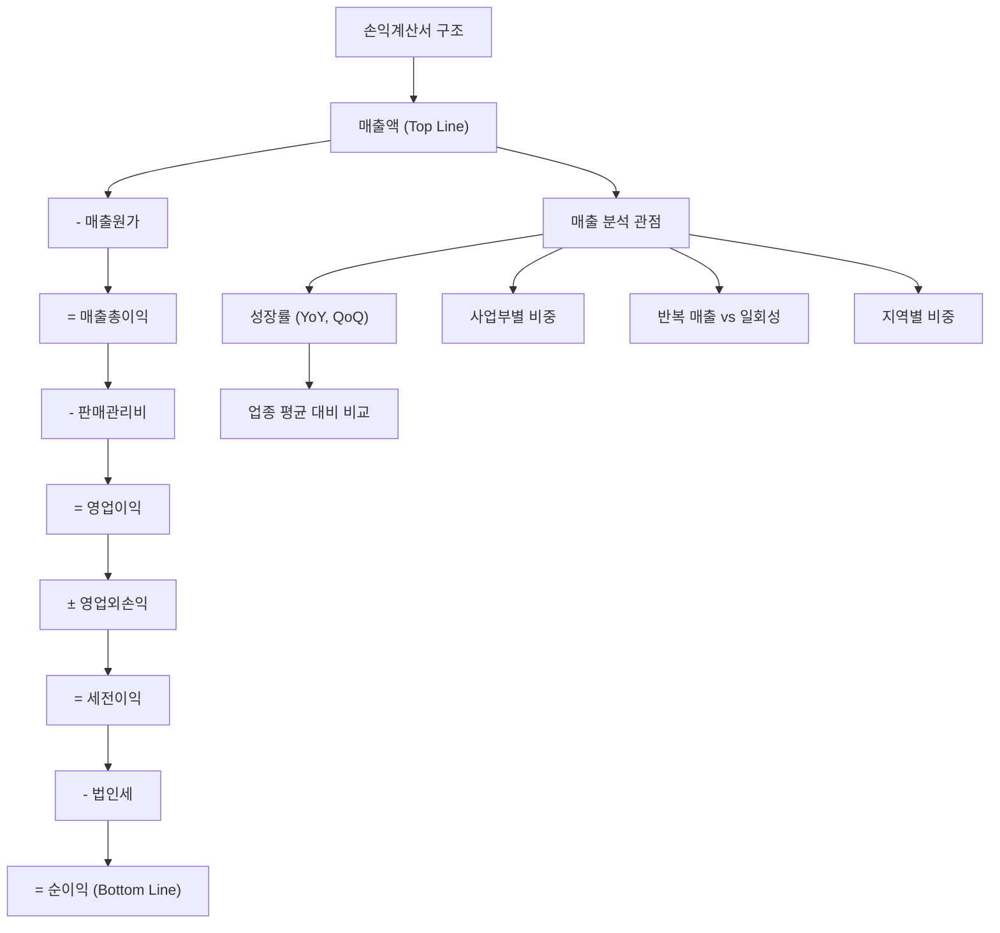

# 매출액 뜻, 회사가 벌어들인 전체 돈

"분기 매출 70조 원 돌파!" 이런 뉴스를 보면 대단해 보이지만, 매출이 크다고 해서 반드시 돈을 많이 번 것은 아닙니다. 매출 100조 원인 회사가 적자일 수도 있고, 매출 1,000억 원인 회사가 더 많은 이익을 남길 수도 있습니다.

매출액은 손익계산서의 가장 첫 줄에 나오는 숫자이며, 기업분석의 출발점입니다. 이 숫자를 제대로 읽는 법을 알아봅시다.

## 한 줄 정의

매출액은 회사가 제품이나 서비스를 팔아서 벌어들인 전체 금액입니다.

## 아주 쉽게 말하면

치킨집에서 하루에 치킨 100마리를 팔고 총 200만 원을 받았다면, 그 200만 원이 매출액입니다. 여기서 닭 원가, 기름값, 월세, 직원 월급을 빼기 전의 총 수입입니다.

중요한 점은 이겁니다: 200만 원을 "벌었다"고 했지만, 실제로 주머니에 남는 돈은 30만 원일 수 있습니다. 매출액은 "들어온 돈"이지 "남은 돈"이 아닙니다.

## 왜 중요한가

매출액이 기업분석에서 특별한 위치를 차지하는 이유가 있습니다.

- **사업 규모 측정** — 회사가 시장에서 차지하는 크기를 가장 직관적으로 보여줍니다.
- **성장성 판단** — 매출 성장률이 업종 평균을 넘으면 시장 점유율을 빼앗고 있다는 의미입니다.
- **조작 난이도 높음** — 이익은 일회성 항목으로 부풀리기 쉽지만, 매출을 조작하려면 가짜 거래를 만들어야 해서 상대적으로 어렵습니다.
- **적자 기업도 비교 가능** — 이익이 마이너스인 스타트업이나 성장주는 이익 기반 지표(PER 등)를 쓸 수 없지만, 매출 기반 지표(PSR)로 비교할 수 있습니다.
- **선행 지표** — 매출이 먼저 감소한 뒤 이익이 감소하는 경우가 많아, 매출 추세는 미래 실적의 선행 신호입니다.

## 그림으로 이해하기

_매출액은 손익계산서의 맨 위(Top Line)에 위치하며, 여기서 비용을 단계별로 빼면 각 이익이 산출됩니다._

## 숫자로 보는 예시

가상 기업 "프레시푸드"(식품 제조업체)의 3년간 실적을 통해 매출의 의미를 봅시다.

| 항목 | 2022년 | 2023년 | 2024년 | 변화 |
|---|---|---|---|---|
| 매출액 | 800억 원 | 1,000억 원 | 1,150억 원 | 꾸준히 성장 |
| 매출원가 | 520억 원 | 650억 원 | 750억 원 | 원가율 상승 |
| 매출총이익 | 280억 원 | 350억 원 | 400억 원 | |
| 판관비 | 180억 원 | 220억 원 | 280억 원 | 마케팅 확대 |
| 영업이익 | 100억 원 | 130억 원 | 120억 원 | **감소** |
| 영업이익률 | 12.5% | 13.0% | **10.4%** | 악화 |

매출은 3년간 44% 성장했지만, 2024년 영업이익은 오히려 줄었습니다. 왜일까요?

- 매출원가율: 65% → 65% → **65.2%** (원재료비 상승)
- 판관비 증가율: 22% → 27% (매출 증가율 15%보다 훨씬 빠름)

"매출 성장 = 좋은 실적"이 아닙니다. **매출 대비 비용이 더 빠르게 늘면 이익은 줄어듭니다.** 이것이 "매출이 커도 적자인 이유"의 핵심입니다.

## 표로 비교하기

| 구분 | 매출액 | 영업이익 | 순이익 |
|---|---|---|---|
| 위치 | 손익계산서 첫 줄 | 중간 | 마지막 줄 |
| 의미 | 총 벌어들인 금액 | 본업으로 남긴 돈 | 최종적으로 남은 돈 |
| 비용 차감 | 없음 | 원가 + 판관비 | 모든 비용 + 세금 |
| 크기 순서 | 가장 큼 | 중간 | 가장 작음 |
| 조작 가능성 | 상대적으로 낮음 | 중간 | 높음 (일회성 조정) |
| 활용 지표 | PSR | 영업이익률, EV/EBIT | PER, ROE |

| 매출 성장의 질을 판단하는 체크리스트 |  |
|---|---|
| 매출 성장률 > 업종 평균 | 시장 점유율 확대 중 |
| 매출 성장률 > 비용 증가율 | 규모의 경제 작동 |
| 매출 성장률 < 비용 증가율 | 수익성 악화 경고 |
| 매출 성장 + 이익률 개선 | 가장 이상적 성장 |
| 매출 감소 + 이익 증가 | 구조조정 효과 (질 개선) |
| 매출 감소 + 이익 감소 | 근본적 경쟁력 문제 |

## 초보자가 자주 하는 오해

**오해 1: "매출이 크면 돈을 많이 번 회사다"**

매출 10조 원인 A사가 적자이고, 매출 5,000억 원인 B사가 영업이익률 30%를 찍는 경우가 얼마든지 있습니다. 대형 유통사(박리다매)와 소프트웨어 회사(고마진)를 비교하면 명확합니다. 매출의 "크기"보다 "이익 전환율"이 중요합니다.

**오해 2: "매출이 줄면 무조건 나쁜 신호다"**

사업 구조조정(수익성 낮은 사업 정리), 고객 선별(단가 인상으로 저수익 고객 이탈), 회계 기준 변경 등으로 매출이 줄지만 이익은 늘어나는 경우가 있습니다. 매출 감소의 **이유**를 반드시 확인해야 합니다.

**오해 3: "매출 성장률만 높으면 좋은 주식이다"**

매출 성장을 위해 마케팅비를 과도하게 쓰거나, 할인 판매로 마진을 깎아먹는 경우가 있습니다. 매출은 늘지만 이익은 줄어드는 "성장의 함정"에 빠진 기업이 있습니다. 성장의 질(이익 동반 여부)을 함께 봐야 합니다.

## 고수는 이렇게 봅니다

숙련된 투자자는 매출 숫자 자체보다 **매출의 구조와 질**을 분석합니다.

- **반복 매출(Recurring Revenue) 비중** — 구독료, 유지보수비 같은 반복 매출이 높을수록 실적 예측이 쉽고 기업가치가 높게 평가됩니다. 일회성 프로젝트 매출은 변동성이 커서 할인됩니다.
- **고객 집중도** — 상위 1개 고객이 매출의 30% 이상이면 그 고객 이탈 시 실적이 급락합니다. 분산될수록 좋습니다.
- **매출 성장률 vs 비용 증가율** — 매출이 20% 늘 때 비용이 15%만 늘면 규모의 경제가 작동 중입니다. 반대라면 "돈을 써서 성장을 사는" 비효율 구조입니다.
- **분기별 계절성** — 특정 분기에 매출이 집중되는 기업(명절 선물, 에어컨)은 연간 기준으로 봐야 합니다. 분기 단위 비교는 전년 동기 대비(YoY)가 정확합니다.
- **오가닉 성장 vs 인수 성장** — 기업 인수로 매출이 갑자기 뛰었다면 내부 성장력과 구분해야 합니다. 인수 비용이 합당했는지도 검토합니다.

## 기업분석에서는 이렇게 씁니다

매출은 모든 재무 분석의 출발점이자, 기업 비교의 공통 언어입니다.

가상 기업 "클라우드원"(SaaS 기업)의 매출 분석:

- **PSR(주가매출비율) 활용**: 클라우드원은 영업적자이므로 PER를 쓸 수 없습니다. 시가총액 5,000억 원 ÷ 연 매출 1,000억 원 = PSR 5배. 동종 SaaS 기업 평균 PSR 8배 대비 저평가 가능성이 있습니다.
- **매출 성장률 추세**: 2022년 +60% → 2023년 +40% → 2024년 +25%. 성장률이 둔화되고 있습니다. 이 추세가 계속되면 PSR 프리미엄이 줄어들 수 있습니다.
- **사업부별 매출**: 국내 70%, 해외 30%. 해외 매출 성장률이 국내보다 2배 빠르다면, 해외 확장이 성공 중이라는 긍정적 신호입니다.
- **ARR(연간반복매출)**: SaaS 기업은 단순 매출보다 ARR을 더 중시합니다. ARR 800억 원이면 향후 이탈 없이 최소 800억 원의 매출이 보장된다는 의미입니다.

## 함께 보면 좋은 용어

- [매출총이익 뜻](../level-03-financial-statements/gross-profit.md)
- [영업이익 뜻](../level-03-financial-statements/operating-income.md)
- [순이익 뜻](../level-03-financial-statements/net-income.md)
- [PSR 뜻](../level-05-valuation/psr.md)
- [매출총이익률 뜻](../level-04-ratios/gross-margin.md)

## 정리

- 매출액은 회사가 제품·서비스를 팔아 벌어들인 총 금액이며, 손익계산서의 첫 줄이다.
- 매출이 크다고 이익이 큰 것은 아니다. 비용 구조를 함께 봐야 한다.
- 매출의 크기, 성장률, 반복성, 고객 분산도를 종합적으로 판단해야 매출의 "질"을 알 수 있다.
- 적자 기업은 PSR(매출 기반 밸류에이션)으로 비교한다.
- 매출 성장률이 비용 증가율보다 빠르면 규모의 경제가 작동 중이라는 긍정 신호이다.

## 한 줄 요약

> 매출액은 회사에 들어온 총 금액이며, 그 크기보다 성장률과 이익 전환율을 함께 봐야 진짜 실력이 보입니다.

---

이 글은 투자 권유가 아니라 주식 용어와 기업분석 방법을 설명하기 위한 교육 콘텐츠입니다. 특정 종목의 매수·매도 판단은 독자 본인의 책임입니다.

Tags: 매출액, 매출액뜻, 재무제표, 주식초보, 기업분석
