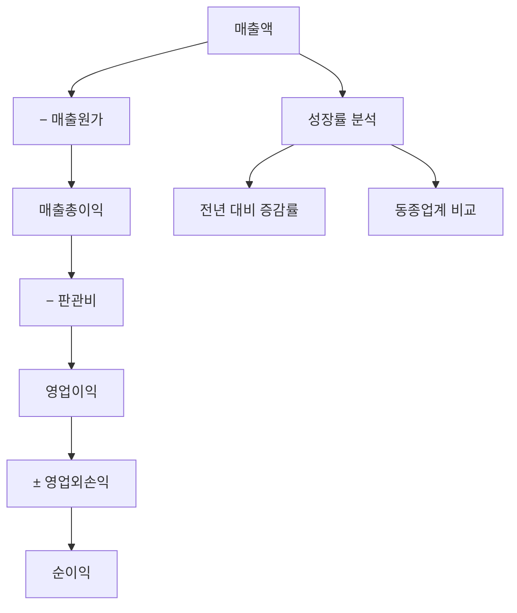

# 매출액 뜻, 회사가 벌어들인 전체 돈

"삼성전자 분기 매출 70조 원 돌파!" 이런 뉴스를 보면 매출이 대단해 보입니다.

매출액은 회사의 성적표에서 가장 첫 번째 줄에 나오는 숫자입니다. 회사가 장사를 해서 벌어들인 총 금액을 의미합니다.

## 한 줄 정의

매출액은 회사가 제품이나 서비스를 팔아서 벌어들인 전체 금액입니다.

## 아주 쉽게 말하면

치킨집에서 하루에 치킨 100마리를 팔고 총 200만 원을 받았다면, 그 200만 원이 매출액입니다.

여기서 닭 원가, 기름값, 월세, 직원 월급 등을 빼기 전의 총 수입입니다. 실제로 남는 돈(이익)과는 다릅니다.

## 왜 중요한가

- 회사의 규모와 시장에서의 위치를 알 수 있습니다.
- 매출이 지속적으로 성장하는지 보면 사업이 잘 되는지 판단할 수 있습니다.
- 매출이 감소하면 제품 경쟁력 약화나 시장 축소를 의미할 수 있습니다.
- 이익보다 조작이 어려워 회사의 사업 규모를 비교적 정확히 반영합니다.

## 그림으로 이해하기

_매출액에서 각종 비용을 순서대로 빼면 이익이 됩니다._

## 숫자로 보는 예시

> ⚠️ 아래 숫자는 개념 설명을 위한 **가상 예시**이며, 실제 투자 데이터가 아닙니다.

치킨 프랜차이즈 A사의 연간 실적:

- 매출액: 1,000억 원 (치킨 판매 총액)
- 매출원가: 600억 원 (닭, 재료비)
- 매출총이익: 400억 원
- 판관비: 250억 원 (직원, 임대, 마케팅)
- 영업이익: 150억 원
- 순이익: 120억 원

매출 1,000억 중 실제로 남은 돈은 120억 원 (순이익률 12%)입니다.

## 표로 비교하기

| 구분 | 매출액 | 영업이익 | 순이익 |
|---|---|---|---|
| 의미 | 총 벌어들인 돈 | 본업으로 남긴 돈 | 최종 남은 돈 |
| 비용 차감 | 아무것도 안 뺌 | 원가+판관비 뺌 | 모든 비용 뺌 |
| 크기 | 가장 큼 | 중간 | 가장 작음 |
| 조작 가능성 | 낮음 | 중간 | 높음 (일회성 항목) |
| 용도 | 사업 규모 파악 | 본업 수익성 | 주주 귀속 이익 |

## 초보자가 자주 하는 오해

**오해 1: 매출이 크면 돈을 많이 번 것이다**

매출이 1조 원이어도 비용이 1조 1천억 원이면 적자입니다. 매출은 "벌어들인 돈"이지 "남은 돈"이 아닙니다. 반드시 이익과 함께 봐야 합니다.

**오해 2: 매출이 줄면 무조건 나쁜 회사다**

사업 구조조정(수익성 낮은 사업 정리)으로 매출은 줄지만 이익은 늘어나는 경우도 있습니다. 매출 감소의 이유를 확인해야 합니다.

## 고수는 이렇게 봅니다

숙련된 투자자는 매출의 "질"을 봅니다.

- 매출 성장률이 업종 평균보다 높은가? (시장 점유율 확대)
- 매출이 한두 거래처에 집중되어 있지 않은가? (집중 리스크)
- 매출의 반복성은 어떤가? (구독형 > 일회성)
- 매출 증가 속도와 이익 증가 속도를 비교 (마진 개선/악화)

## 기업분석에서는 이렇게 씁니다

기업분석에서 매출은 모든 분석의 출발점입니다.

- PSR(주가매출비율) = 시가총액 ÷ 매출 → 적자 기업도 비교 가능
- 매출 성장률 추세 → 기업의 성장 단계 파악
- 사업부별 매출 비중 → 어떤 사업이 핵심인지 파악
- 동종 업계 매출 대비 시가총액 비교 → 상대 밸류에이션

## 함께 보면 좋은 용어

- [매출총이익 뜻](../level-03-financial-statements/gross-profit.md)
- [영업이익 뜻](../level-03-financial-statements/operating-income.md)
- [순이익 뜻](../level-03-financial-statements/net-income.md)
- [PSR 뜻](../level-05-valuation/psr.md)
- [매출총이익률 뜻](../level-04-ratios/gross-margin.md)

## 정리

- 매출액은 회사가 제품·서비스를 팔아 벌어들인 총 금액이다.
- 매출은 비용을 빼기 전 숫자이므로, 이익과 구분해야 한다.
- 매출의 크기, 성장률, 질을 함께 봐야 사업의 건강 상태를 판단할 수 있다.

## 한 줄 요약

> 매출액은 회사가 벌어들인 총 금액이며, 사업의 규모를 보여주지만 실제로 남은 돈(이익)과는 다릅니다.

---

*면책 조항: 이 글은 투자 권유가 아니라 주식 용어와 기업분석 방법을 설명하기 위한 교육 콘텐츠입니다. 특정 종목의 매수·매도 판단은 독자 본인의 책임입니다.*

Tags: 매출액, 매출액뜻, 재무제표, 주식초보, 기업분석
