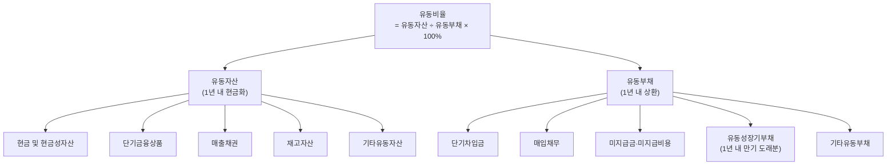

# 유동비율 뜻 — 단기 빚 갚을 능력

기업이 아무리 공장이 크고 특허가 많아도, 다음 달 갚아야 할 돈이 없으면 부도가 납니다. "흑자도산"이 바로 이 상황입니다. 유동비율은 이런 위기를 사전에 감지하는 가장 기본적인 지표입니다.

한 줄로 말하면: "1년 안에 갚아야 할 빚을 1년 안에 현금화할 수 있는 자산으로 갚을 수 있는가?" 이 질문에 대한 답이 유동비율입니다.

## 한 줄 정의

유동비율은 유동자산을 유동부채로 나눈 비율로, 단기 지급 능력을 측정합니다.

## 아주 쉽게 말하면

다음 달까지 갚아야 할 빚이 100만 원입니다. 통장 잔고 80만 원 + 친구한테 받을 돈 40만 원 + 중고로 팔 수 있는 물건 30만 원 = 총 150만 원. 유동비율은 150 ÷ 100 × 100 = **150%**. 빚보다 자산이 많으니 당장 문제는 없습니다.

기업도 마찬가지입니다. 유동자산(현금, 매출채권, 재고 등 1년 내 현금화 가능)을 유동부채(단기차입금, 매입채무 등 1년 내 상환 의무)로 나눕니다.

**공식: 유동비율 = 유동자산 ÷ 유동부채 × 100(%)**

## 왜 중요한가

- **부도 위험의 1차 스크리닝**: 유동비율이 100% 미만이면 당장 갚을 돈이 부족하다는 경고입니다.
- **흑자도산 방지**: 손익계산서에서 이익이 나도, 유동비율이 낮으면 현금 부족으로 망할 수 있습니다.
- **차환 리스크 판단**: 유동부채 중 만기 도래 사채가 많으면, 차환(리파이낸싱) 실패 시 유동성 위기가 발생합니다.
- **은행·신용평가사의 핵심 지표**: 대출 심사와 신용등급 산정에서 유동비율을 기본적으로 확인합니다.
- **업종 비교의 기준**: 같은 업종 내에서 유동비율이 현저히 낮으면 경쟁사 대비 재무 체력이 열위라는 의미입니다.

## 그림으로 이해하기

_분자(유동자산)가 분모(유동부채)보다 크면 유동비율 100% 이상 → 단기 지급 여력 있음._

## 숫자로 보는 예시

> ⚠️ 아래 숫자는 개념 설명을 위한 **가상 예시**이며, 실제 투자 데이터가 아닙니다.

가상 기업 "한빛테크"의 유동비율 계산:

| 유동자산 항목 | 금액 | 유동부채 항목 | 금액 |
|---|---|---|---|
| 현금 및 현금성자산 | 3,000억 | 단기차입금 | 1,000억 |
| 단기금융상품 | 2,000억 | 매입채무 | 1,500억 |
| 매출채권 | 4,000억 | 미지급금 | 500억 |
| 재고자산 | 2,000억 | 유동성장기부채 | 1,000억 |
| **유동자산 합계** | **11,000억** | **유동부채 합계** | **4,000억** |

- **유동비율** = 11,000 ÷ 4,000 × 100 = **275%** (매우 여유)
- **당좌비율** = (11,000 - 2,000) ÷ 4,000 × 100 = **225%** (재고 제외해도 안전)

비교 기업 "델타전자":
- 유동자산 3,000억, 유동부채 3,500억
- **유동비율** = 3,000 ÷ 3,500 × 100 = **85.7%** (1년 내 부채를 자체 유동자산으로 갚기 어려움)

## 표로 비교하기

| 유동비율 수준 | 평가 | 의미 | 투자자 행동 |
|---|---|---|---|
| 200% 이상 | 매우 여유 | 단기 유동성 리스크 거의 없음 | 자산 효율 확인 (놀리는 돈?) |
| 150~200% | 양호 | 일반적 우량 기업 수준 | 안심, 정기 모니터링 |
| 100~150% | 보통 | 관리 가능하나 여유 적음 | 분기별 추이 확인 |
| 100% 미만 | 주의 | 단기 유동성 위험, 차환 의존 | 만기 구조·신용등급 확인 |
| 50% 미만 | 위험 | 유동성 위기 임박 가능 | 투자 회피 또는 구조조정 가능성 검토 |

**업종별 정상 범위:**

| 업종 | 일반적 유동비율 | 이유 |
|---|---|---|
| IT·소프트웨어 | 200~400% | 설비 적고 현금 많음 |
| 제조업 | 120~180% | 재고·설비투자 비중 높음 |
| 유통·소매 | 80~120% | 매입채무 크고 재고 회전 빠름 |
| 건설업 | 100~150% | 선수금·공사미수금 구조 |
| 은행·금융 | 별도 기준 | 예금이 부채이므로 별도 지표 사용 |

## 초보자가 자주 하는 오해

**오해 1: 유동비율 100% 미만이면 곧 망한다**

은행 신용이 좋으면 만기 차환(재대출)으로 정상 운영 가능합니다. 유통업은 매입채무가 커서 구조적으로 유동비율이 낮지만, 현금 회수가 빠르면 문제없습니다. 다만 금융 위기처럼 차환이 막히면 위험하므로 "경고등"으로 인식해야 합니다.

**오해 2: 유동비율이 높을수록 무조건 좋다**

유동비율 500%는 현금을 과도하게 쌓아두고 투자하지 않는다는 뜻일 수 있습니다. 자본 효율이 떨어지고 ROE가 낮아질 수 있어, "적정 수준"이 중요합니다.

**오해 3: 유동비율만 보면 단기 안전성을 알 수 있다**

유동자산 중 재고가 대부분이면, 급히 팔 때 원가 대비 크게 할인해야 할 수 있습니다. 당좌비율(재고 제외)을 함께 보고, 매출채권의 회수 기간도 확인해야 합니다.

**오해 4: 유동비율은 변하지 않는 안정적 지표다**

분기마다 크게 변할 수 있습니다. 대규모 사채 만기가 내년으로 넘어오면 유동부채가 갑자기 급증해 유동비율이 하락합니다. 시점별 추이를 확인하는 습관이 필요합니다.

## 고수는 이렇게 봅니다

숙련된 투자자는 유동비율의 "구성"과 "추세"를 분석합니다.

- **당좌비율 병행**: (유동자산 - 재고) ÷ 유동부채. 재고를 제외한 순수 유동성. 제조업에서 특히 중요합니다.
- **현금비율**: 현금 ÷ 유동부채. 가장 보수적인 지표. 50% 이상이면 극도로 안전합니다.
- **유동부채 만기 구조**: 유동부채 중 "유동성장기부채"(1년 내 만기 도래 장기차입)의 비중을 확인합니다. 이것이 급증하면 차환 리스크가 커집니다.
- **매출채권 회수 기간**: 매출채권이 크더라도 60일 내 회수되면 양호. 180일 이상이면 부실화 우려.
- **분기별 추세**: 4분기 연속 유동비율이 하락하면 구조적 악화 신호. 특정 분기 급락 시 원인(대규모 투자? 사채 만기?)을 파악합니다.

## 기업분석에서는 이렇게 씁니다

기업분석에서 유동비율은 재무 안정성 체크의 첫 번째 관문입니다.

- **스크리닝 필터**: 유동비율 100% 미만 기업을 1차 제외하거나 추가 확인 대상으로 분류합니다.
- **동종업 상대 비교**: 같은 업종 평균 대비 현저히 낮으면 경쟁사 대비 재무 열위를 의미합니다.
- **위기 시나리오 분석**: "만약 매출이 20% 감소하면 유동비율이 어떻게 변할까?"를 시뮬레이션합니다.
- **부채비율·이자보상배율과 종합 판단**: 유동비율은 단기, 부채비율은 전체 구조, 이자보상배율은 이자 지급 능력. 세 지표를 함께 봐야 완전한 재무 안정성 평가가 됩니다.

## 함께 보면 좋은 용어

- [부채](../level-03-financial-statements/liabilities.md) — 유동부채의 상위 개념
- [부채비율](./debt-ratio.md) — 전체 재무구조 건전성
- [이자보상배율](./interest-coverage.md) — 이자 지급 능력 (손익 관점)
- [현금흐름](../level-03-financial-statements/cash-flow.md) — 실제 현금 유입·유출
- [재고자산회전율](./inventory-turnover.md) — 재고의 현금화 속도

## 정리

- 유동비율 = 유동자산 ÷ 유동부채 × 100%. 단기 채무 상환 능력의 기본 잣대다.
- 150% 이상이면 일반적으로 양호, 100% 미만이면 단기 유동성 위험 경고다.
- 업종마다 정상 범위가 다르므로 동종업 비교가 필수다.
- 유동비율 단독이 아닌, 당좌비율·현금비율·부채비율을 종합적으로 판단해야 한다.
- 분기별 추세를 확인해 구조적 악화 여부를 감지하는 것이 중요하다.

## 한 줄 요약

> 유동비율은 '1년 내 갚을 빚 대비 1년 내 쓸 수 있는 자산'으로, 150% 이상이면 단기 유동성은 양호합니다.

---

이 글은 투자 권유가 아니라 주식 용어와 기업분석 방법을 설명하기 위한 교육 콘텐츠입니다. 특정 종목의 매수·매도 판단은 독자 본인의 책임입니다.

Tags: 유동비율, 유동자산, 유동부채, 단기상환, 재무안정성
