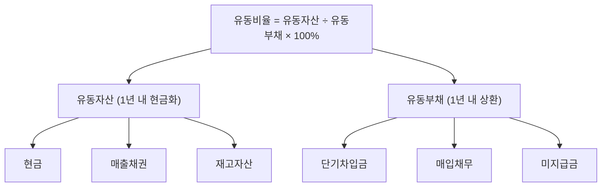

# 유동비율 뜻 — 단기 빚 갚을 능력

## 한 줄 정의

유동비율은 1년 이내 현금화 가능한 자산(유동자산)을 1년 이내 갚아야 할 부채(유동부채)로 나눈 비율로, 단기 지급 능력을 측정합니다.

## 아주 쉽게 말하면

다음 달까지 갚아야 할 빚이 100만 원인데, 통장 잔고와 곧 받을 돈이 합쳐서 150만 원이면 유동비율은 150%입니다. 100% 이상이면 당장 갚을 돈은 있다는 뜻입니다.

## 왜 중요한가

기업이 아무리 자산이 많아도 당장 현금이 부족하면 부도날 수 있습니다(흑자도산). 유동비율은 "1년 안에 갚아야 할 돈을 갚을 수 있는가?"라는 생존 질문에 답합니다.

## 그림으로 이해하기

## 숫자로 보는 예시

> ⚠️ 아래 숫자는 개념 설명을 위한 **가상 예시**이며, 실제 투자 데이터가 아닙니다.

M기업:
- 유동자산: 현금 300억 + 매출채권 400억 + 재고 500억 = 1,200억
- 유동부채: 단기차입금 400억 + 매입채무 300억 + 미지급금 100억 = 800억
- **유동비율 = 1,200 ÷ 800 × 100 = 150%**
- → 1년 내 부채를 갚고도 400억 여유

## 표로 비교하기

| 유동비율 수준 | 평가 | 의미 |
|-------------|------|------|
| 200% 이상 | 매우 안전 | 여유 자금 풍부, 다만 자산 효율 낮을 수 있음 |
| 150~200% | 안전 | 일반적 우량 기업 수준 |
| 100~150% | 보통 | 관리 가능하나 모니터링 필요 |
| 100% 미만 | 주의 | 단기 유동성 위험, 차환 의존 |
| 50% 미만 | 위험 | 유동성 위기 가능성 높음 |

## 초보자가 자주 하는 오해

1. **"유동비율 100% 미만이면 곧 망한다"**
   → 은행 신용이 좋으면 만기 차환(재대출)으로 운영 가능합니다. 다만 금융 위기처럼 차환이 막히면 위험해지므로 '경고등'으로 봐야 합니다.

2. **"유동비율이 높을수록 무조건 좋다"**
   → 유동비율 500%는 현금을 놀리고 있다는 뜻일 수 있습니다. 투자 기회를 놓치거나 자본 효율이 떨어질 수 있어 적정 수준이 중요합니다.

## 고수는 이렇게 봅니다

숙련된 투자자는 '당좌비율'(= (유동자산 - 재고) ÷ 유동부채)도 함께 봅니다. 재고는 급히 팔면 가치가 떨어지기 때문입니다. 또한 매출채권 회수 기간이 길면 유동자산이어도 실질 현금화에 시간이 걸림을 감안합니다.

## 기업분석에서는 이렇게 씁니다

유동비율이 급격히 하락하는 기업을 분기마다 추적합니다. 특히 유동부채 중 '1년 내 만기 도래 사채'가 급증하면 차환 실패 리스크를 평가하고, 신용등급 변동 가능성을 점검합니다.

## 함께 보면 좋은 용어

- [부채](../level-03-financial-statements/liabilities.md) — 유동부채의 상위 개념
- [부채비율](./debt-ratio.md) — 전체 재무구조 건전성
- [이자보상배율](./interest-coverage.md) — 이자 지급 능력 (손익 관점)
- [현금흐름](../level-03-financial-statements/cash-flow.md) — 실제 현금 유입·유출
- [재고자산회전율](./inventory-turnover.md) — 재고의 현금화 속도

## 정리

유동비율은 단기 채무 상환 능력의 기본 잣대입니다. 100% 이상이면 1차적으로 안전하지만, 재고·매출채권의 질을 함께 점검하고 당좌비율로 보완하세요.

## 한 줄 요약

> 유동비율은 '1년 내 갚을 빚 대비 1년 내 쓸 수 있는 자산'으로, 150% 이상이면 안심입니다.

---

이 글은 투자 권유가 아니라 주식 용어와 기업분석 방법을 설명하기 위한 교육 콘텐츠입니다. 특정 종목의 매수·매도 판단은 독자 본인의 책임입니다.

Tags: 유동비율, 유동자산, 유동부채, 단기상환, 재무안정성
