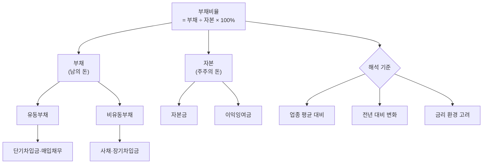

# 부채비율 뜻 — 빚이 자본의 몇 배인가

"이 회사 부채비율이 300%래, 위험한 거 아니야?" — 주식 커뮤니티에서 자주 보는 말입니다. 하지만 건설사의 300%와 IT기업의 300%는 의미가 완전히 다릅니다. 부채비율은 숫자 자체보다 "업종 맥락"과 "변화 방향"이 더 중요한 지표입니다.

이 글에서는 부채비율의 계산법, 업종별 정상 범위, 그리고 실전에서 부채비율을 해석하는 프레임을 가상 기업 시나리오와 함께 설명합니다.

## 한 줄 정의

부채비율은 타인자본(부채)을 자기자본(자본)으로 나눈 비율로, 기업의 재무 건전성을 측정하는 대표 지표입니다.

## 아주 쉽게 말하면

내 돈이 1억인데 빚이 2억이면 부채비율은 200%입니다. "내 돈 대비 빌린 돈이 2배"라는 뜻이죠.

기업도 마찬가지입니다. 자본(주주의 돈) 5,000억에 부채(남의 돈) 10,000억이면 부채비율 200%. 자기 돈의 2배를 빌려서 사업한다는 뜻입니다.

**공식: 부채비율 = 부채 ÷ 자본 × 100(%)**

## 왜 중요한가

- **재무 안정성의 바로미터**: 부채비율이 높을수록 외부 충격(금리 인상, 매출 감소)에 취약합니다.
- **레버리지 효과**: 적정 부채는 ROE를 높여줍니다(남의 돈으로 벌어서 주주 수익률 상승). 하지만 과도하면 역레버리지로 전환됩니다.
- **금리 민감도**: 부채비율 300% 기업은 금리 1% 상승 시 이자 부담이 자본 대비 3% 증가합니다. 금리 환경과 직결됩니다.
- **신용등급·대출 조건**: 부채비율이 업종 기준을 넘으면 신용등급 하향, 대출 금리 인상으로 이어집니다.
- **구조조정 리스크**: 과도한 부채비율은 채권단 관리, 워크아웃, 법정관리의 전조 신호가 될 수 있습니다.

## 그림으로 이해하기

_부채비율은 절대값보다 업종 평균, 변화 추세, 금리 환경과 함께 해석해야 합니다._

## 숫자로 보는 예시

> ⚠️ 아래 숫자는 개념 설명을 위한 **가상 예시**이며, 실제 투자 데이터가 아닙니다.

가상 기업 "한빛테크" vs "델타건설" 비교:

| 항목 | 한빛테크 (IT) | 델타건설 (건설) |
|---|---|---|
| 부채 | 8,000억 | 12,000억 |
| 자본 | 12,000억 | 5,000억 |
| **부채비율** | **66.7%** | **240%** |
| 업종 평균 | 50~80% | 200~300% |
| 판단 | 정상 범위 | 정상 범위 |

같은 240%라도 업종이 다르면 의미가 완전히 다릅니다.

**금리 민감도 분석 (한빛테크):**
- 이자부 부채(차입금 + 사채): 5,000억
- 현재 평균 이자율: 3.5%
- 연간 이자 비용: 175억
- 금리 1%p 상승 시 추가 이자: +50억 → 총 225억
- 영업이익 2,400억 대비: 이자보상배율 14.7배 → 10.7배 (여전히 양호)

## 표로 비교하기

| 부채비율 수준 | 평가 | 특징 | 해당 업종 예시 |
|---|---|---|---|
| 50% 이하 | 매우 보수적 | 무차입 또는 저차입 경영 | IT, 플랫폼 |
| 50~100% | 양호 | 대부분의 우량 제조기업 | 반도체, 식품 |
| 100~200% | 보통 | 업종에 따라 정상 범위 | 화학, 자동차 |
| 200~400% | 주의 | 레버리지 높음, 금리 민감 | 건설, 해운 |
| 400% 이상 | 위험 | 재무구조 개선 시급 | 구조조정 대상 |

## 초보자가 자주 하는 오해

**오해 1: 부채비율 100% 이하여야 좋은 회사다**

업종마다 사업 구조가 다릅니다. 건설사는 선수금·공사미수금 구조 때문에 200%가 정상이고, 은행은 예금이 부채라 1,000% 이상이 일반적입니다. "100% 이하"라는 절대 기준은 없습니다.

**오해 2: 부채비율이 갑자기 올랐으면 빚을 많이 낸 것이다**

자본이 줄어도(적자 발생 → 이익잉여금 감소) 부채비율은 올라갑니다. 분자(부채)가 늘었는지, 분모(자본)가 줄었는지 각각 확인해야 정확한 원인을 알 수 있습니다.

**오해 3: 부채비율 0%가 최고다**

부채가 전혀 없으면 레버리지 효과를 못 씁니다. 3% 이자로 빌려서 15% 수익을 내면 차이(12%)가 주주 이익입니다. 적정 부채는 ROE를 높여줍니다. "최적 자본 구조"가 중요합니다.

**오해 4: 부채비율만 보면 재무 안정성을 알 수 있다**

부채비율이 낮아도 단기 부채가 집중돼 있으면 유동성 위기가 올 수 있습니다. 반대로 부채비율이 높아도 현금이 풍부하면 실질 위험은 낮습니다. 유동비율, 이자보상배율, 순부채비율을 함께 봐야 합니다.

## 고수는 이렇게 봅니다

숙련된 투자자는 부채비율의 "실질"과 "추세"를 분석합니다.

- **순부채비율**: (총차입금 - 현금) ÷ 자본. 실질적인 부채 부담을 측정합니다. 부채비율 150%여도 현금이 풍부해 순부채비율이 30%라면 실질적으로 매우 안전합니다.
- **이자부 부채 비중**: 전체 부채 중 이자가 발생하는 차입금·사채의 비중. 매입채무는 무이자이므로 부채비율 계산에서 체감 위험이 다릅니다.
- **부채 만기 분산**: 향후 3년간 만기 도래 구조. 특정 연도에 집중 만기면 차환 리스크 상승.
- **부채비율 추세**: 3년 연속 상승이면 구조적 악화 경고. 하락 추세면 재무 개선 중.
- **금리 시나리오 분석**: 기준금리 +2%p 시 이자보상배율이 어떻게 변하는지 시뮬레이션.

## 기업분석에서는 이렇게 씁니다

기업분석에서 부채비율은 재무 건전성 평가의 출발점입니다.

- **동종업 상대 비교**: 업종 평균 대비 ±50%p 이상 차이나면 그 원인(공격 투자? 누적 적자?)을 분석합니다.
- **금리 민감도 시나리오**: 금리 인상기에 고부채비율 기업의 EPS 하락폭을 추정합니다. 반대로 금리 인하기엔 고레버리지 기업이 이자 절감으로 실적이 급반등할 수 있어 수혜주로 선별합니다.
- **재무구조 개선 이벤트**: 유상증자, 자산 매각, 부채 상환 공시 시 부채비율 변동을 계산해 주가 영향을 평가합니다.
- **듀퐁 분석 연결**: ROE = 순이익률 × 자산회전율 × 재무레버리지. 부채비율이 높으면 레버리지가 높아 ROE가 부풀려질 수 있으므로, ROE를 부채비율과 함께 해석해야 합니다.

## 함께 보면 좋은 용어

- [부채](../level-03-financial-statements/liabilities.md) — 부채비율의 분자
- [자본](../level-03-financial-statements/equity.md) — 부채비율의 분모
- [유동비율](./current-ratio.md) — 단기 상환 능력 측정
- [이자보상배율](./interest-coverage.md) — 이자 지급 능력 측정
- [ROE](./roe.md) — 레버리지가 ROE를 높이는 구조 이해

## 정리

- 부채비율 = 부채 ÷ 자본 × 100%. 자기 돈 대비 빌린 돈의 배수를 나타낸다.
- 업종마다 정상 범위가 다르므로, 절대값이 아닌 동종업 평균 대비로 판단한다.
- 부채비율 단독이 아닌, 순부채비율·유동비율·이자보상배율과 종합적으로 본다.
- 금리 환경 변화에 따른 이자 부담 시나리오를 항상 고려한다.
- 추세(3년간 변화 방향)가 절대값보다 더 중요한 정보를 줄 때가 많다.

## 한 줄 요약

> 부채비율은 '내 돈 대비 빌린 돈의 배수'이며, 업종 평균 대비 과도하지 않으면서 추세가 안정적이면 정상입니다.

---

이 글은 투자 권유가 아니라 주식 용어와 기업분석 방법을 설명하기 위한 교육 콘텐츠입니다. 특정 종목의 매수·매도 판단은 독자 본인의 책임입니다.

Tags: 부채비율, 재무건전성, 부채, 자본, 레버리지
