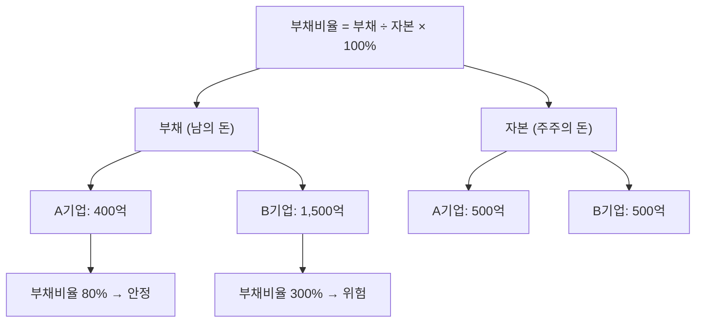

# 부채비율 뜻 — 빚이 자본의 몇 배인가

## 한 줄 정의

부채비율은 타인자본(부채)을 자기자본(자본)으로 나눈 비율로, 기업의 재무 건전성을 측정하는 대표 지표입니다.

## 아주 쉽게 말하면

내 돈이 1억인데 빚이 2억이면 부채비율은 200%입니다. 빚이 내 돈의 2배라는 뜻입니다. 기업도 자기 돈 대비 빌린 돈이 얼마나 많은지로 재무 안정성을 판단합니다.

## 왜 중요한가

부채비율이 높으면 금리 상승기에 이자 부담이 급증하고, 경기 침체 시 유동성 위기에 빠질 수 있습니다. 반면 너무 낮으면 레버리지를 활용하지 못해 성장이 느릴 수 있습니다. 적정 수준의 균형이 핵심입니다.

## 그림으로 이해하기

## 숫자로 보는 예시

> ⚠️ 아래 숫자는 개념 설명을 위한 **가상 예시**이며, 실제 투자 데이터가 아닙니다.

L기업 재무상태표:
- 부채: 3,000억 원
- 자본: 2,000억 원
- **부채비율 = 3,000 ÷ 2,000 × 100 = 150%**

금리 1% 상승 시 이자 부담 증가:
- 이자부 부채(차입금+사채): 2,000억 원
- 추가 이자: 2,000억 × 1% = **20억 원/년**

## 표로 비교하기

| 부채비율 수준 | 평가 | 특징 |
|-------------|------|------|
| 50% 이하 | 매우 보수적 | 무차입 경영, 안정적이나 성장 느릴 수 있음 |
| 50~100% | 안정적 | 대부분의 우량기업 수준 |
| 100~200% | 보통 | 업종에 따라 정상 범위 |
| 200~400% | 주의 | 금리·경기 민감, 모니터링 필요 |
| 400% 이상 | 위험 | 재무구조 개선 시급 |

## 초보자가 자주 하는 오해

1. **"부채비율 100% 이하여야 안전하다"**
   → 업종마다 다릅니다. 건설·해운은 구조적으로 200% 이상이 일반적이고, IT는 50% 이하도 흔합니다. 동일 업종 평균과 비교해야 합니다.

2. **"부채비율이 갑자기 올랐으면 빚을 많이 낸 것이다"**
   → 자본이 줄어도(적자 → 이익잉여금 감소) 부채비율은 올라갑니다. 분자(부채)와 분모(자본) 변동을 각각 확인해야 합니다.

## 고수는 이렇게 봅니다

숙련된 투자자는 '순부채비율'(= (부채 - 현금) ÷ 자본)을 더 중시합니다. 부채가 5,000억이어도 현금이 3,000억이면 실질 부담은 2,000억입니다. 또한 부채 만기 구조(1년 내 상환해야 할 부채 비중)를 함께 봅니다.

## 기업분석에서는 이렇게 씁니다

금리 인상기에는 부채비율 높은 기업의 EPS 하락 시나리오를 작성합니다. 반대로 금리 인하기에는 고레버리지 기업이 이자 절감으로 실적 턴어라운드할 수 있어 수혜주를 선별합니다.

## 함께 보면 좋은 용어

- [부채](../level-03-financial-statements/liabilities.md) — 부채비율의 분자
- [자본](../level-03-financial-statements/equity.md) — 부채비율의 분모
- [유동비율](./current-ratio.md) — 단기 상환 능력 측정
- [이자보상배율](./interest-coverage.md) — 이자 지급 능력 측정
- [ROE](./roe.md) — 레버리지가 ROE를 높이는 구조 이해

## 정리

부채비율은 자본 대비 부채의 크기로, 재무 안정성의 기본 잣대입니다. 업종 평균과 비교하고, 순부채비율·이자보상배율과 함께 종합 판단하세요.

## 한 줄 요약

> 부채비율은 '내 돈 대비 빌린 돈의 배수'이며, 업종 평균 대비 과도하지 않으면 정상입니다.

---

이 글은 투자 권유가 아니라 주식 용어와 기업분석 방법을 설명하기 위한 교육 콘텐츠입니다. 특정 종목의 매수·매도 판단은 독자 본인의 책임입니다.

Tags: 부채비율, 재무건전성, 부채, 자본, 레버리지
