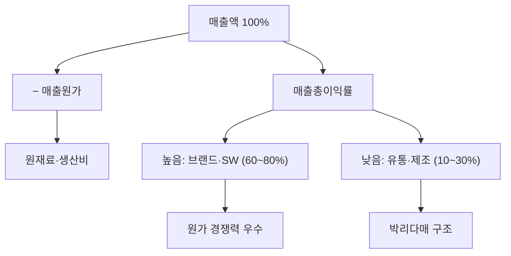

# 매출총이익률 뜻 — 원가 경쟁력의 첫 관문

## 한 줄 정의

매출총이익률은 매출액에서 매출원가를 뺀 매출총이익의 비율로, 제품·서비스 자체의 원가 경쟁력을 나타냅니다.

## 아주 쉽게 말하면

커피 한 잔을 5,000원에 팔고 원두·우유·컵 원가가 1,500원이면, 3,500원(70%)이 남습니다. 이 70%가 매출총이익률입니다. 아직 임대료, 인건비, 광고비를 빼기 전의 '1차 마진'입니다.

## 왜 중요한가

매출총이익률이 낮으면 아무리 경비를 아껴도 영업이익을 내기 어렵습니다. 제품 자체의 가격 결정력과 원가 관리 능력을 가장 먼저 보여주는 지표로, 사업 모델의 체급을 판단합니다.

## 그림으로 이해하기

## 숫자로 보는 예시

> ⚠️ 아래 숫자는 개념 설명을 위한 **가상 예시**이며, 실제 투자 데이터가 아닙니다.

G기업 vs H기업 (같은 업종):
| | G기업 | H기업 |
|--|-------|-------|
| 매출액 | 1,000억 | 1,000억 |
| 매출원가 | 400억 | 650억 |
| 매출총이익 | 600억 | 350억 |
| **매출총이익률** | **60%** | **35%** |

→ G기업이 원가 경쟁력에서 압도적 우위

## 표로 비교하기

| 업종 | 평균 매출총이익률 | 원가 구성 |
|------|------------------|----------|
| 소프트웨어(SaaS) | 70~85% | 서버비, 인건비 일부 |
| 화장품·럭셔리 | 60~75% | 원료비 낮음, 브랜드 프리미엄 |
| 제조업(전자) | 25~40% | 부품·조립 비용 |
| 유통·도매 | 15~25% | 매입 원가 높음 |
| 건설 | 10~20% | 자재·인건비 비중 높음 |

## 초보자가 자주 하는 오해

1. **"매출총이익률이 높으면 돈을 잘 버는 기업이다"**
   → 매출총이익률이 80%여도 R&D·마케팅(판관비)이 매출의 70%라면 영업이익률은 10%에 불과합니다. 반드시 영업이익률까지 이어서 봐야 합니다.

2. **"매출총이익률은 변하지 않는다"**
   → 원재료 가격, 환율, 제품 믹스 변화로 분기마다 달라질 수 있습니다. 특히 원자재 의존도 높은 업종은 변동폭이 큽니다.

## 고수는 이렇게 봅니다

숙련된 투자자는 매출총이익률의 추세를 봅니다. 지속적 상승이면 가격 인상 성공 또는 원가 절감 효과이고, 하락이면 경쟁 심화로 가격 할인 또는 원재료 상승 부담을 의심합니다. 제품별 믹스가 바뀌면 전체 매출총이익률도 변하므로 사업부별로 분해해서 봅니다.

## 기업분석에서는 이렇게 씁니다

신제품 출시 기업 분석 시, 기존 제품 대비 신제품의 매출총이익률이 높은지 확인합니다. 고마진 제품 비중 확대(믹스 개선)는 구조적 수익성 향상의 핵심 동력입니다.

## 함께 보면 좋은 용어

- [매출총이익](../level-03-financial-statements/gross-profit.md) — 매출총이익률의 분자
- [매출액](../level-03-financial-statements/revenue.md) — 매출총이익률의 분모
- [영업이익률](./operating-margin.md) — 판관비까지 뺀 다음 단계 수익성
- [순이익률](./net-margin.md) — 모든 비용 차감 후 최종 수익성
- [마진 개선](../level-08-industry-macro/margin-improvement.md) — 매출총이익률 상승이 실적 서프라이즈로 이어지는 과정

## 정리

매출총이익률은 제품 자체의 원가 경쟁력을 보여주는 1차 마진입니다. 업종별 수준이 다르므로 같은 업종 내에서 비교하고, 추세적 변화에 주목하세요.

## 한 줄 요약

> 매출총이익률은 '제품 원가를 빼고 남는 1차 마진'으로, 사업 모델의 체급을 보여줍니다.

---

*면책 조항: 이 글은 투자 권유가 아니라 주식 용어와 기업분석 방법을 설명하기 위한 교육 콘텐츠입니다. 특정 종목의 매수·매도 판단은 독자 본인의 책임입니다.*

Tags: 매출총이익률, 매출총이익, 매출원가, 원가율, 수익성
