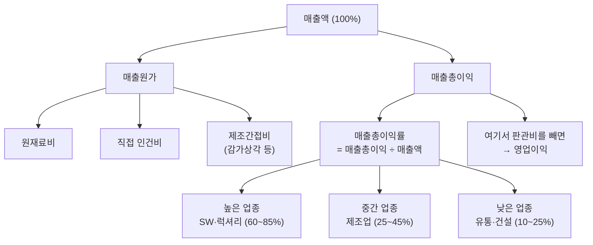

# 매출총이익률 뜻 — 원가 경쟁력의 첫 관문

손익계산서를 위에서 아래로 읽으면, 가장 먼저 만나는 수익성 지표가 매출총이익률입니다. "이 회사가 파는 제품이 원가 대비 얼마나 마진을 남기는가?"에 대한 답이죠.

매출총이익률이 낮으면, 아무리 경비를 아끼고 광고를 줄여도 남는 게 없습니다. 반대로 매출총이익률이 높으면 판관비에 여유를 주면서도 영업이익을 낼 수 있습니다. 그래서 "사업 모델의 체급"을 보여주는 지표라고 불립니다.

## 한 줄 정의

매출총이익률은 매출액에서 매출원가를 뺀 매출총이익의 비율로, 제품·서비스 자체의 원가 경쟁력을 나타냅니다.

## 아주 쉽게 말하면

커피 한 잔을 5,000원에 팝니다. 원두, 우유, 컵 등 재료비가 1,500원이면 3,500원이 남습니다. 이 3,500원이 매출총이익이고, 비율로 보면 3,500 ÷ 5,000 = **70%**가 매출총이익률입니다.

아직 임대료, 직원 급여, 광고비는 빼지 않았습니다. 이건 "제품 자체가 남기는 1차 마진"입니다. 여기서부터 시작이 좋아야 최종 이익도 좋을 수 있습니다.

**공식: 매출총이익률 = (매출액 - 매출원가) ÷ 매출액 × 100(%)**

## 왜 중요한가

- **사업 모델의 체급**: SaaS 기업의 75%와 유통업의 15%는 근본적으로 다른 수익 구조입니다. 매출총이익률은 이 구조적 차이를 한 숫자로 보여줍니다.
- **가격 결정력(Pricing Power)**: 매출총이익률이 꾸준히 유지되거나 오르면, 원가 상승을 소비자에게 전가할 수 있다는 뜻입니다. 브랜드 파워의 증거입니다.
- **영업이익의 상한선**: 매출총이익률이 30%면 영업이익률은 절대 30%를 넘을 수 없습니다. 1차 마진이 최종 수익의 천장을 결정합니다.
- **원가 관리 능력**: 같은 업종에서 A사 매출총이익률 45%, B사 35%면, A사가 원가를 더 잘 관리하거나 더 높은 가격에 팔 수 있다는 뜻입니다.
- **믹스 변화 추적**: 고마진 제품 비중이 높아지면 전체 매출총이익률이 상승합니다. 제품 포트폴리오 변화를 읽는 핵심 지표입니다.

## 그림으로 이해하기

_매출총이익은 영업이익의 출발점이며, 판관비(R&D, 마케팅, 관리비)를 감당할 수 있는 여력입니다._

## 숫자로 보는 예시

> ⚠️ 아래 숫자는 개념 설명을 위한 **가상 예시**이며, 실제 투자 데이터가 아닙니다.

가상 기업 "한빛테크"와 "델타유통" 비교:

| 항목 | 한빛테크 (SW) | 델타유통 (도매) |
|---|---|---|
| 매출액 | 5,000억 | 5,000억 |
| 매출원가 | 1,000억 | 4,000억 |
| **매출총이익** | **4,000억** | **1,000억** |
| **매출총이익률** | **80%** | **20%** |
| 판관비 | 2,500억 | 800억 |
| 영업이익 | 1,500억 | 200억 |
| 영업이익률 | 30% | 4% |

같은 매출 5,000억이지만, 매출총이익률의 차이가 최종 영업이익 격차(7.5배)를 만들었습니다.

**한빛테크 3개년 추이:**

| 연도 | 매출총이익률 | 변화 | 해석 |
|---|---|---|---|
| 2023년 | 76% | — | 기준점 |
| 2024년 | 78% | +2%p | 고마진 SaaS 비중 확대 |
| 2025년 | 80% | +2%p | 믹스 개선 지속 → 긍정 |

## 표로 비교하기

| 업종 | 평균 매출총이익률 | 원가 구성 | 마진 변동 요인 |
|---|---|---|---|
| 소프트웨어(SaaS) | 70~85% | 서버비, 인건비 일부 | 고객 수 증가 → 마진 개선 |
| 화장품·럭셔리 | 60~75% | 원료비 낮음, 브랜드 프리미엄 | 환율, 원료 가격 |
| 반도체 | 40~60% | 장비 감가상각, 원재료 | 수급 사이클(슈퍼사이클 vs 다운턴) |
| 제조업(전자) | 25~40% | 부품·조립 비용 | 부품 가격, 자동화율 |
| 유통·도매 | 15~25% | 매입 원가 높음 | 납품 단가 협상, 물류비 |
| 건설 | 10~20% | 자재·인건비 비중 높음 | 원자재 가격, 수주 경쟁 |

## 초보자가 자주 하는 오해

**오해 1: 매출총이익률이 높으면 돈을 잘 버는 기업이다**

매출총이익률 80%여도 R&D 비용이 매출의 40%, 마케팅이 30%라면 영업이익률은 10%에 불과합니다. SaaS나 바이오 기업에서 흔한 패턴입니다. 반드시 영업이익률까지 이어서 봐야 합니다.

**오해 2: 매출총이익률은 변하지 않는 안정적 지표다**

원재료 가격 급등, 환율 변동, 제품 믹스 변화로 분기마다 달라질 수 있습니다. 특히 원자재 의존도가 높은 정유·화학·식품업은 변동폭이 5~10%p에 달하기도 합니다.

**오해 3: 매출총이익률이 낮은 업종은 투자하면 안 된다**

유통업 매출총이익률이 15%여도, 자산회전율(매출 ÷ 자산)이 높으면 ROE는 우수할 수 있습니다. "박리다매" 모델도 규모의 경제를 달성하면 충분히 수익적입니다.

**오해 4: 매출총이익률 상승 = 항상 좋은 신호다**

매출이 줄면서 고마진 제품만 남아 매출총이익률이 오르는 경우도 있습니다(역설적 마진 개선). 이때는 매출 감소가 더 큰 문제입니다. 매출 성장과 마진 개선이 동시에 나타나야 진정한 긍정 신호입니다.

## 고수는 이렇게 봅니다

숙련된 투자자는 매출총이익률의 "추세"와 "원인"을 분석합니다.

- **추세 분석**: 3~5년간 매출총이익률이 꾸준히 상승하면 → 가격 인상 성공 또는 원가 절감 효과(구조적 개선). 하락하면 → 경쟁 심화, 원재료 상승 부담.
- **제품 믹스 분해**: 전체 매출총이익률 변화를 사업부별·제품별로 분해합니다. 어떤 제품이 마진을 끌어올리고, 어떤 제품이 깎아먹는지 파악합니다.
- **원가 구조 분석**: 매출원가 중 원재료비, 인건비, 감가상각비 비중을 확인합니다. 원재료비 비중이 높으면 원자재 가격에 민감하고, 감가상각 비중이 높으면 고정비 구조입니다.
- **경쟁사 대비**: 같은 업종 내 매출총이익률 격차가 10%p 이상이면 근본적인 비즈니스 모델 차이가 있습니다.
- **한계이익률 추정**: 추가 매출 1원당 원가 증가분. 고정비 비중이 높은 기업은 매출 증가 시 매출총이익률이 급격히 개선됩니다(영업 레버리지).

## 기업분석에서는 이렇게 씁니다

기업분석에서 매출총이익률은 수익성 분석의 첫 번째 단계입니다.

- **수익성 워터폴**: 매출총이익률 → 영업이익률 → 순이익률 순서로 각 단계에서 얼마가 빠지는지 추적합니다. 어디에서 이익이 새는지 정확히 알 수 있습니다.
- **믹스 개선 시나리오**: 고마진 신제품 출시 시 전체 매출총이익률 상승폭을 추정합니다. 이것이 실적 서프라이즈의 핵심 동력이 됩니다.
- **원가 전가 능력 평가**: 원재료 가격이 20% 올랐을 때 매출총이익률이 얼마나 방어되는지 확인합니다. 방어되면 가격 결정력 있음, 급락하면 경쟁 시장.
- **동종업 순위**: 매출총이익률 기준 업종 내 순위를 매깁니다. 상위 25% 기업은 구조적 경쟁 우위를 가진 것으로 판단합니다.

## 함께 보면 좋은 용어

- [매출총이익](../level-03-financial-statements/gross-profit.md) — 매출총이익률의 분자
- [매출액](../level-03-financial-statements/revenue.md) — 매출총이익률의 분모
- [영업이익률](./operating-margin.md) — 판관비까지 뺀 다음 단계 수익성
- [순이익률](./net-margin.md) — 모든 비용 차감 후 최종 수익성
- [마진 개선](../level-08-industry-macro/margin-improvement.md) — 매출총이익률 상승이 실적 서프라이즈로 이어지는 과정

## 정리

- 매출총이익률 = (매출액 - 매출원가) ÷ 매출액 × 100%. 제품 자체의 1차 마진이다.
- 업종별로 정상 범위가 크게 다르므로(SW 70~85%, 유통 15~25%), 같은 업종 내 비교가 핵심이다.
- 매출총이익률이 높아도 판관비가 크면 영업이익은 적을 수 있다. 항상 영업이익률까지 이어서 본다.
- 3~5년 추세가 구조적 경쟁력 변화를 보여준다. 단일 분기 변동에 과민반응하지 않는다.
- 매출 성장과 마진 개선이 동시에 나타나면 가장 강력한 실적 모멘텀이다.

## 한 줄 요약

> 매출총이익률은 '제품 원가를 빼고 남는 1차 마진'으로, 사업 모델의 체급과 가격 결정력을 보여줍니다.

---

이 글은 투자 권유가 아니라 주식 용어와 기업분석 방법을 설명하기 위한 교육 콘텐츠입니다. 특정 종목의 매수·매도 판단은 독자 본인의 책임입니다.

Tags: 매출총이익률, 매출총이익, 매출원가, 원가율, 수익성
