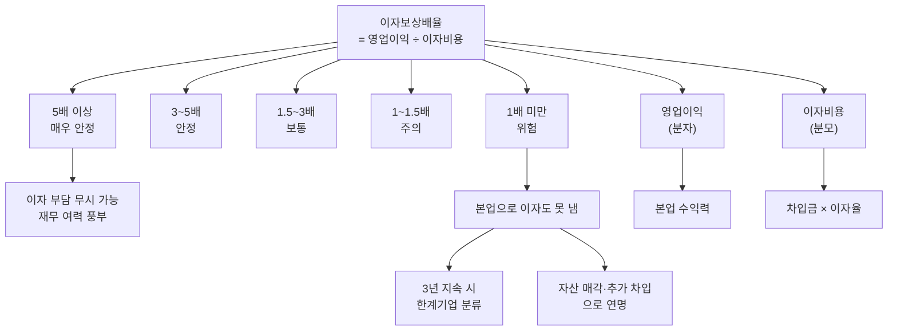

# 이자보상배율 뜻 — 이자를 몇 번 갚을 수 있나

"한계기업", "좀비기업"이라는 뉴스를 본 적 있으시죠? 한국은행이 한계기업을 판별하는 핵심 기준이 바로 이자보상배율입니다. 3년 연속 1배 미만이면 "벌어서 이자도 못 내는 기업"으로 분류됩니다.

이 지표 하나로 기업의 부채가 "감당 가능한 수준인지"를 한눈에 판단할 수 있습니다. 부채비율, 유동비율과 함께 재무 안정성 3대 지표 중 하나입니다.

## 한 줄 정의

이자보상배율은 영업이익을 이자비용으로 나눈 값으로, 본업 이익으로 이자를 몇 번 갚을 수 있는지를 보여줍니다.

## 아주 쉽게 말하면

월급이 300만 원이고 대출 이자가 100만 원이면 이자보상배율은 3배입니다. 벌어서 이자 내고도 200만 원이 생활비로 남습니다.

만약 월급이 80만 원인데 이자가 100만 원이면? 이자보상배율 0.8배. 월급으로 이자도 못 내는 상태입니다. 저축을 깎아먹거나 추가 대출로 버티는 수밖에 없죠. 기업도 이 상태가 되면 자산 매각이나 추가 차입으로 연명하게 됩니다.

**공식: 이자보상배율 = 영업이익 ÷ 이자비용 (배)**

## 왜 중요한가

- **한계기업 판별 기준**: 한국은행·KDI 기준으로 3년 연속 이자보상배율 1배 미만이면 한계기업(좀비기업)으로 분류합니다. 정책적 구조조정 대상이 됩니다.
- **부도 위험의 선행 지표**: 이자보상배율이 급격히 하락하면 1~2년 내 유동성 위기가 올 수 있습니다.
- **부채의 "감당 능력" 측정**: 부채비율이 높아도 이자보상배율이 5배 이상이면 이자 부담은 감당 가능합니다. 반대로 부채비율이 낮아도 이자보상배율이 1배면 위험합니다.
- **금리 민감도 판단**: 이자보상배율 2배인 기업은 금리 상승 시 빠르게 1배 미만으로 전락할 수 있어 금리 리스크에 취약합니다.
- **신용등급과 직결**: 신용평가사가 기업 신용등급을 산정할 때 이자보상배율을 핵심 재무 지표로 활용합니다.

## 그림으로 이해하기

_이자보상배율은 분자(영업이익)와 분모(이자비용) 양쪽 변화에 모두 영향을 받습니다._

## 숫자로 보는 예시

> ⚠️ 아래 숫자는 개념 설명을 위한 **가상 예시**이며, 실제 투자 데이터가 아닙니다.

가상 기업 "한빛테크" vs "델타중공업" 비교:

| 항목 | 한빛테크 | 델타중공업 |
|---|---|---|
| 영업이익 | 2,400억 | 150억 |
| 이자비용 | 175억 | 200억 |
| **이자보상배율** | **13.7배** | **0.75배** |
| 판단 | 매우 여유 | 위험 (이자 미충당) |

**델타중공업 3개년 추이 (악화 패턴):**

| 연도 | 영업이익 | 이자비용 | 이자보상배율 | 상태 |
|---|---|---|---|---|
| 2023 | 600억 | 150억 | 4.0배 | 안정 |
| 2024 | 250억 | 180억 | 1.4배 | 주의 |
| 2025 | 150억 | 200억 | **0.75배** | 위험 |

원인 분석:
- 영업이익 감소: 수주 감소 + 원자재 가격 상승
- 이자비용 증가: 설비투자 차입 + 금리 인상
- 양쪽 악화가 동시에 → 이자보상배율 급락

## 표로 비교하기

| 이자보상배율 | 평가 | 의미 | 투자자 대응 |
|---|---|---|---|
| 10배 이상 | 매우 우수 | 이자 부담 거의 없음 | 재무 안정성 최상급 |
| 5~10배 | 우수 | 여유 있는 이자 지급 | 안심 수준 |
| 3~5배 | 양호 | 정상 운영 가능 | 기본 모니터링 |
| 1.5~3배 | 보통 | 경기 하락 시 취약 가능 | 금리 시나리오 점검 |
| 1~1.5배 | 주의 | 이자 지급에 빠듯 | 원인 분석 필수 |
| 1배 미만 | 위험 | 본업 수익으로 이자 불충당 | 투자 재검토 |
| 3년 연속 1배 미만 | 한계기업 | 구조적 부실 | 투자 회피 |

## 초보자가 자주 하는 오해

**오해 1: 이자보상배율 1배 미만이면 즉시 부도난다**

영업 외 수익(자산 매각, 투자 수익)이나 보유 현금으로 당장 이자를 갚을 수는 있습니다. 하지만 "본업으로 이자를 감당 못 하는 구조"는 장기적으로 지속 불가능합니다. 즉시 부도는 아니지만 시한폭탄과 같습니다.

**오해 2: 이자보상배율이 높으면 부채가 적다는 뜻이다**

부채가 많아도 영업이익이 훨씬 크면 이자보상배율은 높습니다. 부채 10,000억이어도 영업이익 5,000억, 이자 500억이면 10배입니다. 이 지표는 부채 규모가 아닌 "감당 능력"을 측정합니다.

**오해 3: 이자보상배율은 일정하다**

영업이익은 경기·수주·원가에 따라 크게 변동하고, 이자비용은 금리·차입 규모에 따라 변합니다. 특히 경기 민감업종(건설, 해운, 철강)은 호황기 10배 → 불황기 1배 미만으로 급변할 수 있습니다.

**오해 4: 이자보상배율만 보면 재무 안전성을 알 수 있다**

이자보상배율은 "이자 지급 능력"만 측정합니다. 원금 상환 능력은 별개입니다. 이자는 감당해도 거액의 원금 만기가 도래하면 유동성 위기가 올 수 있습니다. 유동비율, 부채 만기 구조를 함께 봐야 합니다.

## 고수는 이렇게 봅니다

숙련된 투자자는 이자보상배율의 "스트레스 테스트"를 합니다.

- **금리 시나리오**: 현재 3배인 기업에 금리 +2%p를 적용. 변동금리 비중이 높으면 이자비용이 급증해 1.5배로 전락할 수 있습니다.
- **EBITDA 기준**: 영업이익 대신 EBITDA(영업이익 + 감가상각비)를 분자로 쓰면 현금 기반 이자 상환 능력을 더 정확히 볼 수 있습니다.
- **업종 사이클 고려**: 경기 정점의 이자보상배율은 과대평가, 저점은 과소평가됩니다. 사이클 평균으로 보는 습관이 필요합니다.
- **원금 상환 부담 포함**: (영업이익) ÷ (이자 + 당해 원금 상환액)으로 확장하면 더 보수적인 판단이 가능합니다.
- **턴어라운드 감지**: 이자보상배율이 0.5배 → 1.5배 → 3배로 회복되는 기업은 구조조정 성공의 신호. 초기에 잡으면 큰 수익 기회입니다.

## 기업분석에서는 이렇게 씁니다

기업분석에서 이자보상배율은 재무 리스크 판단의 최종 관문입니다.

- **한계기업 스크리닝**: 이자보상배율 1배 미만 기업 리스트를 만들어 투자 유니버스에서 제외합니다.
- **금리 민감도 분석**: 기준금리 +1%p 시 이자보상배율 변화를 추정합니다. 2배 미만으로 떨어지면 "금리 리스크 높음"으로 분류합니다.
- **턴어라운드 모니터링**: 구조조정 중인 기업의 분기별 이자보상배율 추이를 추적합니다. 1배를 넘어서는 시점이 투자 검토 시작점입니다.
- **동종업 하위 25% 경계**: 업종 내 이자보상배율 하위 25%에 속하면 상대적 재무 열위로 분류합니다.

## 함께 보면 좋은 용어

- [영업이익](../level-03-financial-statements/operating-income.md) — 이자보상배율의 분자
- [부채](../level-03-financial-statements/liabilities.md) — 이자비용의 원천
- [부채비율](./debt-ratio.md) — 재무구조 전체 건전성
- [유동비율](./current-ratio.md) — 단기 상환 능력 (재무상태표 관점)
- [턴어라운드](../level-08-industry-macro/turnaround.md) — 이자보상배율 회복이 핵심 신호

## 정리

- 이자보상배율 = 영업이익 ÷ 이자비용. 본업 수익으로 이자를 몇 번 갚을 수 있는지 측정한다.
- 3배 이상이면 안정, 1배 미만이면 위험, 3년 연속 1배 미만이면 한계기업으로 분류된다.
- 금리 상승기에 특히 중요한 지표이며, 이자비용 증가 시나리오를 항상 고려해야 한다.
- 이자 지급 능력만 측정하므로, 유동비율(원금 상환)과 부채비율(전체 구조)을 함께 봐야 한다.
- 이자보상배율이 회복되는 기업은 턴어라운드의 핵심 신호이다.

## 한 줄 요약

> 이자보상배율은 '벌어서 이자를 몇 번 갚을 수 있나'이며, 1배 미만이 지속되면 한계기업입니다.

---

이 글은 투자 권유가 아니라 주식 용어와 기업분석 방법을 설명하기 위한 교육 콘텐츠입니다. 특정 종목의 매수·매도 판단은 독자 본인의 책임입니다.

Tags: 이자보상배율, 영업이익, 이자비용, 재무안정성, 한계기업
