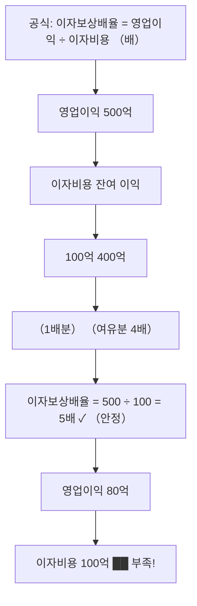

# 이자보상배율 뜻 — 이자를 몇 번 갚을 수 있나

## 한 줄 정의

이자보상배율은 영업이익을 이자비용으로 나눈 값으로, 본업 이익으로 이자를 몇 번 갚을 수 있는지를 보여줍니다.

## 아주 쉽게 말하면

월급이 300만 원이고 대출 이자가 100만 원이면 이자보상배율은 3배입니다. 벌어서 이자 내고도 200만 원이 남습니다. 1배 미만이면 이자도 못 내는 상태입니다.

## 왜 중요한가

이자보상배율 1배 미만이 3년 연속이면 '한계기업(좀비기업)'으로 분류됩니다. 한국은행과 신용평가사가 기업 부실 위험을 판단하는 핵심 기준이며, 투자자에게는 부도 위험의 조기 경보 역할을 합니다.

## 그림으로 이해하기

## 숫자로 보는 예시

> ⚠️ 아래 숫자는 개념 설명을 위한 **가상 예시**이며, 실제 투자 데이터가 아닙니다.

N기업 3개년 추이:
| 연도 | 영업이익 | 이자비용 | 이자보상배율 |
|------|---------|---------|------------|
| 2023 | 600억 | 100억 | 6.0배 |
| 2024 | 400억 | 120억 | 3.3배 |
| 2025 | 90억 | 130억 | **0.7배** ⚠️ |

→ 2025년 이자도 못 내는 상태. 2년 더 지속되면 한계기업

## 표로 비교하기

| 이자보상배율 | 평가 | 투자자 대응 |
|------------|------|-----------|
| 5배 이상 | 매우 안정 | 이자 부담 무시 가능 |
| 3~5배 | 안정 | 정상 수준 |
| 1.5~3배 | 보통 | 추이 모니터링 |
| 1~1.5배 | 주의 | 경기 하락 시 위험 |
| 1배 미만 | 위험 | 이자 못 내는 상태 |
| 3년 연속 1배 미만 | 한계기업 | 투자 회피 |

## 초보자가 자주 하는 오해

1. **"이자보상배율 1배 미만이면 즉시 부도난다"**
   → 영업 외 수익이나 자산 매각으로 당장은 이자를 갚을 수 있습니다. 하지만 본업으로 이자를 감당 못 하는 구조는 장기적으로 지속 불가능합니다.

2. **"이자보상배율이 높으면 부채가 적다는 뜻이다"**
   → 부채가 많아도 영업이익이 훨씬 크면 이자보상배율이 높을 수 있습니다. 이는 부채 수준이 아닌 '감당 능력'을 측정하는 지표입니다.

## 고수는 이렇게 봅니다

숙련된 투자자는 금리 시나리오를 적용합니다. 현재 이자보상배율 3배인 기업에 금리 2% 인상을 가정하면 이자비용 증가로 배율이 얼마까지 떨어지는지 계산합니다. 또한 EBITDA 기준 이자보상배율도 함께 보며, 감가상각 전 현금 창출력을 평가합니다.

## 기업분석에서는 이렇게 씁니다

금리 인상기에는 이자보상배율이 낮은 기업을 선별해 리스크 리스트를 만듭니다. 반대로 구조조정 후 영업이익이 회복되면서 이자보상배율이 1배 미만 → 3배 이상으로 올라오는 기업은 턴어라운드 후보로 주목합니다.

## 함께 보면 좋은 용어

- [영업이익](../level-03-financial-statements/operating-income.md) — 이자보상배율의 분자
- [부채](../level-03-financial-statements/liabilities.md) — 이자비용의 원천
- [부채비율](./debt-ratio.md) — 재무구조 전체 건전성
- [유동비율](./current-ratio.md) — 단기 상환 능력 (재무상태표 관점)
- [턴어라운드](../level-08-industry-macro/turnaround.md) — 이자보상배율 회복이 핵심 신호

## 정리

이자보상배율은 영업이익으로 이자를 몇 번 갚을 수 있는지를 보여주는 안정성 지표입니다. 3배 이상이면 안정, 1배 미만이 지속되면 부실 위험이 높아집니다.

## 한 줄 요약

> 이자보상배율은 '벌어서 이자를 몇 번 갚을 수 있나'이며, 1배 미만이 지속되면 한계기업입니다.

---

*면책 조항: 이 글은 투자 권유가 아니라 주식 용어와 기업분석 방법을 설명하기 위한 교육 콘텐츠입니다. 특정 종목의 매수·매도 판단은 독자 본인의 책임입니다.*

Tags: 이자보상배율, 영업이익, 이자비용, 재무안정성, 한계기업
