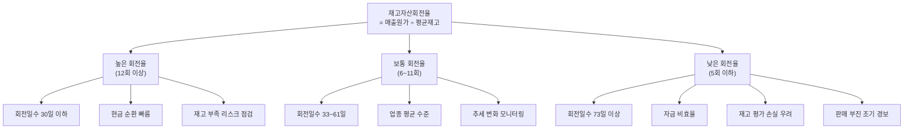

# 재고자산회전율 뜻 — 재고가 얼마나 빨리 팔리나

## 한 줄 정의

재고자산회전율은 매출원가를 평균 재고자산으로 나눈 값으로, 재고가 1년에 몇 번 팔려 나가는지를 보여주는 효율성 지표입니다.

## 아주 쉽게 말하면

동네 빵집을 생각해 보세요. 매일 빵 100개를 진열하는데, 저녁이면 다 팔려서 진열대가 비어 있다면? 재고회전율이 아주 높은 겁니다. 반대로 이틀째, 사흘째 남은 빵이 점점 쌓인다면? 회전율이 떨어지고 있다는 신호죠.

주식 투자에서도 마찬가지입니다. 기업의 창고에 제품이 쌓여만 가고 안 팔린다면, 그 재고는 곧 돈이 잠든 것과 같습니다. 재고자산회전율은 바로 이 '잠든 돈'이 얼마나 빠르게 깨어나 현금으로 돌아오는지를 숫자 하나로 보여줍니다.

## 왜 중요한가

재고가 쌓이면 세 가지 비용이 동시에 발생합니다.

첫째, **보관 비용**입니다. 창고 임대료, 관리비, 보험료가 매달 나갑니다. 둘째, **기회비용**입니다. 재고에 묶인 자금으로 R&D나 설비 투자를 할 수 있었는데, 그 기회를 놓치는 셈입니다. 셋째, **가치 하락 위험**입니다. 스마트폰 부품처럼 기술이 빨리 바뀌는 업종에서는 6개월만 지나도 재고 가치가 반 토막 날 수 있습니다.

반대로 재고회전율이 높으면 현금 순환이 빠르고, 운전자본 부담이 줄어 재무 건전성이 좋아집니다. 그래서 투자자들은 이 지표를 '기업의 영업 효율성 체온계'처럼 씁니다.

## 그림으로 이해하기

## 숫자로 보는 예시

> ⚠️ 아래 숫자는 개념 설명을 위한 **가상 예시**이며, 실제 투자 데이터가 아닙니다.

**가상 기업 '그린테크전자'** (스마트폰 부품 제조)

| 항목 | 2024년 | 2025년 | 변화 |
|------|--------|--------|------|
| 매출원가 | 8,000억 원 | 8,400억 원 | +5% |
| 기초 재고 | 1,000억 원 | 1,400억 원 | +40% |
| 기말 재고 | 1,400억 원 | 2,200억 원 | +57% |
| 평균 재고 | 1,200억 원 | 1,800억 원 | +50% |
| **재고자산회전율** | **6.7회** | **4.7회** | **-30%** |
| 회전일수 | 55일 | 78일 | +23일 |

해석해 보면: 매출원가는 5%밖에 안 늘었는데 재고는 50%나 불었습니다. 회전율이 6.7 → 4.7로 떨어지면서 재고가 창고에 23일이나 더 머무르게 됐습니다. 이런 패턴이 보이면 "다음 분기에 재고 평가 손실이 발생할 수 있겠구나"라고 미리 경계할 수 있습니다.

## 표로 비교하기

| 업종 | 평균 재고회전율 | 회전일수 | 특징 |
|------|---------------|---------|------|
| 식품·음료 | 12~20회 | 18~30일 | 유통기한 존재, 빠른 회전 필수 |
| 의류·패션 | 4~8회 | 46~91일 | 시즌성 강함, 재고 리스크 큼 |
| 전자제품 | 6~10회 | 37~61일 | 기술 변화 빠름, 재고 가치 하락 위험 |
| 자동차 | 8~12회 | 30~46일 | JIT(적시생산) 방식으로 관리 |
| 중공업·조선 | 2~4회 | 91~183일 | 대형 프로젝트, 긴 제작 기간 |
| 제약·바이오 | 3~6회 | 61~122일 | 규제 재고, 유효기간 관리 |

핵심 포인트: **같은 업종끼리 비교해야 의미가 있습니다.** 식품회사의 회전율 15회와 조선사의 3회를 직접 비교하면 아무 인사이트도 얻을 수 없습니다.

## 초보자가 자주 하는 오해

1. **"재고회전율이 높을수록 무조건 좋다"**
   → 지나치게 높으면 재고 부족(품절)으로 고객 주문을 놓칩니다. 이를 '기회 손실(lost sales)'이라 부릅니다. 적정 재고를 유지하면서 빠르게 도는 것이 이상적입니다.

2. **"재고가 늘면 무조건 나쁘다"**
   → 성수기 대비 선제 생산, 원재료 저가 매입 타이밍, 신제품 출시 준비 등 의도적 재고 확대는 정상입니다. 핵심은 '매출 증가율 대비 재고 증가율'의 격차입니다.

3. **"분기 말 재고 수치만 보면 된다"**
   → 기업이 분기 말에 의도적으로 재고를 줄이는 '윈도우 드레싱'을 할 수 있습니다. 분기 간 추세와 회전일수 변화를 함께 확인해야 실상을 파악할 수 있습니다.

4. **"매출이 늘면 재고회전율도 자동으로 좋아진다"**
   → 공식 분자는 매출액이 아니라 '매출원가'입니다. 매출이 늘어도 원가 구조가 변하거나 재고가 더 빠르게 늘면 회전율은 오히려 떨어질 수 있습니다.

## 고수는 이렇게 봅니다

숙련된 투자자는 세 가지를 동시에 점검합니다.

**첫째, 재고 증가율 vs 매출 증가율 비교.** 매출이 10% 늘었는데 재고가 30% 늘었다면, 판매 속도보다 생산이 앞서간다는 뜻입니다. 다음 분기 마진 하락의 선행 지표로 봅니다.

**둘째, 재고 구성 분해.** 재고는 '원재료 → 재공품 → 제품(완성품)'으로 나뉩니다. 완성품 재고만 급증하면 판매 부진, 원재료 재고 급증이면 공급망 이슈를 의심합니다.

**셋째, 업종 사이클과 연동.** 반도체·디스플레이 업종에서 재고 회전일수가 전 분기 대비 20일 이상 늘면 다운사이클 진입 신호로 활용합니다. 반대로 회전일수가 줄기 시작하면 업황 반등의 초기 징후입니다.

## 기업분석에서는 이렇게 씁니다

실적 시즌에 다음 체크리스트를 적용합니다.

1. 전 분기 대비 재고자산 증감률 확인
2. 동일 분기 매출원가 증감률과 비교
3. 재고 중 완제품 비중 변화 확인 (사업보고서 주석)
4. 경쟁사 동기간 재고 회전율과 비교
5. 회전일수 추이를 4분기 이동평균으로 스무딩

제품 재고가 급증하면 다음 분기 가격 인하(마진 하락) 가능성을 경고합니다. 반대로 재고가 줄면서 매출이 유지되면 공급 부족 → 가격 결정력 강화 가능성을 점검합니다.

## 함께 보면 좋은 용어

- [매출총이익](../level-03-financial-statements/gross-profit.md) — 재고 평가 손실이 매출원가에 반영
- [현금흐름](../level-03-financial-statements/cash-flow.md) — 재고 증가는 영업CF를 감소시킴
- [유동비율](./current-ratio.md) — 재고가 유동자산에 포함
- [매출채권회전율](./receivables-turnover.md) — 또 다른 운전자본 효율 지표
- [재고조정](../level-08-industry-macro/inventory-adjustment.md) — 산업 전체 재고 사이클

## 정리

재고자산회전율은 재고가 1년에 몇 번 팔리는지를 보여주는 효율성 지표입니다. 동일 업종 평균과 비교하고, '매출 증가율 대비 재고 증가율'의 괴리가 커지면 판매 부진의 조기 경보로 활용하세요. 분기별 추세와 재고 구성(원재료·재공품·완제품)까지 함께 확인하면 기업의 영업 건강 상태를 한층 정밀하게 읽을 수 있습니다.

## 한 줄 요약

> 재고자산회전율은 '재고가 1년에 몇 바퀴 도는가'이며, 매출 대비 재고가 빠르게 늘면 판매 부진의 경고 신호입니다.

---

이 글은 투자 권유가 아니라 주식 용어와 기업분석 방법을 설명하기 위한 교육 콘텐츠입니다. 특정 종목의 매수·매도 판단은 독자 본인의 책임입니다.

Tags: 재고자산회전율, 재고, 매출원가, 효율성, 재고관리
