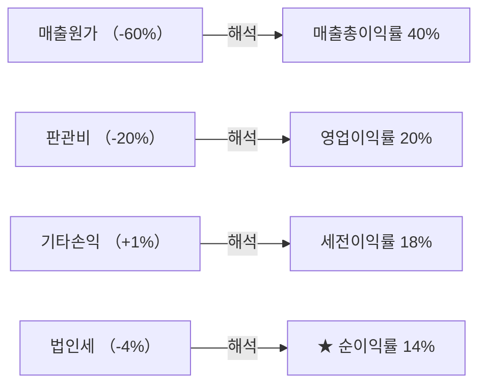

# 순이익률 뜻 — 최종적으로 남긴 비율

## 한 줄 정의

순이익률은 매출액 대비 당기순이익의 비율로, 모든 비용과 세금을 뺀 뒤 최종적으로 남는 수익성입니다.

## 아주 쉽게 말하면

연봉 5,000만 원에서 세금, 보험료, 생활비를 모두 빼고 연말에 통장에 남은 돈의 비율입니다. 기업도 매출에서 원가, 판관비, 이자, 세금을 모두 빼고 최종 남은 비율이 순이익률입니다.

## 왜 중요한가

영업이익률이 높아도 이자 부담이 크거나 세금이 많으면 주주에게 돌아오는 몫이 줄어듭니다. 순이익률은 주주 몫의 최종 수익성을 보여주며, EPS와 직결됩니다.

## 그림으로 이해하기

## 숫자로 보는 예시

> ⚠️ 아래 숫자는 개념 설명을 위한 **가상 예시**이며, 실제 투자 데이터가 아닙니다.

F기업 손익계산서:
- 매출액: 5,000억 원
- 영업이익: 1,000억 원 (영업이익률 20%)
- 이자비용: -150억 원
- 기타이익: +50억 원
- 세전이익: 900억 원
- 법인세: -200억 원
- **순이익: 700억 원**
- **순이익률 = 700 ÷ 5,000 × 100 = 14%**

## 표로 비교하기

| 구분 | 영업이익률 | 순이익률 | 차이 원인 |
|------|-----------|---------|----------|
| 무차입 기업 | 20% | 16% | 세금만 차감 |
| 고차입 기업 | 20% | 10% | 이자+세금 차감 |
| 투자수익 큰 기업 | 15% | 20% | 영업 외 이익 큼 |
| 일회성 손실 기업 | 15% | 5% | 대규모 일회성 비용 |

## 초보자가 자주 하는 오해

1. **"순이익률이 영업이익률보다 항상 낮다"**
   → 보유 부동산 매각이나 투자 이익이 크면 순이익률이 영업이익률을 넘을 수 있습니다. 이 경우 일회성인지 확인이 필요합니다.

2. **"순이익률이 높으면 영업을 잘하는 것이다"**
   → 순이익에는 영업 외 수익(환차익, 자산매각 등)이 포함됩니다. 본업 경쟁력은 영업이익률로 따로 봐야 합니다.

## 고수는 이렇게 봅니다

숙련된 투자자는 영업이익률과 순이익률의 '갭'을 주시합니다. 갭이 크면 이자 부담(재무구조 문제)이나 일회성 항목이 많다는 뜻입니다. 또한 법인세 실효세율이 갑자기 낮아지면 세제 혜택이 끝나는 시점도 체크합니다.

## 기업분석에서는 이렇게 씁니다

EPS 추정 시 매출 → 영업이익률 → 순이익률 순서로 추정합니다. 순이익률에 영향을 주는 이자비용, 환율, 법인세율 변동을 시나리오별로 나눠 민감도 분석을 합니다.

## 함께 보면 좋은 용어

- [순이익](../level-03-financial-statements/net-income.md) — 순이익률의 분자
- [영업이익률](./operating-margin.md) — 본업만의 수익성 측정
- [매출총이익률](./gross-margin.md) — 원가 단계의 수익성
- [EPS](../level-05-valuation/eps.md) — 순이익 ÷ 주식수 = 주당순이익
- [ROE](./roe.md) — 순이익을 자본으로 나눈 자본 효율

## 정리

순이익률은 매출에서 모든 비용을 차감한 최종 수익성입니다. 영업이익률과의 차이를 분석하면 재무구조와 일회성 항목의 영향을 파악할 수 있습니다.

## 한 줄 요약

> 순이익률은 '100원 팔아서 세금·이자까지 다 내고 최종 몇 원이 남았나'를 보여줍니다.

---

*면책 조항: 이 글은 투자 권유가 아니라 주식 용어와 기업분석 방법을 설명하기 위한 교육 콘텐츠입니다. 특정 종목의 매수·매도 판단은 독자 본인의 책임입니다.*

Tags: 순이익률, 순이익, 매출액, 수익성, 당기순이익
