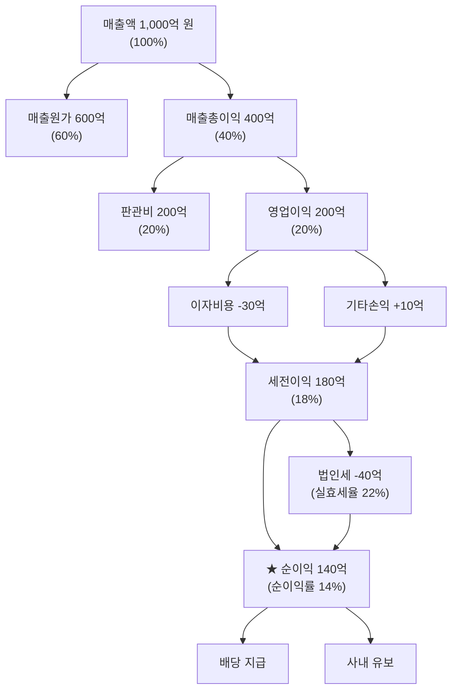

# 순이익률 뜻 — 최종적으로 남긴 비율

## 한 줄 정의

순이익률은 매출액 대비 당기순이익의 비율로, 모든 비용과 세금을 뺀 뒤 최종적으로 남는 수익성입니다.

## 아주 쉽게 말하면

연봉 5,000만 원을 받는 직장인을 생각해 보세요. 여기서 세금, 4대 보험, 집세, 식비, 교통비, 통신비를 전부 빼고 연말에 통장에 남은 금액 — 그 비율이 바로 순이익률입니다.

기업도 마찬가지입니다. 매출이 아무리 커도 원가, 판관비, 이자, 세금을 다 내고 나면 정작 남는 게 별로 없을 수 있습니다. 순이익률은 이 '진짜 남는 비율'을 한 눈에 보여주는 최종 수익성 지표입니다.

## 왜 중요한가

영업이익률이 20%로 높아 보여도, 차입금 이자가 무겁거나 대규모 환율 손실이 발생하면 주주에게 돌아오는 몫은 크게 줄어듭니다. 순이익률이 중요한 이유는 크게 세 가지입니다.

**첫째, 주주 몫의 정확한 크기입니다.** 배당과 EPS(주당순이익)의 원천이 바로 순이익입니다. 순이익률이 낮으면 배당 여력도 주가 상승 동력도 약해집니다.

**둘째, 재무구조의 건강 상태를 드러냅니다.** 영업이익률과 순이익률의 갭이 크면 이자 부담이 과도하거나, 일회성 손실이 반복되고 있다는 신호입니다.

**셋째, 밸류에이션의 출발점입니다.** PER을 계산하려면 EPS가 필요하고, EPS를 추정하려면 순이익률 전망이 핵심 변수가 됩니다.

## 그림으로 이해하기

## 숫자로 보는 예시

> ⚠️ 아래 숫자는 개념 설명을 위한 **가상 예시**이며, 실제 투자 데이터가 아닙니다.

**가상 기업 '블루웨이브 소프트'** (SaaS 기업)

| 항목 | 2024년 | 2025년 | 변화 |
|------|--------|--------|------|
| 매출액 | 2,000억 원 | 2,600억 원 | +30% |
| 영업이익 | 400억 원 | 520억 원 | +30% |
| 영업이익률 | 20% | 20% | 유지 |
| 이자비용 | -40억 원 | -120억 원 | 3배 증가 |
| 세전이익 | 370억 원 | 410억 원 | +11% |
| 법인세 | -80억 원 | -90억 원 | - |
| **순이익** | **290억 원** | **320억 원** | **+10%** |
| **순이익률** | **14.5%** | **12.3%** | **-2.2%p** |

해석해 보면: 영업이익률은 20%로 동일한데, 신규 데이터센터 건설을 위해 차입을 늘리면서 이자비용이 3배가 됐습니다. 결과적으로 매출은 30% 성장했지만 순이익은 10%밖에 늘지 못했고, 순이익률은 오히려 하락했습니다. "본업은 잘하는데 재무비용이 수익을 깎아먹고 있구나"라는 진단이 가능합니다.

## 표로 비교하기

| 구분 | 영업이익률 | 순이익률 | 차이 원인 | 투자자 체크포인트 |
|------|-----------|---------|----------|-----------------|
| 무차입 기업 | 20% | 16% | 세금만 차감 | 재무구조 우량 |
| 고차입 기업 | 20% | 8% | 이자+세금 차감 | 금리 상승 리스크 |
| 투자수익 큰 기업 | 15% | 22% | 영업 외 이익 큼 | 일회성 여부 확인 |
| 환율 영향 큰 기업 | 18% | 12~22% | 분기마다 변동 | 환헷지 정책 확인 |
| 세제 혜택 기업 | 15% | 14% | 실효세율 극히 낮음 | 혜택 종료 시점 확인 |

## 초보자가 자주 하는 오해

1. **"순이익률이 영업이익률보다 항상 낮다"**
   → 보유 부동산 매각이나 자회사 지분 처분 등 영업 외 이익이 크면 순이익률이 영업이익률을 넘을 수 있습니다. 이 경우 지속 가능한지 반드시 확인해야 합니다.

2. **"순이익률이 높으면 영업을 잘하는 것이다"**
   → 순이익에는 환차익, 부동산 매각익, 보조금 등 본업과 무관한 항목이 포함됩니다. 본업 경쟁력은 영업이익률로 따로 평가해야 합니다.

3. **"순이익률만 보면 기업 수익성을 다 알 수 있다"**
   → 감가상각 방식, 연구개발비 자본화 여부, 일회성 항목 등에 따라 순이익이 왜곡될 수 있습니다. 현금흐름과 함께 봐야 진짜 수익성이 보입니다.

4. **"순이익률이 마이너스면 망하는 기업이다"**
   → 성장 단계 기업은 의도적으로 투자를 늘려 일시적 적자를 감수합니다. 영업현금흐름이 플러스인지, 적자 원인이 투자인지 확인이 필요합니다.

## 고수는 이렇게 봅니다

숙련된 투자자는 순이익률을 '분해'해서 읽습니다.

**영업이익률 → 세전이익률 → 순이익률** 경로에서 각 단계의 갭을 분석합니다. 영업이익률 대비 세전이익률 갭이 크면 재무비용 문제, 세전이익률 대비 순이익률 갭이 크면 법인세 부담을 의미합니다.

또한 '조정 순이익률'을 자체 계산합니다. 일회성 항목(구조조정 비용, 자산 매각익, 소송 합의금 등)을 제거하고 반복 가능한(recurring) 순이익률을 추정해, 향후 EPS 예측의 기준선으로 삼습니다.

마지막으로 법인세 실효세율 추이를 4분기 이상 추적합니다. 갑자기 세율이 낮아지면 일시적 세제 혜택이 끝나는 시점에 순이익률이 급락할 수 있습니다.

## 기업분석에서는 이렇게 씁니다

EPS 추정의 핵심 과정:

1. 매출 성장률 추정 (시장 규모, 점유율)
2. 영업이익률 가정 (원가 구조, 경쟁 강도)
3. 이자비용 추정 (차입금 규모 × 적용 금리)
4. 실효 법인세율 적용
5. **순이익률 도출 → 순이익 → EPS → 목표 PER 적용 → 적정 주가 수준 추정**

이 과정에서 순이익률에 가장 큰 변동을 주는 요소(금리, 환율, 세율)를 시나리오별로 나눠 민감도 분석을 합니다. 예를 들어 "기준금리 0.5%p 상승 시 순이익률 1.2%p 하락" 같은 정량화가 가능합니다.

## 함께 보면 좋은 용어

- [순이익](../level-03-financial-statements/net-income.md) — 순이익률의 분자
- [영업이익률](./operating-margin.md) — 본업만의 수익성 측정
- [매출총이익률](./gross-margin.md) — 원가 단계의 수익성
- [EPS](../level-05-valuation/eps.md) — 순이익 ÷ 주식수 = 주당순이익
- [ROE](./roe.md) — 순이익을 자본으로 나눈 자본 효율

## 정리

순이익률은 매출에서 모든 비용을 차감한 최종 수익성입니다. 영업이익률과의 차이를 분석하면 재무구조(이자 부담)와 일회성 항목의 영향을 파악할 수 있습니다. 단독으로 보기보다 영업이익률·현금흐름과 함께 삼각 검증하면 기업의 진짜 수익 체력이 보입니다.

## 한 줄 요약

> 순이익률은 '100원 팔아서 세금·이자까지 다 내고 최종 몇 원이 남았나'를 보여주는 궁극의 수익성 지표입니다.

---

이 글은 투자 권유가 아니라 주식 용어와 기업분석 방법을 설명하기 위한 교육 콘텐츠입니다. 특정 종목의 매수·매도 판단은 독자 본인의 책임입니다.

Tags: 순이익률, 순이익, 매출액, 수익성, 당기순이익
