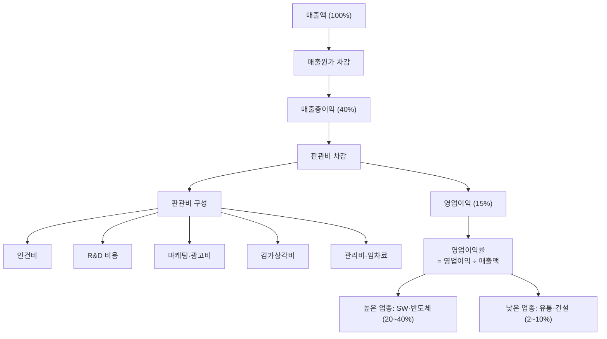

# 영업이익률 뜻 — 매출 중 본업으로 남긴 비율

"매출 1조 달성!"이라는 뉴스가 나와도, 남는 게 100억뿐이면 의미가 있을까요? 매출의 크기보다 중요한 것은 "얼마를 남기느냐"입니다. 영업이익률은 바로 이 질문에 답하는 지표입니다.

같은 업종, 같은 매출 규모인데 A사는 영업이익률 20%, B사는 5%라면 — A사가 원가 관리, 운영 효율, 가격 결정력에서 압도적 우위에 있다는 뜻입니다. 이것이 "경제적 해자(moat)"의 증거이기도 합니다.

## 한 줄 정의

영업이익률은 매출액 대비 영업이익의 비율로, 본업의 수익성을 나타내는 지표입니다.

## 아주 쉽게 말하면

빵집이 100만 원어치 빵을 팔았습니다. 밀가루·버터 등 재료비(매출원가)가 50만 원, 직원 급여·임대료·광고비(판관비)가 35만 원이면, 남은 15만 원이 영업이익입니다. 영업이익률 = 15만 ÷ 100만 = **15%**.

이 15%가 "본업으로 장사해서 실제로 남기는 비율"입니다. 이자, 세금, 일회성 손익을 빼기 전의 순수한 영업 수익력입니다.

**공식: 영업이익률 = 영업이익 ÷ 매출액 × 100(%)**

## 왜 중요한가

- **본업 경쟁력의 핵심 지표**: 이자·세금·일회성 항목을 제외하므로, 순수하게 "장사를 얼마나 잘하는가"를 보여줍니다.
- **동종업 비교의 핵심**: 같은 업종에서 영업이익률이 높으면 원가 경쟁력, 브랜드 파워, 규모의 경제 등 구조적 우위가 있다는 증거입니다.
- **영업레버리지 판단**: 매출이 10% 늘 때 영업이익이 20% 늘면 영업레버리지가 작동하는 것. 고정비 구조의 기업에서 나타나는 강력한 수익성 신호입니다.
- **투자자 컨센서스의 핵심**: 증권사 리포트에서 가장 많이 추정하는 지표 중 하나. 시장 기대치 대비 영업이익률 상향/하향이 주가에 직접적 영향을 줍니다.
- **기업 가치평가 연결**: EV/EBIT 배수 등 영업이익 기반 밸류에이션의 출발점입니다.

## 그림으로 이해하기

_영업이익률은 매출총이익에서 판관비를 뺀 후의 비율입니다. 판관비 구성을 분석하면 수익성 개선 포인트가 보입니다._

## 숫자로 보는 예시

> ⚠️ 아래 숫자는 개념 설명을 위한 **가상 예시**이며, 실제 투자 데이터가 아닙니다.

가상 기업 "한빛테크" 수익성 워터폴:

| 항목 | 금액 | 비율 |
|---|---|---|
| 매출액 | 10,000억 | 100% |
| 매출원가 | -5,000억 | 50% |
| **매출총이익** | **5,000억** | **50%** |
| 인건비 | -1,500억 | 15% |
| R&D | -800억 | 8% |
| 마케팅 | -500억 | 5% |
| 기타 판관비 | -700억 | 7% |
| **영업이익** | **1,500억** | **15%** |

**3개년 추이 (영업레버리지 확인):**

| 연도 | 매출 | 영업이익 | 영업이익률 | 해석 |
|---|---|---|---|---|
| 2023 | 8,000억 | 800억 | 10% | 기준점 |
| 2024 | 9,000억 (+12.5%) | 1,100억 (+37.5%) | 12.2% | 레버리지 작동 |
| 2025 | 10,000억 (+11.1%) | 1,500억 (+36.4%) | 15% | 레버리지 강화 |

매출 증가율(11~12%)보다 영업이익 증가율(36~37%)이 3배 높습니다 → 고정비 구조에서 영업레버리지가 강하게 작동하는 기업.

## 표로 비교하기

| 업종 | 평균 영업이익률 | 특징 | 마진 변동 요인 |
|---|---|---|---|
| 반도체 | 20~40% | 고정비 높지만 호황 시 단가 급등 | 수급 사이클 |
| 소프트웨어(SaaS) | 20~35% | 한계비용 거의 0 | 고객 수·이탈률 |
| 제약·바이오 | 15~25% | 성공 시 독점, R&D 비중 높음 | 신약 출시·특허 만료 |
| 제조업(전자) | 5~15% | 원가·경쟁 민감 | 부품 가격, 환율 |
| 철강·화학 | 5~15% | 원재료 가격에 좌우 | 원자재 사이클 |
| 유통·마트 | 2~5% | 박리다매, 규모로 승부 | 객단가, 점포 효율 |
| 건설 | 3~8% | 수주 기반, 원가 변동 | 자재비, 분양률 |

## 초보자가 자주 하는 오해

**오해 1: 영업이익률이 높을수록 무조건 좋은 기업이다**

업종마다 구조적 수준이 다릅니다. 유통업 5%와 반도체 30%를 직접 비교할 수 없습니다. 유통업에서 5%면 우수, 반도체에서 10%면 부진입니다. 반드시 같은 업종 내에서 비교해야 의미가 있습니다.

**오해 2: 한 분기 영업이익률이 올랐으면 좋아진 것이다**

일회성 비용 감소(구조조정비 소멸), 계절성 효과(4분기 성수기), 원재료 일시적 하락 등으로 단기 개선될 수 있습니다. 최소 4분기 추이를 보고 구조적 개선인지 판단해야 합니다.

**오해 3: 영업이익률이 높으면 순이익도 높다**

영업 외 손실(환차손, 지분법 손실), 높은 법인세, 대규모 이자비용 등으로 영업이익률은 20%여도 순이익률이 5%인 경우가 있습니다. 영업이익률과 순이익률의 괴리도 확인해야 합니다.

**오해 4: 영업이익률 하락 = 매출 부진이다**

매출이 늘어도 영업이익률은 하락할 수 있습니다. 신사업 초기 투자(마케팅 집중), 인력 확충, R&D 강화 등 "의도된 마진 하락"일 수 있으므로 원인을 반드시 확인해야 합니다.

## 고수는 이렇게 봅니다

숙련된 투자자는 영업이익률의 "방향"과 "원인"을 분석합니다.

- **영업레버리지 측정**: 매출 증가율 대비 영업이익 증가율. 이 배율이 2배 이상이면 고정비 구조에서 스케일 효과가 나타나는 것입니다.
- **비용 구조 분해**: 판관비를 인건비, R&D, 마케팅, 감가상각으로 나눠 어디에서 마진이 개선/악화되는지 파악합니다.
- **경쟁사 대비 스프레드**: 업종 내 1위와의 영업이익률 격차를 추적합니다. 격차 축소 = 따라잡는 중, 확대 = 격차 벌어지는 중.
- **사이클 정점 vs 저점**: 경기 민감업종은 호황 정점의 높은 마진이 지속된다고 가정하면 안 됩니다. 사이클 평균 마진을 기준으로 평가합니다.
- **마진 밴드**: 최근 5년간 영업이익률의 상한·하한(밴드)을 파악합니다. 밴드를 상향 돌파하면 구조적 변화, 하향 이탈하면 경고 신호입니다.

## 기업분석에서는 이렇게 씁니다

기업분석에서 영업이익률은 수익성과 경쟁력 분석의 중심축입니다.

- **수익성 워터폴**: 매출총이익률 → 영업이익률 → 순이익률. 각 단계에서 얼마가 빠지는지 추적합니다.
- **경제적 해자 판단**: 동종업 대비 지속적으로 5%p 이상 높은 영업이익률 = 구조적 경쟁 우위(해자) 증거.
- **컨센서스 비교**: 시장 기대치(컨센서스) 대비 영업이익률 상향 → 어닝 서프라이즈 → 주가 상승. 하향 → 어닝 쇼크 → 주가 하락.
- **목표 마진 추정**: 신사업이 본격 궤도에 오르면 영업이익률이 업종 평균(예: 15%)까지 도달할 것으로 추정하고, 이를 기반으로 적정 가치를 산출합니다.

## 함께 보면 좋은 용어

- [영업이익](../level-03-financial-statements/operating-income.md) — 영업이익률의 분자
- [매출액](../level-03-financial-statements/revenue.md) — 영업이익률의 분모
- [매출총이익률](./gross-margin.md) — 원가 경쟁력만 따로 측정
- [순이익률](./net-margin.md) — 영업 외 손익까지 포함한 최종 수익성
- [ROE](./roe.md) — 수익성을 자본 효율로 확장한 지표

## 정리

- 영업이익률 = 영업이익 ÷ 매출액 × 100%. 본업에서 얼마를 남기는지 보여준다.
- 업종마다 정상 범위가 크게 다르므로(SW 20~35%, 유통 2~5%) 동종업 비교가 핵심이다.
- 영업레버리지: 매출 증가율 < 영업이익 증가율이면 고정비 구조에서 수익성이 가속된다.
- 단일 분기 변동보다 4분기 이상 추세가 구조적 경쟁력을 보여준다.
- 동종업 대비 지속적으로 높은 영업이익률 = 경제적 해자의 증거다.

## 한 줄 요약

> 영업이익률은 '100원 팔아서 본업으로 몇 원 남기나'를 보여주는 수익성의 핵심 지표입니다.

---

이 글은 투자 권유가 아니라 주식 용어와 기업분석 방법을 설명하기 위한 교육 콘텐츠입니다. 특정 종목의 매수·매도 판단은 독자 본인의 책임입니다.

Tags: 영업이익률, 수익성, 영업이익, 매출액, 마진
