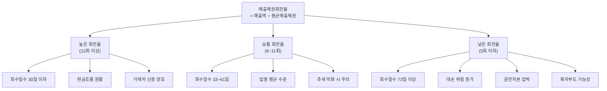

# 매출채권회전율 뜻 — 외상값을 얼마나 빨리 받나

## 한 줄 정의

매출채권회전율은 매출액을 평균 매출채권으로 나눈 값으로, 외상 매출금을 1년에 몇 번 회수하는지를 보여주는 효율성 지표입니다.

## 아주 쉽게 말하면

친구에게 10만 원을 빌려줬다고 생각해 보세요. 한 달 뒤에 바로 돌려받으면 다시 쓸 수 있지만, 석 달째 "다음 달에 줄게"를 반복하면 정작 본인이 쓸 돈이 부족해집니다.

기업도 마찬가지입니다. 제품을 납품하고 "30일 후 결제"를 약속받은 금액이 매출채권입니다. 이 돈을 빨리 받을수록 기업의 현금 주머니가 두둑해지고, 받는 게 늦어질수록 '장부상 흑자, 통장은 적자'라는 위험한 상황이 됩니다. 매출채권회전율은 이 회수 속도를 숫자 하나로 보여줍니다.

## 왜 중요한가

매출이 아무리 늘어도 대금을 못 받으면 의미가 없습니다. 매출채권회전율이 중요한 이유는 세 가지입니다.

**첫째, 현금흐름 예측의 핵심 변수입니다.** 회전율이 떨어지면 영업현금흐름이 악화되고, 운전자본 부담이 커집니다. 흑자부도의 전조가 여기서 나타납니다.

**둘째, 거래처 건전성의 바로미터입니다.** 거래처가 돈을 늦게 주기 시작하면, 그 거래처의 재무 상태가 나빠지고 있다는 신호일 수 있습니다.

**셋째, 대손(bad debt) 리스크의 선행 지표입니다.** 오래 못 받은 채권일수록 아예 회수 불능이 될 확률이 높습니다. 회전율 하락은 곧 대손충당금 증가 → 이익 감소로 이어질 수 있습니다.

## 그림으로 이해하기

## 숫자로 보는 예시

> ⚠️ 아래 숫자는 개념 설명을 위한 **가상 예시**이며, 실제 투자 데이터가 아닙니다.

**가상 기업 '한빛산업'** (건자재 납품업체)

| 항목 | 2024년 | 2025년 | 변화 |
|------|--------|--------|------|
| 매출액 | 6,000억 원 | 6,600억 원 | +10% |
| 기초 매출채권 | 500억 원 | 700억 원 | +40% |
| 기말 매출채권 | 700억 원 | 1,100억 원 | +57% |
| 평균 매출채권 | 600억 원 | 900억 원 | +50% |
| **매출채권회전율** | **10회** | **7.3회** | **-27%** |
| 회수일수 | 37일 | 50일 | +13일 |

해석해 보면: 매출은 10% 늘었는데 매출채권은 50%나 불었습니다. 회수일수가 37일 → 50일로 13일이나 길어졌습니다. 이런 패턴이 보이면 "주요 거래처(건설사)의 자금 사정이 악화되고 있는 건 아닌가? 다음 분기 대손충당금 설정이 늘어날 수 있겠다"고 경계합니다.

추가로 현금전환주기(CCC)를 계산하면:
- 재고회전일수: 45일
- 매출채권회수일수: 50일
- 매입채무지급일수: 35일
- **CCC = 45 + 50 - 35 = 60일**

현금이 60일간 묶인다는 뜻입니다. 전년(37일 + 40일 - 35일 = 42일) 대비 18일이나 늘었으니 운전자본 부담이 커졌음을 알 수 있습니다.

## 표로 비교하기

| 업종 | 평균 회전율 | 회수일수 | 특징 |
|------|-----------|---------|------|
| 소매·유통 | 20~50회 | 7~18일 | 현금·카드 결제 비중 높음 |
| IT·소프트웨어 | 8~15회 | 24~46일 | 월정액 과금, 비교적 빠른 회수 |
| 제조·부품 | 6~10회 | 37~61일 | 납품 후 30~60일 결제 조건 |
| 건설·플랜트 | 3~6회 | 61~122일 | 공정률 기반 청구, 긴 회수 |
| 조선·중공업 | 2~4회 | 91~183일 | 대형 프로젝트, 장기 결제 |

핵심: **같은 업종 내에서 비교하고, 분기별 추세 변화를 보는 것이 중요합니다.**

## 초보자가 자주 하는 오해

1. **"매출채권이 늘면 매출이 좋은 것이다"**
   → 매출 증가 없이 매출채권만 늘면 거래처가 돈을 안 갚고 있다는 뜻입니다. 반드시 '매출 증가율 vs 매출채권 증가율'을 비교하세요.

2. **"회전율이 높을수록 무조건 좋다"**
   → 지나치게 빠른 회수 조건(현금결제만 고집)은 거래처와의 관계를 해칠 수 있고, 영업 확장의 걸림돌이 됩니다. 업종 평균 대비 적정 수준이 중요합니다.

3. **"모든 업종에서 같은 기준으로 봐야 한다"**
   → 소매업(카드 결제)은 회전율 30회 이상도 정상이지만, 건설업은 4회만 돼도 양호합니다. 업종 특성을 반드시 고려해야 합니다.

4. **"분기 말 잔액만 보면 된다"**
   → 분기 말에 의도적으로 채권을 팩토링(매각)하면 일시적으로 잔액이 줄어 보입니다. 팩토링 규모와 함께 확인해야 실질 회수 능력을 파악할 수 있습니다.

## 고수는 이렇게 봅니다

숙련된 투자자는 매출채권을 세 가지 각도에서 분석합니다.

**첫째, 연령 분석(Aging Analysis).** 사업보고서 주석에 '매출채권 연령별 잔액'이 있습니다. 90일 초과 채권 비중이 늘면 대손 위험이 급증합니다.

**둘째, 대손충당금 설정률 변화.** 매출채권 대비 대손충당금 비율이 올라가면, 경영진 스스로도 회수 가능성을 낮게 보고 있다는 의미입니다.

**셋째, 현금전환주기(CCC) 종합 분석.** 재고회전일수 + 매출채권회수일수 - 매입채무지급일수를 계산해, 영업 사이클 전체에서 현금이 묶이는 기간을 파악합니다. CCC가 길어지면 외부 차입 의존도가 올라갑니다.

## 기업분석에서는 이렇게 씁니다

실적 발표 시 다음 순서로 체크합니다:

1. 매출 증가율 vs 매출채권 증가율 비교 (채권이 더 빨리 늘면 경고)
2. 회수일수 전 분기 대비 변화 확인
3. 대손충당금 설정률 변화 확인 (사업보고서 주석)
4. 상위 거래처 집중도 확인 (단일 거래처 비중 30% 이상이면 리스크)
5. 팩토링·어음할인 규모 확인 (실질 채권 규모 추정)

특히 경기 둔화기에는 매출채권 회수일수 악화가 실적 하락보다 1~2분기 먼저 나타나는 경향이 있어 선행 지표로 활용합니다.

## 함께 보면 좋은 용어

- [매출액](../level-03-financial-statements/revenue.md) — 매출채권회전율의 분자
- [현금흐름](../level-03-financial-statements/cash-flow.md) — 매출채권 증가는 영업CF 감소 요인
- [재고자산회전율](./inventory-turnover.md) — 또 다른 운전자본 효율 지표
- [유동비율](./current-ratio.md) — 매출채권이 유동자산에 포함
- [영업이익](../level-03-financial-statements/operating-income.md) — 대손상각비가 영업비용에 반영

## 정리

매출채권회전율은 외상 대금을 얼마나 빨리 회수하는지를 보여주는 핵심 효율성 지표입니다. 회수일수가 늘어나면 거래처 부실, 현금흐름 악화, 대손 리스크 증가의 조기 경보입니다. 재고회전율과 함께 현금전환주기(CCC)를 계산하면 기업의 운전자본 효율을 종합적으로 판단할 수 있습니다.

## 한 줄 요약

> 매출채권회전율은 '외상값을 1년에 몇 번 받는가'이며, 회수 속도가 느려지면 현금 부족과 부실 채권의 경고 신호입니다.

---

이 글은 투자 권유가 아니라 주식 용어와 기업분석 방법을 설명하기 위한 교육 콘텐츠입니다. 특정 종목의 매수·매도 판단은 독자 본인의 책임입니다.

Tags: 매출채권회전율, 매출채권, 외상, 회수기간, 운전자본
