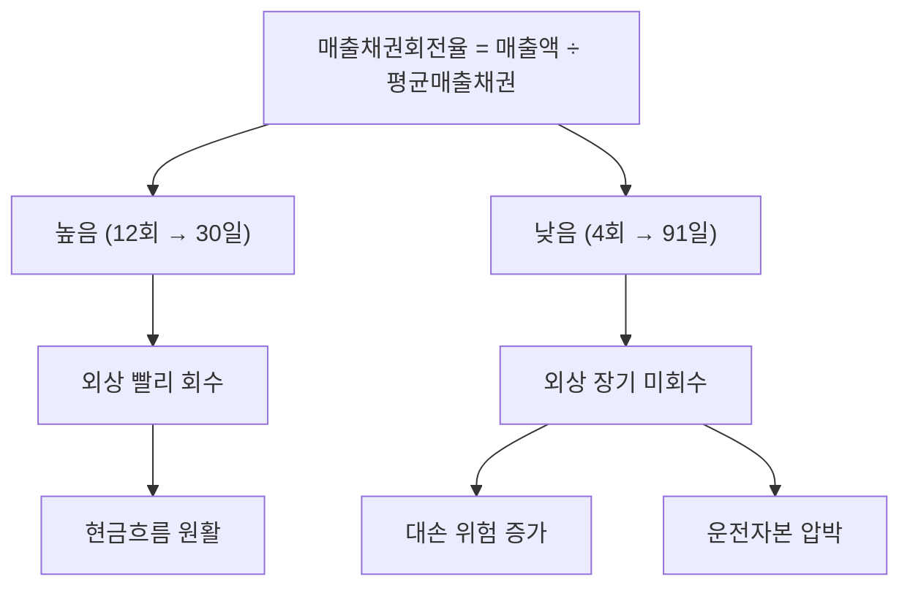

# 매출채권회전율 뜻 — 외상값을 얼마나 빨리 받나

## 한 줄 정의

매출채권회전율은 매출액을 평균 매출채권으로 나눈 값으로, 외상 매출금을 1년에 몇 번 회수하는지를 보여주는 효율성 지표입니다.

## 아주 쉽게 말하면

물건을 팔고 "다음 달에 줄게" 하는 외상이 매출채권입니다. 이 외상값을 빨리 받을수록 회전율이 높습니다. 느리게 받으면 내 돈이 묶여 현금이 부족해집니다.

## 왜 중요한가

매출이 늘어도 대금 회수가 느리면 현금 부족으로 운영에 차질이 생깁니다. 매출채권회전율이 하락하면 거래처 재무 악화, 채권 부실화 가능성을 의심해야 합니다.

## 그림으로 이해하기

## 숫자로 보는 예시

> ⚠️ 아래 숫자는 개념 설명을 위한 **가상 예시**이며, 실제 투자 데이터가 아닙니다.

P기업:
- 매출액: 12,000억 원
- 기초 매출채권: 900억 원
- 기말 매출채권: 1,100억 원
- 평균 매출채권: (900 + 1,100) ÷ 2 = 1,000억 원
- **매출채권회전율 = 12,000 ÷ 1,000 = 12회**
- 회수일수 = 365 ÷ 12 = **약 30일**

→ 평균 30일 만에 외상 회수 (양호)

## 표로 비교하기

| 구분 | 매출채권회전율 | 재고자산회전율 |
|------|-------------|-------------|
| 측정 대상 | 외상 회수 속도 | 재고 판매 속도 |
| 공식 분자 | 매출액 | 매출원가 |
| 높을수록 | 빠른 회수 | 빠른 판매 |
| 낮을 때 위험 | 대손 발생 가능 | 재고 평가 손실 가능 |
| 관련 위험 | 부실 채권 | 진부화 재고 |

## 초보자가 자주 하는 오해

1. **"매출채권이 늘면 매출이 좋은 것이다"**
   → 매출 증가 없이 매출채권만 늘면 거래처가 돈을 안 갚고 있다는 뜻입니다. 매출 증가율과 매출채권 증가율을 반드시 비교하세요.

2. **"매출채권회전율은 모든 업종에서 같은 기준으로 봐야 한다"**
   → 건설·조선은 프로젝트 기반이라 회수 기간이 길고, 소매업은 현금 거래 비중이 높아 회전율이 매우 높습니다. 업종 특성을 고려해야 합니다.

## 고수는 이렇게 봅니다

숙련된 투자자는 매출채권 회수일수의 추세 변화를 주시합니다. 갑자기 30일 → 60일로 늘어나면 주요 거래처 재무 악화나 업황 침체의 선행 지표입니다. 또한 대손충당금 설정 비율도 함께 봐서 부실 채권 리스크를 평가합니다.

## 기업분석에서는 이렇게 씁니다

운전자본(Working Capital) 분석에서 핵심입니다. 현금전환주기(CCC) = 재고회전일수 + 매출채권회수일수 - 매입채무지급일수를 계산해, 영업 사이클에서 현금이 묶이는 기간을 파악합니다. CCC가 짧을수록 현금 효율이 좋습니다.

## 함께 보면 좋은 용어

- [매출액](../level-03-financial-statements/revenue.md) — 매출채권회전율의 분자
- [현금흐름](../level-03-financial-statements/cash-flow.md) — 매출채권 증가는 영업CF 감소 요인
- [재고자산회전율](./inventory-turnover.md) — 또 다른 운전자본 효율 지표
- [유동비율](./current-ratio.md) — 매출채권이 유동자산에 포함
- [영업이익](../level-03-financial-statements/operating-income.md) — 대손상각비가 영업비용에 반영

## 정리

매출채권회전율은 외상 대금을 얼마나 빨리 회수하는지를 보여줍니다. 회전율 하락(회수일수 증가)은 거래처 부실이나 업황 악화의 조기 경보이며, 재고회전율과 함께 운전자본 효율을 종합 판단합니다.

## 한 줄 요약

> 매출채권회전율은 '외상값을 1년에 몇 번 받는가'이며, 회수 속도가 느려지면 현금 부족 경고입니다.

---

*면책 조항: 이 글은 투자 권유가 아니라 주식 용어와 기업분석 방법을 설명하기 위한 교육 콘텐츠입니다. 특정 종목의 매수·매도 판단은 독자 본인의 책임입니다.*

Tags: 매출채권회전율, 매출채권, 외상, 회수기간, 운전자본
