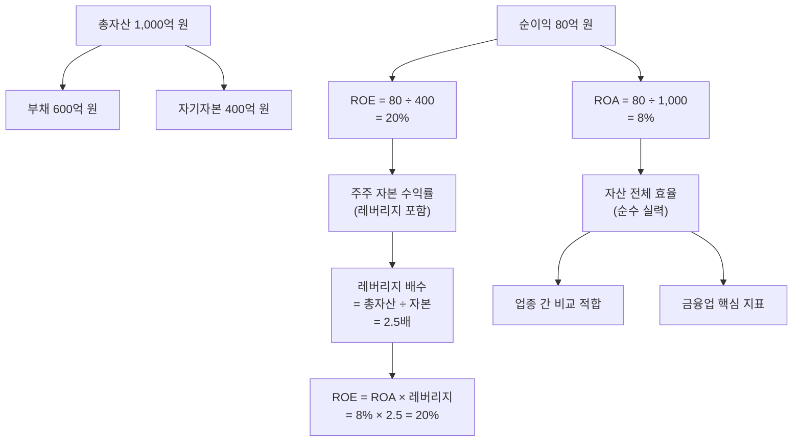

# ROA 뜻 — 전체 자산으로 얼마를 벌었나

## 한 줄 정의

ROA(Return on Assets)는 기업이 보유한 총자산 대비 얼마의 순이익을 창출했는지를 나타내는 효율성 지표입니다.

## 아주 쉽게 말하면

두 사람이 각각 1억 원어치 가게를 운영한다고 생각해 보세요. A는 1년에 800만 원을 벌고, B는 400만 원을 법니다. 둘 다 같은 규모의 자산을 쓰는데 결과가 다릅니다. ROA는 바로 이 차이를 보여줍니다 — A가게 ROA 8%, B가게 ROA 4%.

핵심은 '내 돈이든 빌린 돈이든, 동원한 자원 전체를 얼마나 효율적으로 써서 이익을 만들었나'입니다. ROE가 '주주 돈 대비 수익률'이라면, ROA는 '전체 자산 대비 수익률'이라서 부채 효과를 걷어낸 순수 실력을 보여줍니다.

## 왜 중요한가

ROA가 중요한 이유는 세 가지입니다.

**첫째, 레버리지 착시를 제거합니다.** 부채를 많이 쓰면 ROE는 높아 보이지만, 실제 자산 활용 능력은 다를 수 있습니다. ROA는 이 착시를 벗겨냅니다.

**둘째, 업종 간 비교가 가능합니다.** 자본 구조가 전혀 다른 기업들도 ROA로 비교하면 '자산 1원당 수익 창출력'을 공정하게 평가할 수 있습니다.

**셋째, 금융업의 핵심 지표입니다.** 은행·보험은 구조적으로 부채 비율이 90% 이상이라 ROE가 의미 없을 정도로 왜곡됩니다. 이 업종에서 ROA는 유일하게 의미 있는 수익성 잣대입니다.

## 그림으로 이해하기

## 숫자로 보는 예시

> ⚠️ 아래 숫자는 개념 설명을 위한 **가상 예시**이며, 실제 투자 데이터가 아닙니다.

**가상 기업 비교: '솔리드텍' vs '하이레버 산업'**

| 항목 | 솔리드텍 | 하이레버 산업 |
|------|---------|-------------|
| 총자산 | 5,000억 원 | 5,000억 원 |
| 부채 | 1,000억 원 | 3,500억 원 |
| 자기자본 | 4,000억 원 | 1,500억 원 |
| 순이익 | 400억 원 | 300억 원 |
| **ROA** | **8%** | **6%** |
| ROE | 10% | 20% |
| 부채비율 | 25% | 233% |

해석해 보면: 하이레버 산업은 ROE가 20%로 솔리드텍(10%)보다 두 배 높습니다. 하지만 ROA를 보면 솔리드텍이 8%로 더 효율적입니다. 하이레버 산업의 높은 ROE는 실력이 아니라 부채 레버리지(2.5배 → 3.3배) 덕분입니다. 금리가 오르면 하이레버 산업의 이자 부담이 급증해 ROE가 급락할 리스크가 있습니다.

**듀폰 분해(DuPont Analysis)로 보면:**
- ROA = 순이익률 × 자산회전율
- 솔리드텍: ROA 8% = 순이익률 10% × 자산회전율 0.8회
- 하이레버: ROA 6% = 순이익률 7.5% × 자산회전율 0.8회

→ 자산회전율은 같지만 순이익률 차이가 ROA 격차를 만들고 있습니다.

## 표로 비교하기

| 구분 | ROA | ROE |
|------|-----|-----|
| 공식 | 순이익 ÷ 총자산 | 순이익 ÷ 자기자본 |
| 분모 | 부채 + 자본 전체 | 자기자본만 |
| 부채 영향 | 없음 (순수 효율) | 부채 ↑ → ROE ↑ |
| 비교 적합 대상 | 업종 간, 자본구조 다른 기업 | 같은 업종, 유사 자본구조 |
| 금융업 활용 | 핵심 지표 (0.8~1.5% 수준) | 보조 지표 (왜곡 큼) |
| 일반 기업 기준 | 5% 이상 양호 | 10% 이상 양호 |
| 해석 초점 | 자산 활용 실력 | 주주 입장 수익률 |

## 초보자가 자주 하는 오해

1. **"ROA가 ROE보다 항상 낮다"**
   → 부채가 0이면 ROA = ROE입니다. 무차입 기업(현금 부자 기업)에서는 두 지표가 동일합니다.

2. **"ROA만 보면 ROE는 안 봐도 된다"**
   → 둘 다 봐야 합니다. ROA는 자산 효율(경영 실력), ROE는 주주 수익률(투자 관점)입니다. ROA 대비 ROE가 지나치게 높으면 과도한 레버리지를 의심합니다.

3. **"ROA가 낮으면 무조건 나쁜 기업이다"**
   → 은행은 ROA 1%만 돼도 우량 수준입니다. 자산 규모가 구조적으로 큰 업종(금융, 유틸리티)은 ROA 기준이 낮습니다. 반드시 동일 업종과 비교하세요.

4. **"자산이 크면 ROA가 자동으로 낮아진다"**
   → 자산이 커도 그만큼 이익이 늘면 ROA는 유지됩니다. ROA 하락은 자산 증가 대비 이익 성장이 부족할 때 발생합니다. 과잉 설비 투자나 비효율 자산 보유의 신호입니다.

## 고수는 이렇게 봅니다

숙련된 투자자는 ROA를 **듀폰 분해**로 읽습니다.

**ROA = 순이익률 × 자산회전율**

이 분해를 통해 ROA 변동의 원인을 정확히 진단합니다:
- 순이익률 하락이 원인? → 비용 구조 문제 (원가 상승, 판관비 증가)
- 자산회전율 하락이 원인? → 자산 비효율 문제 (유휴 설비, 과잉 재고)

또한 ROA 추세를 3년 이상 추적합니다. 대규모 설비 투자 직후에는 자산이 늘어 ROA가 일시적으로 떨어지지만, 2~3년 내 이익이 따라오면 정상입니다. 그러나 투자 후 3년이 지나도 ROA가 회복되지 않으면 투자 실패를 의심합니다.

금융업 분석 시에는 ROA 0.1%p 차이도 큰 의미를 갖습니다. 예를 들어 은행 A의 ROA가 0.9%에서 0.7%로 떨어지면, 절대치는 작아 보여도 수익성이 22% 악화된 것입니다.

## 기업분석에서는 이렇게 씁니다

M&A나 대규모 투자 분석 시 ROA 시뮬레이션을 합니다:

1. 인수 전 양사 ROA 확인
2. 통합 자산(인수 대가 포함) 기준 예상 ROA 계산
3. 시너지 효과 반영 후 3년차 ROA 추정
4. 인수 전 ROA 대비 하락폭이 크면 → 인수 가격 과도 판단
5. 기존 주주 관점에서 EPS 희석 효과와 연결

예: "기존 ROA 7%인 기업이 ROA 3% 기업을 인수하면, 통합 ROA가 5%로 하락. 시너지 반영 시 3년 내 6.5% 회복 가능한지가 인수 정당성의 핵심"

## 함께 보면 좋은 용어

- [ROE](./roe.md) — 자기자본 대비 수익률 (레버리지 포함)
- [자산](../level-03-financial-statements/assets.md) — ROA의 분모
- [순이익](../level-03-financial-statements/net-income.md) — ROA의 분자
- [부채비율](./debt-ratio.md) — ROA와 ROE 괴리의 원인
- [매출채권회전율](./receivables-turnover.md) — 자산 효율성의 구성 요소

## 정리

ROA는 총자산 대비 순이익률로, 부채 레버리지 효과를 제거한 순수 자산 활용 효율을 보여줍니다. 듀폰 분해(순이익률 × 자산회전율)로 원인을 진단하고, ROE와 함께 보면 기업의 수익성이 진짜 실력인지 레버리지 덕분인지 구분할 수 있습니다.

## 한 줄 요약

> ROA는 '가진 자산 전체로 몇 % 벌었나'이며, 레버리지를 걷어낸 순수 경영 효율을 보여주는 지표입니다.

---

이 글은 투자 권유가 아니라 주식 용어와 기업분석 방법을 설명하기 위한 교육 콘텐츠입니다. 특정 종목의 매수·매도 판단은 독자 본인의 책임입니다.

Tags: 총자산수익률, 총자산이익률, 순이익, 총자산, 자산효율
