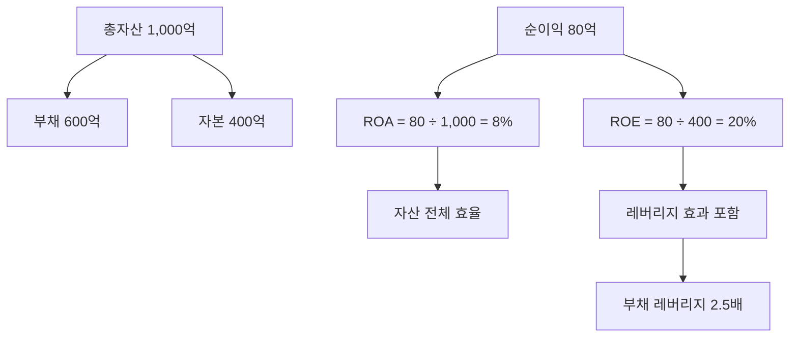

# ROA 뜻 — 전체 자산으로 얼마를 벌었나

## 한 줄 정의

ROA(Return on Assets)는 기업이 보유한 총자산 대비 얼마의 순이익을 창출했는지를 나타내는 효율성 지표입니다.

## 아주 쉽게 말하면

가게 시설·재고·현금 등 전부 합쳐 1억짜리 자산으로 1년에 500만 원을 벌었다면 ROA는 5%입니다. 내 것이든 빌린 것이든, 가진 자원 전체를 얼마나 효율적으로 쓰는지 보여줍니다.

## 왜 중요한가

ROE는 부채 레버리지에 영향받지만, ROA는 자본 구조에 관계없이 순수한 자산 활용 효율을 보여줍니다. 업종 간 비교나 부채 수준이 다른 기업 비교 시 ROA가 더 공정한 잣대입니다.

## 그림으로 이해하기

## 숫자로 보는 예시

> ⚠️ 아래 숫자는 개념 설명을 위한 **가상 예시**이며, 실제 투자 데이터가 아닙니다.

J기업 vs K기업:
| | J기업 | K기업 |
|--|-------|-------|
| 총자산 | 5,000억 | 5,000억 |
| 부채 | 1,000억 | 3,500억 |
| 자본 | 4,000억 | 1,500억 |
| 순이익 | 400억 | 300억 |
| **ROA** | **8%** | **6%** |
| ROE | 10% | 20% |

→ K기업 ROE가 높지만, ROA로 보면 J기업이 자산을 더 효율적으로 사용

## 표로 비교하기

| 구분 | ROA | ROE |
|------|-----|-----|
| 분모 | 총자산 | 자기자본 |
| 부채 영향 | 없음 | 부채↑ → ROE↑ |
| 비교 적합 | 업종 간, 자본구조 다른 기업 | 같은 업종, 유사 구조 |
| 금융업 활용 | 핵심 지표 | 보조 지표 |
| 일반 기준 | 5% 이상 양호 | 10% 이상 양호 |

## 초보자가 자주 하는 오해

1. **"ROA가 ROE보다 항상 낮다"**
   → 부채가 0이면 ROA = ROE입니다. 부채가 있을 때만 ROE > ROA가 됩니다. 무차입 기업에선 두 지표가 같습니다.

2. **"ROA만 보면 ROE는 안 봐도 된다"**
   → 둘 다 봐야 합니다. ROA는 자산 효율, ROE는 주주 수익률입니다. ROA 대비 ROE가 지나치게 높으면 레버리지 리스크를 의심합니다.

## 고수는 이렇게 봅니다

숙련된 투자자는 은행·보험 같은 금융업에서 ROA를 핵심 지표로 봅니다. 금융업은 구조적으로 레버리지가 높아 ROE가 왜곡되기 쉽기 때문입니다. 또한 ROA 추이가 하락하면 자산이 비효율적으로 늘어나는(잉여 설비, 과잉 투자) 신호로 해석합니다.

## 기업분석에서는 이렇게 씁니다

M&A 분석 시 인수 후 통합 자산 기준 ROA를 시뮬레이션합니다. 인수로 자산은 크게 늘지만 이익 시너지가 작으면 ROA가 하락해, 인수 가격이 과도했다는 판단 근거가 됩니다.

## 함께 보면 좋은 용어

- [ROE](./roe.md) — 자기자본 대비 수익률 (레버리지 포함)
- [자산](../level-03-financial-statements/assets.md) — ROA의 분모
- [순이익](../level-03-financial-statements/net-income.md) — ROA의 분자
- [부채비율](./debt-ratio.md) — ROA와 ROE 괴리의 원인
- [자산회전율](./receivables-turnover.md) — 자산 효율성의 구성 요소

## 정리

ROA는 총자산 대비 순이익률로, 부채 레버리지 효과를 제거한 순수 자산 효율을 보여줍니다. ROE와 함께 보면 기업의 수익성이 실력인지 레버리지인지 구분할 수 있습니다.

## 한 줄 요약

> ROA는 '가진 자산 전체로 몇 % 벌었나'이며, 레버리지를 걷어낸 순수 효율을 보여줍니다.

---

*면책 조항: 이 글은 투자 권유가 아니라 주식 용어와 기업분석 방법을 설명하기 위한 교육 콘텐츠입니다. 특정 종목의 매수·매도 판단은 독자 본인의 책임입니다.*

Tags: ROA, 총자산이익률, 순이익, 총자산, 자산효율
