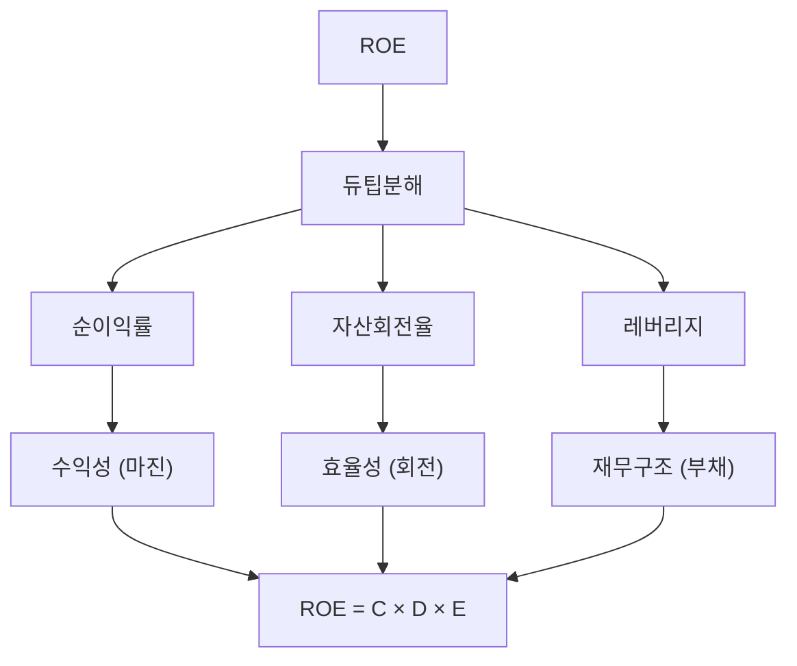

# ROE 뜻 — 주주 돈으로 얼마를 벌었나

## 한 줄 정의

ROE(Return on Equity)는 주주가 투자한 자본 대비 얼마의 순이익을 창출했는지를 나타내는 수익성 지표입니다.

## 아주 쉽게 말하면

내가 1,000만 원을 맡겼는데 1년 뒤 150만 원 수익이 생겼다면 ROE는 15%입니다. 내 돈을 얼마나 효율적으로 굴려주는지 보여주는 '자본 효율 성적표'입니다.

## 왜 중요한가

워런 버핏이 가장 중시하는 지표 중 하나입니다. ROE가 높으면 적은 자본으로 많은 이익을 내는 효율적 기업이고, 이익을 재투자할수록 복리로 가치가 성장합니다. 장기 주가 상승률은 ROE에 수렴하는 경향이 있습니다.

## 그림으로 이해하기

## 숫자로 보는 예시

> ⚠️ 아래 숫자는 개념 설명을 위한 **가상 예시**이며, 실제 투자 데이터가 아닙니다.

I기업:
- 자본(기초+기말 평균): 2,000억 원
- 당기순이익: 300억 원
- **ROE = 300 ÷ 2,000 × 100 = 15%**

듀퐁 분해:
- 순이익률: 10% (300/3,000)
- 자산회전율: 0.75배 (3,000/4,000)
- 레버리지: 2배 (4,000/2,000)
- ROE = 10% × 0.75 × 2 = **15%** ✓

## 표로 비교하기

| ROE 수준 | 평가 | 예시 업종 |
|----------|------|----------|
| 20% 이상 | 매우 우수 | 플랫폼, 고부가 제조 |
| 10~20% | 양호 | 일반 제조, 금융 |
| 5~10% | 보통 | 유틸리티, 건설 |
| 5% 미만 | 부진 | 자본 과잉, 저수익 산업 |
| 마이너스 | 적자 | 적자 기업 |

> ⚠️ 밸류에이션 지표는 투자 판단의 **참고 자료**일 뿐, 특정 수치가 매수·매도 시점을 의미하지 않습니다. 반드시 다른 지표·정성 분석과 함께 종합적으로 판단하세요.

## 초보자가 자주 하는 오해

1. **"ROE가 높으면 무조건 좋은 기업이다"**
   → 부채를 많이 쓰면(레버리지↑) ROE가 인위적으로 높아집니다. 듀퐁 분해로 높은 이유를 확인해야 합니다. 마진 개선으로 높아진 ROE가 진짜 좋은 것입니다.

2. **"ROE와 ROA는 같은 뜻이다"**
   → ROA는 총자산 대비, ROE는 자기자본 대비 수익률입니다. 부채가 없으면 같지만, 부채가 있으면 ROE > ROA가 됩니다.

## 고수는 이렇게 봅니다

숙련된 투자자는 ROE의 지속 가능성을 봅니다. 일회성 이익으로 ROE가 급등했다면 다음 해 급락할 것이고, 영업이익 성장으로 올랐다면 지속됩니다. 또한 '자본 배치 능력'을 봅니다 — ROE 15% 기업이 이익을 재투자해서 다음 해에도 15%를 유지하면 복리 성장 기계입니다.

## 기업분석에서는 이렇게 씁니다

PBR = ROE ÷ 할인율(근사) 관계가 있어, ROE가 높을수록 PBR 프리미엄을 받는 것이 정당화됩니다. 기업 비교 시 "ROE 대비 PBR이 낮은 기업"을 찾으면 저평가 후보가 됩니다.

## 함께 보면 좋은 용어

- [자본](../level-03-financial-statements/equity.md) — ROE의 분모
- [순이익](../level-03-financial-statements/net-income.md) — ROE의 분자
- [ROA](./roa.md) — 총자산 대비 수익률 (레버리지 제외)
- [PBR](../level-05-valuation/pbr.md) — ROE와 밀접한 밸류에이션 지표
- [부채비율](./debt-ratio.md) — 레버리지가 ROE에 미치는 영향 확인

## 정리

ROE는 주주 자본 대비 수익률로, 기업의 자본 효율성을 측정합니다. 듀퐁 분해로 수익성·효율성·레버리지 중 무엇이 ROE를 높이는지 파악하고, 지속 가능 여부를 판단하세요.

## 한 줄 요약

> ROE는 '주주 돈 100원으로 몇 원을 벌었나'이며, 마진 개선으로 높아진 ROE가 가장 가치 있습니다.

---

*면책 조항: 이 글은 투자 권유가 아니라 주식 용어와 기업분석 방법을 설명하기 위한 교육 콘텐츠입니다. 특정 종목의 매수·매도 판단은 독자 본인의 책임입니다.*

Tags: ROE, 자기자본이익률, 순이익, 자본, 듀퐁분석
