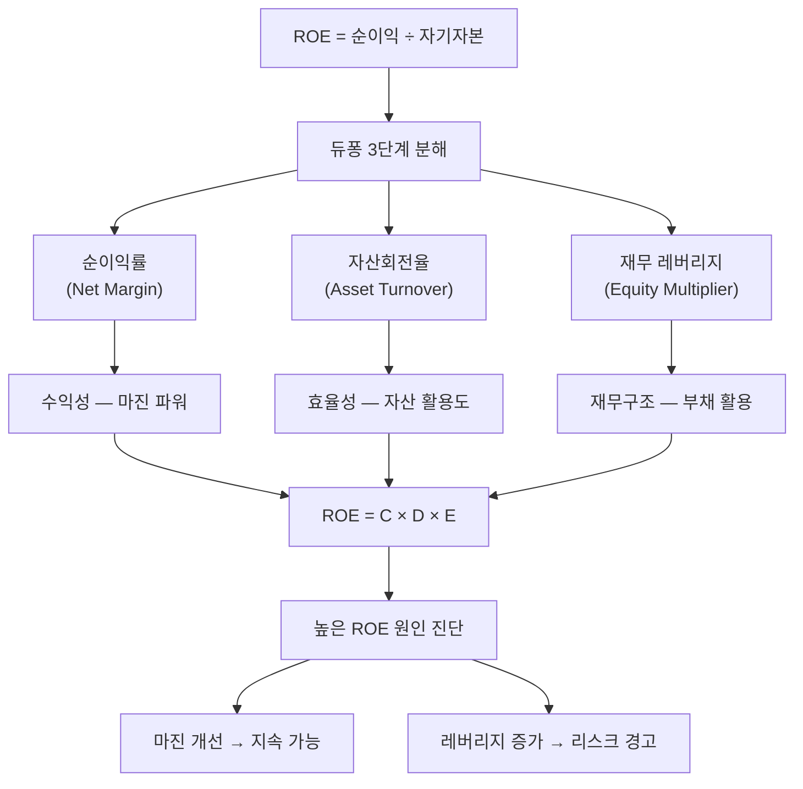

# ROE 뜻 — 주주 돈으로 얼마를 벌었나

## 한 줄 정의

ROE(Return on Equity)는 주주가 투자한 자본 대비 얼마의 순이익을 창출했는지를 나타내는 수익성 지표입니다.

## 아주 쉽게 말하면

친구 두 명이 각각 치킨집을 차렸다고 생각해 보세요. 둘 다 자기 돈 1억 원을 투자했습니다. A 친구는 1년 뒤 1,500만 원을 벌었고, B 친구는 800만 원을 벌었습니다. A의 ROE는 15%, B는 8%입니다.

ROE는 '내가 맡긴 돈을 얼마나 잘 굴려주고 있는가'를 보여주는 성적표입니다. 은행 예금 금리가 3%인 시대에 ROE 15%인 기업은 당신의 돈을 예금보다 5배 효율적으로 굴려주고 있는 셈입니다.

## 왜 중요한가

ROE가 투자에서 핵심인 이유는 세 가지입니다.

**첫째, 복리 성장의 엔진입니다.** ROE가 15%인 기업이 순이익을 100% 재투자하면, 자본이 매년 15%씩 불어납니다. 장기적으로 주가 상승률은 ROE × 유보율에 수렴하는 경향이 있습니다.

**둘째, 자본 배분 능력을 보여줍니다.** ROE가 지속적으로 높다는 것은 경영진이 늘어나는 자본을 계속 수익성 높은 프로젝트에 투자하고 있다는 증거입니다.

**셋째, 밸류에이션의 근거입니다.** PBR(주가순자산비율)의 이론적 정당화 근거가 ROE입니다. ROE > 주주 요구수익률이면 PBR 1배 이상이 정당하고, ROE가 높을수록 높은 PBR 프리미엄을 받을 자격이 있습니다.

## 그림으로 이해하기

## 숫자로 보는 예시

> ⚠️ 아래 숫자는 개념 설명을 위한 **가상 예시**이며, 실제 투자 데이터가 아닙니다.

**가상 기업 '스마트플랫폼'의 3년간 ROE 변화**

| 항목 | 2023년 | 2024년 | 2025년 |
|------|--------|--------|--------|
| 자기자본(평균) | 2,000억 원 | 2,300억 원 | 2,650억 원 |
| 당기순이익 | 300억 원 | 368억 원 | 450억 원 |
| **ROE** | **15%** | **16%** | **17%** |

듀퐁 분해 (2025년):
| 구성 요소 | 2023년 | 2025년 | 변화 |
|-----------|--------|--------|------|
| 순이익률 | 10% | 12% | +2%p (마진 개선) |
| 자산회전율 | 0.75배 | 0.71배 | -0.04 (소폭 하락) |
| 레버리지 | 2.0배 | 2.0배 | 변동 없음 |
| **ROE** | **15%** | **17%** | **+2%p** |

해석: ROE 상승의 원인이 레버리지가 아니라 순이익률 개선(마진 파워 강화)이므로 건강한 성장입니다. 만약 레버리지만 2.0 → 3.0으로 올라서 ROE가 높아진 거라면 차입 리스크를 경계해야 합니다.

## 표로 비교하기

| ROE 수준 | 평가 | 예시 업종 | 투자자 체크포인트 |
|----------|------|----------|-----------------|
| 25% 이상 | 매우 우수 | 플랫폼, 고부가 브랜드 | 지속 가능성, 경쟁 진입 장벽 확인 |
| 15~25% | 우수 | 소비재, 제약, IT | 듀퐁 분해로 원인 파악 |
| 10~15% | 양호 | 일반 제조, 금융 | 개선 추세인지 확인 |
| 5~10% | 보통 | 유틸리티, 건설, 철강 | 업종 특성 감안 |
| 5% 미만 | 부진 | 자본 과잉 기업 | 자사주 매입·배당 확대 기대 |
| 마이너스 | 적자 | 적자 지속 기업 | 턴어라운드 가능성 점검 |

> ⚠️ ROE 수준은 투자 판단의 **참고 자료**일 뿐, 특정 수치가 매수·매도 시점을 의미하지 않습니다.

## 초보자가 자주 하는 오해

1. **"ROE가 높으면 무조건 좋은 기업이다"**
   → 부채를 많이 쓰면(레버리지 ↑) ROE가 인위적으로 높아집니다. 듀퐁 분해로 높은 이유를 반드시 확인하세요. 마진 개선으로 높아진 ROE가 진짜 좋은 것이고, 부채로 높아진 ROE는 위험 신호입니다.

2. **"ROE가 갑자기 높아졌으니 좋은 신호다"**
   → 일회성 이익(부동산 매각, 소송 합의금 수령)으로 순이익이 급등하면 ROE도 급등합니다. 다음 해에 원래 수준으로 돌아가므로, 반복 가능한(recurring) 이익인지 확인이 필수입니다.

3. **"ROE와 ROA는 같은 뜻이다"**
   → ROA는 총자산(부채+자본) 대비, ROE는 자기자본만 대비 수익률입니다. 부채가 없으면 같지만, 부채가 있으면 항상 ROE > ROA입니다.

4. **"ROE가 높으면 주가도 비싸서 살 수 없다"**
   → ROE가 높아도 시장이 아직 반영하지 않았다면 PBR이 낮을 수 있습니다. 'ROE 대비 PBR이 낮은 기업'이 가치투자의 핵심 발굴 조건 중 하나입니다.

## 고수는 이렇게 봅니다

숙련된 투자자는 ROE의 **지속 가능성**에 집중합니다.

**첫째, 3년 이상 ROE 추세를 봅니다.** 한 해 높은 것은 의미 없고, 3년 연속 15% 이상을 유지하는 기업이 진짜 경쟁력을 가진 기업입니다.

**둘째, '자본 배치 능력'을 평가합니다.** ROE 15%인 기업이 이익을 재투자해서 다음 해에도 15%를 유지하면, 그 기업은 복리 성장 기계입니다. 반대로 자본이 쌓이면서 ROE가 하락하면, 수익성 있는 투자처를 찾지 못하고 있다는 신호입니다.

**셋째, 배당 정책과 연결합니다.** ROE가 자본비용(WACC)보다 높으면 이익을 재투자하는 게 주주에게 유리하고, 낮으면 배당이나 자사주 매입으로 돌려주는 게 낫습니다. 이 판단이 기업 가치 극대화의 핵심입니다.

## 기업분석에서는 이렇게 씁니다

ROE-PBR 연계 분석:

1. **이론적 PBR = ROE ÷ 주주 요구수익률** (고든 모델 근사)
2. ROE 15%, 요구수익률 10% → 정당 PBR ≈ 1.5배
3. 현재 PBR이 1.2배면 → 저평가 가능성
4. 동종 업계 ROE-PBR 산점도에서 회귀선 아래 기업 → 가치투자 후보

또한 지속 성장률(Sustainable Growth Rate) = ROE × (1 - 배당성향)을 계산해, 외부 자금 조달 없이 가능한 매출 성장률의 상한을 추정합니다.

## 함께 보면 좋은 용어

- [자본](../level-03-financial-statements/equity.md) — ROE의 분모
- [순이익](../level-03-financial-statements/net-income.md) — ROE의 분자
- [ROA](./roa.md) — 총자산 대비 수익률 (레버리지 제외)
- [PBR](../level-05-valuation/pbr.md) — ROE와 밀접한 밸류에이션 지표
- [부채비율](./debt-ratio.md) — 레버리지가 ROE에 미치는 영향 확인

## 정리

ROE는 주주 자본 대비 수익률로, 기업이 주주의 돈을 얼마나 효율적으로 굴리는지 보여줍니다. 듀퐁 분해로 수익성·효율성·레버리지 중 무엇이 ROE를 높이는지 파악하고, 3년 이상 지속 가능 여부를 확인하세요. 마진 개선으로 높아진 ROE가 가장 가치 있고, 부채로 높아진 ROE는 리스크를 동반합니다.

## 한 줄 요약

> ROE는 '주주 돈 100원으로 몇 원을 벌었나'이며, 마진 개선으로 높아진 지속 가능한 ROE가 가장 가치 있습니다.

---

이 글은 투자 권유가 아니라 주식 용어와 기업분석 방법을 설명하기 위한 교육 콘텐츠입니다. 특정 종목의 매수·매도 판단은 독자 본인의 책임입니다.

Tags: 자기자본수익률, 자기자본이익률, 순이익, 자본, 듀퐁분석
