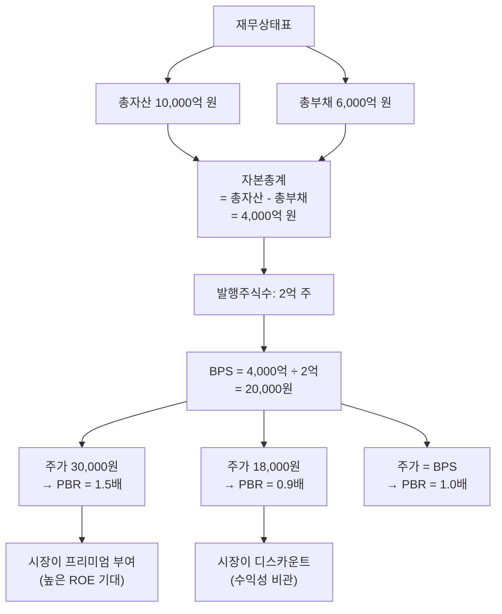

# BPS 뜻 — 주식 1주의 장부 가치

## 한 줄 정의

BPS(Book Value Per Share)는 자본총계를 발행주식수로 나눈 값으로, 주식 1주당 귀속되는 순자산(장부가치)입니다.

## 아주 쉽게 말하면

친구 4명이 공동으로 카페를 차렸다고 해보세요. 카페의 모든 재산(인테리어, 장비, 현금)이 4억 원이고, 은행 빚이 2억 원이면, 순자산은 2억 원입니다. 4명이 똑같이 나누면 1인당 5,000만 원 — 이게 '1주당 순자산', 즉 BPS입니다.

기업도 마찬가지입니다. 회사의 모든 자산에서 빚을 뺀 나머지를 주식수로 나누면 BPS가 나옵니다. "만약 지금 당장 회사를 정리하면 내 주식 1주에 얼마가 돌아올까?"에 대한 장부상 답이 바로 BPS입니다.

## 왜 중요한가

BPS가 중요한 이유는 세 가지입니다.

**첫째, 기업 가치의 '바닥'을 알려줍니다.** 주가가 BPS 아래로 내려가면(PBR < 1), 시장이 기업의 청산가치조차 인정하지 않는 것입니다. 극단적 비관론의 지표이자, 반대로 저평가 기회의 신호가 될 수 있습니다.

**둘째, PBR 계산의 분모입니다.** PBR = 주가 ÷ BPS이므로, BPS를 정확히 이해해야 PBR 기반 밸류에이션을 제대로 활용할 수 있습니다.

**셋째, 장기 자본 축적을 보여줍니다.** BPS가 매년 꾸준히 증가한다는 것은 기업이 이익을 축적하고 있다는 증거입니다. BPS 성장률은 곧 주주 자본의 복리 성장률입니다.

## 그림으로 이해하기

## 숫자로 보는 예시

> ⚠️ 아래 숫자는 개념 설명을 위한 **가상 예시**이며, 실제 투자 데이터가 아닙니다.

**가상 기업 '코어밸류 홀딩스'의 BPS 변동 분석**

| 연도 | 자본총계 | 주식수 | BPS | 변동 원인 |
|------|---------|--------|------|----------|
| 2022 | 3,000억 | 1억 주 | 30,000원 | 기준 |
| 2023 | 3,500억 | 1억 주 | 35,000원 | 순이익 600억 축적, 배당 100억 지급 |
| 2024 | 3,900억 | 1억 주 | 39,000원 | 순이익 500억 축적, 배당 100억 지급 |
| 2025 | 3,900억 | 1.2억 주 | 32,500원 | 유상증자 2,000만 주 (1주당 20,000원) |

해석:
- 2022→2024: 이익 축적으로 BPS가 30% 성장 (연 14% 복리) → 건강한 자본 증가
- 2025: 유상증자로 주식수 20% 증가했지만, 증자 가격(20,000원)이 기존 BPS(39,000원)보다 낮아 기존 주주의 BPS가 희석됨 (39,000 → 32,500원, -17%)

**BPS 희석의 교훈**: 기존 BPS보다 낮은 가격으로 유상증자하면, 기존 주주의 1주당 가치가 줄어듭니다. 이것이 '저가 유상증자'에 시장이 부정적으로 반응하는 이유입니다.

## 표로 비교하기

| 구분 | BPS | EPS |
|------|-----|-----|
| 의미 | 주당 자산가치 (저량, Stock) | 주당 이익 (유량, Flow) |
| 기준 재무제표 | 재무상태표 | 손익계산서 |
| 증가 요인 | 이익 축적, 자산 재평가, 자사주 소각 | 매출·마진 개선 |
| 감소 요인 | 적자, 대규모 배당, 저가 증자 | 실적 악화, 일회성 손실 |
| 연결 밸류에이션 | PBR (주가 ÷ BPS) | PER (주가 ÷ EPS) |
| 관계식 | BPS × ROE ≈ EPS | EPS 축적 → BPS 증가 |
| 적합한 업종 | 금융, 지주사, 자산주 | 성장주, 일반 제조 |

> ⚠️ 밸류에이션 지표는 투자 판단의 **참고 자료**일 뿐, 특정 수치가 매수·매도 시점을 의미하지 않습니다.

## 초보자가 자주 하는 오해

1. **"BPS = 실제 청산 시 받는 금액이다"**
   → 장부가치와 시장가치는 다릅니다. 공장·부동산은 장부가보다 비싸거나 싸게 팔릴 수 있고, 브랜드·특허 같은 무형자산은 장부에 과소 반영됩니다. BPS는 '장부상 추정치'일 뿐입니다.

2. **"BPS가 매년 올라가면 주가도 올라간다"**
   → BPS가 늘어도 ROE가 낮으면 시장은 프리미엄을 주지 않습니다. 자본은 쌓이는데 수익성이 떨어지면 PBR이 하락해 주가가 BPS 성장을 따라가지 못합니다.

3. **"PBR 1배 미만이면 무조건 저평가다"**
   → ROE가 자본비용보다 낮으면 PBR < 1이 이론적으로 정당합니다. "돈을 벌어도 주주 기대 수익률을 못 채우는 기업"은 디스카운트를 받아 마땅합니다.

4. **"BPS는 변하지 않는 고정 값이다"**
   → 분기마다 이익 축적, 배당, 자사주 매입·소각, 유상증자, 환율 변동(해외 자회사) 등으로 BPS는 계속 변합니다.

## 고수는 이렇게 봅니다

숙련된 투자자는 '장부 BPS'를 그대로 쓰지 않고 **조정 BPS(Adjusted BPS)**를 계산합니다.

**조정 항목들:**
- 토지·건물: 취득 원가가 아닌 현재 시가로 재평가 (감정평가액 활용)
- 보유 유가증권: 장부가가 아닌 현재 시가 반영
- 부실 매출채권: 회수 불능 추정액 차감
- 영업권: 인수 시 과대 지급한 프리미엄은 할인 적용

특히 보유 부동산이 많은 기업(건설사, 유통사)은 장부 BPS와 조정 BPS 간 괴리가 클 수 있어, 숨은 가치를 발견하는 열쇠가 됩니다.

또한 **BPS 성장률 = ROE × (1 - 배당성향)**이라는 관계를 활용해, ROE가 유지된다면 미래 BPS를 추정하고 이를 기반으로 적정 주가를 역산합니다.

## 기업분석에서는 이렇게 씁니다

지주사·금융지주의 NAV(순자산가치) 분석 과정:

1. 자회사별 지분 가치를 시가(상장사)·수익가치(비상장사)로 재평가
2. 지주사 자체 보유 자산(부동산, 현금) 시가 반영
3. 순차입금 차감
4. 합산 NAV ÷ 주식수 = 조정 BPS
5. 지주사 할인율(통상 20~40%) 적용 → 적정 주가 범위 산출

은행 분석에서도 BPS가 핵심입니다. 은행의 자산 대부분이 시가에 가까운 금융자산이라 BPS의 신뢰도가 높고, PBR 밴드(역사적 PBR 범위)로 적정 주가를 추정하는 것이 업계 표준입니다.

## 함께 보면 좋은 용어

- [PBR](./pbr.md) — 주가 ÷ BPS = 자산 기준 밸류에이션
- [자본](../level-03-financial-statements/equity.md) — BPS의 분자
- [EPS](./eps.md) — 주당 이익 (BPS와 보완 관계)
- [ROE](../level-04-ratios/roe.md) — EPS ÷ BPS의 근사치
- [유상증자](../level-07-earnings/paid-in-capital-increase.md) — BPS 희석 이벤트

## 정리

BPS는 주식 1주당 장부상 순자산으로, 기업 가치의 하한선 역할을 합니다. 이익 축적으로 BPS가 꾸준히 증가하면 장기적으로 주가를 뒷받침하며, PBR과 함께 저평가 판단의 기초가 됩니다. 단, 장부가와 시가의 괴리를 인식하고 조정 BPS를 활용하면 더 정밀한 분석이 가능합니다.

## 한 줄 요약

> BPS는 '회사를 정리하면 1주당 돌려받을 장부 금액'이며, PBR의 분모이자 주가의 바닥 가늠자입니다.

---

이 글은 투자 권유가 아니라 주식 용어와 기업분석 방법을 설명하기 위한 교육 콘텐츠입니다. 특정 종목의 매수·매도 판단은 독자 본인의 책임입니다.

Tags: 주당순자산, 순자산가치, 주가순자산비율, 자본총계, 기업가치
