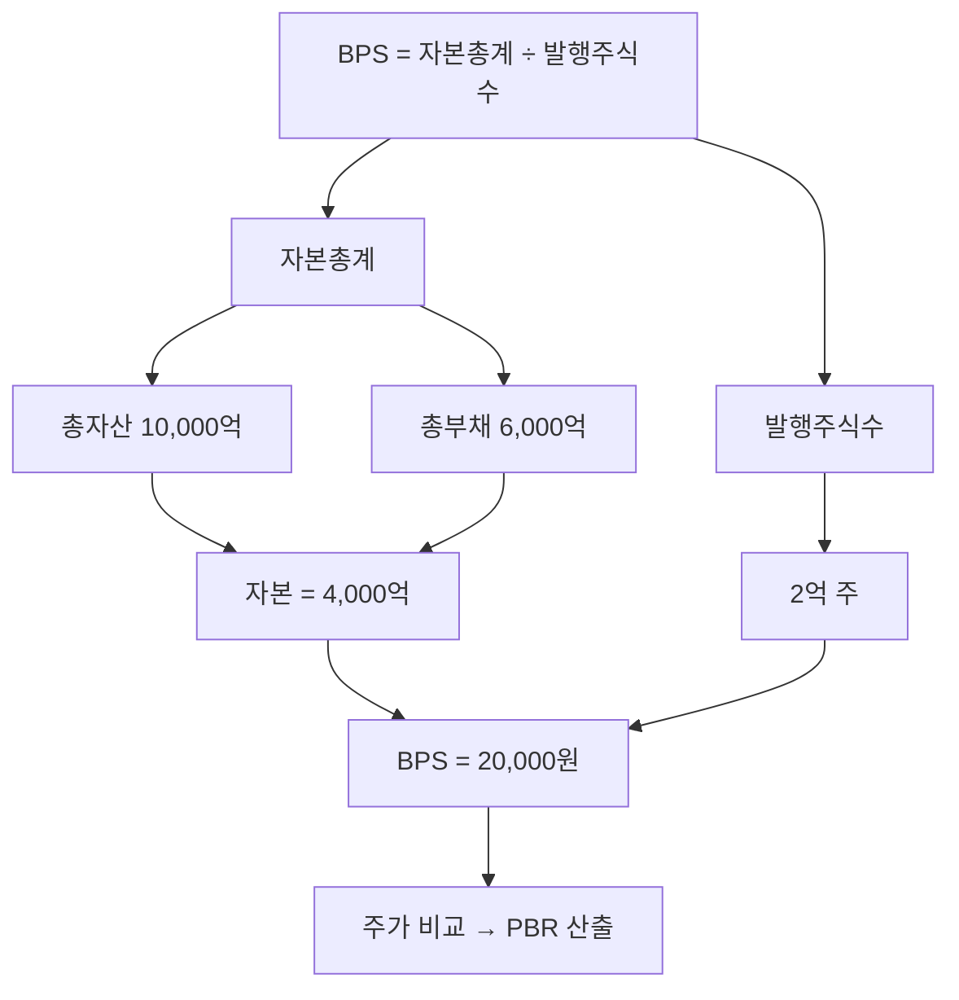

# BPS 뜻 — 주식 1주의 장부 가치

## 한 줄 정의

BPS(Book Value Per Share)는 자본총계를 발행주식수로 나눈 값으로, 주식 1주당 귀속되는 순자산(장부가치)입니다.

## 아주 쉽게 말하면

회사가 모든 자산을 팔고 빚을 갚은 뒤 남는 돈을 주주끼리 나눠 가지면, 1주당 받는 금액이 BPS입니다. 회사의 '최소 가치' 또는 '바닥 가격'으로 볼 수 있습니다.

## 왜 중요한가

BPS는 PBR 계산의 분모이자, 기업 가치의 하한선 역할을 합니다. 주가가 BPS보다 낮으면(PBR < 1) 시장이 기업의 청산가치조차 인정하지 않는 것으로, 극단적 비관론을 반영합니다.

## 그림으로 이해하기

## 숫자로 보는 예시

> ⚠️ 아래 숫자는 개념 설명을 위한 **가상 예시**이며, 실제 투자 데이터가 아닙니다.

U기업 BPS 추이:
| 연도 | 자본총계 | 주식수 | BPS | 변동 원인 |
|------|---------|--------|-----|----------|
| 2023 | 3,000억 | 1억주 | 3,000원 | - |
| 2024 | 3,500억 | 1억주 | 3,500원 | 이익 축적 |
| 2025 | 3,500억 | 1.2억주 | 2,917원 | 유상증자로 희석 |

## 표로 비교하기

| 구분 | BPS | EPS |
|------|-----|-----|
| 측정 대상 | 주당 자산가치 (스톡) | 주당 이익 (플로우) |
| 기준 재무제표 | 재무상태표 | 손익계산서 |
| 증가 요인 | 이익 축적, 자산 재평가 | 매출·마진 개선 |
| 감소 요인 | 적자, 배당, 증자 | 실적 악화 |
| 연결 지표 | PBR | PER |

> ⚠️ 밸류에이션 지표는 투자 판단의 **참고 자료**일 뿐, 특정 수치가 매수·매도 시점을 의미하지 않습니다. 반드시 다른 지표·정성 분석과 함께 종합적으로 판단하세요.

## 초보자가 자주 하는 오해

1. **"BPS = 실제 청산 시 받는 금액이다"**
   → 장부가치와 시장가치는 다릅니다. 공장·부동산은 장부가보다 비싸거나 싸게 팔릴 수 있고, 무형자산(브랜드)은 장부에 제대로 반영되지 않습니다.

2. **"BPS가 매년 올라가면 주가도 올라간다"**
   → BPS가 올라도 ROE가 낮으면 시장은 프리미엄을 주지 않습니다. BPS 성장 + 높은 ROE가 결합해야 주가 상승으로 이어집니다.

## 고수는 이렇게 봅니다

숙련된 투자자는 '조정 BPS'를 계산합니다. 장부상 토지·건물을 시가로 재평가하고, 부실 자산(회수 불능 채권)을 차감해 실질 BPS를 구합니다. 특히 보유 부동산이 많은 기업은 장부가 BPS보다 실질 BPS가 훨씬 높을 수 있습니다.

## 기업분석에서는 이렇게 씁니다

지주사·금융지주의 NAV(순자산가치) 분석에서 출발점입니다. 자회사 지분 가치를 시가로 재평가하고, 할인율(지주사 디스카운트)을 적용해 적정 주가를 산출합니다.

## 함께 보면 좋은 용어

- [PBR](./pbr.md) — 주가 ÷ BPS = 자산 기준 밸류에이션
- [자본](../level-03-financial-statements/equity.md) — BPS의 분자
- [EPS](./eps.md) — 주당 이익 (BPS와 보완)
- [ROE](../level-04-ratios/roe.md) — EPS ÷ BPS의 근사치
- [유상증자](../level-07-earnings/paid-in-capital-increase.md) — BPS 희석 이벤트

## 정리

BPS는 주식 1주당 장부상 순자산으로, 기업 가치의 하한선 역할을 합니다. 이익 축적으로 BPS가 꾸준히 증가하면 장기적으로 주가를 뒷받침하며, PBR과 함께 저평가 판단의 기초가 됩니다.

## 한 줄 요약

> BPS는 '회사를 정리하면 1주당 돌려받을 장부 금액'이며, 주가의 바닥 가늠자 역할을 합니다.

---

*면책 조항: 이 글은 투자 권유가 아니라 주식 용어와 기업분석 방법을 설명하기 위한 교육 콘텐츠입니다. 특정 종목의 매수·매도 판단은 독자 본인의 책임입니다.*

Tags: BPS, 주당순자산, 자본, PBR, 청산가치
