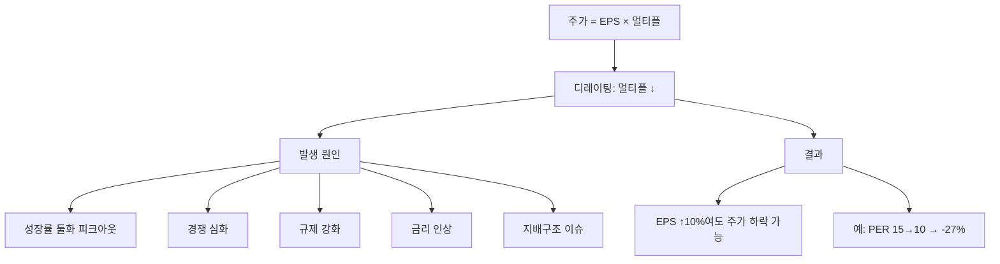

# 디레이팅 뜻 — 시장이 가치를 깎아 내릴 때

## 한 줄 정의

디레이팅(De-rating)은 기업의 밸류에이션 멀티플이 하향 조정되는 현상으로, 이익이 유지되거나 늘어도 시장 기대 하락으로 주가가 떨어지는 것을 말합니다.

## 아주 쉽게 말하면

실력은 그대론데 업계 전망이 어두워져서 연봉 협상에서 깎이는 것과 비슷합니다. 기업이 똑같이 벌어도 "앞으로 힘들겠다"는 시각이 퍼지면 멀티플이 내려가고 주가가 하락합니다.

## 왜 중요한가

이익이 10% 늘어도 멀티플이 20% 떨어지면 주가는 12% 하락합니다. "실적은 좋은데 왜 주가가 떨어지지?"의 가장 흔한 원인이 디레이팅입니다. 원인을 이해해야 손절·보유 판단을 할 수 있습니다.

## 그림으로 이해하기

## 숫자로 보는 예시

> ⚠️ 아래 숫자는 개념 설명을 위한 **가상 예시**이며, 실제 투자 데이터가 아닙니다.

X기업 (성장 둔화로 디레이팅):
| 연도 | EPS | EPS성장률 | PER | 주가 |
|------|-----|---------|-----|------|
| 2023 | 3,000원 | +40% | 30배 | 90,000원 |
| 2024 | 4,000원 | +33% | 25배 | 100,000원 |
| 2025 | 4,500원 | +12% | 15배 | 67,500원 |

→ 2025년: 이익↑인데 성장 둔화로 PER 급락 → 주가 -32.5%

## 표로 비교하기

| 디레이팅 유형 | 원인 | 회복 가능성 |
|-------------|------|-----------|
| 일시적 (시장 전체) | 금리 인상, 유동성 축소 | 높음 (금리 인하 시 회복) |
| 구조적 (개별 기업) | 성장 둔화, 경쟁력 약화 | 낮음 (턴어라운드 필요) |
| 산업 재평가 | 규제, 기술 변화 | 중간 (규제 완화 시 일부 회복) |
| 이벤트성 | 횡령, 사고 | 불확실 (신뢰 회복 기간 필요) |

## 초보자가 자주 하는 오해

1. **"이익이 늘면 주가도 오른다"**
   → 이익 증가 < 멀티플 하락이면 주가는 떨어집니다. 시장은 '현재 이익'보다 '미래 기대'에 더 민감합니다.

2. **"디레이팅된 주식은 저평가라 사야 한다"**
   → 디레이팅에 구조적 이유가 있다면 멀티플이 더 떨어질 수 있습니다. "떨어지는 칼날"일 수 있으므로 디레이팅 원인 분석이 우선입니다.

## 고수는 이렇게 봅니다

숙련된 투자자는 디레이팅의 원인이 '일시적'인지 '구조적'인지를 구분합니다. 금리 인상으로 시장 전체가 디레이팅됐다면 금리 인하 시 회복될 수 있지만, 성장률 영구 하락이라면 낮은 멀티플이 뉴노멀이 됩니다.

## 기업분석에서는 이렇게 씁니다

목표주가를 하향할 때 "타겟 PER을 20배 → 14배로 하향"이라고 표현합니다. 이 경우 실적 추정치는 유지하면서 멀티플만 내린 것이며, 성장 둔화·경쟁 심화 등 구조적 이유를 근거로 제시합니다.

## 함께 보면 좋은 용어

- [리레이팅](./rerating.md) — 디레이팅의 반대 (멀티플 상향)
- [멀티플](./multiple.md) — 디레이팅의 대상
- [피크아웃](../level-08-industry-macro/peak-out.md) — 성장 정점 통과가 디레이팅 촉발
- [어닝 쇼크](../level-08-industry-macro/earnings-shock.md) — 기대 미달이 디레이팅 가속
- [밸류 트랩](../level-10-company-analysis/value-trap.md) — 만성 디레이팅 상태의 기업

## 정리

디레이팅은 시장 기대 하락으로 멀티플이 낮아지는 현상입니다. 이익이 늘어도 주가가 떨어지는 원인이 되며, 일시적·구조적 원인을 구분하는 것이 투자 판단의 핵심입니다.

## 한 줄 요약

> 디레이팅은 '실적은 괜찮은데 시장이 덜 쳐주는 것'이며, 구조적 원인이면 저가 매수가 아닌 회피 대상입니다.

---

*면책 조항: 이 글은 투자 권유가 아니라 주식 용어와 기업분석 방법을 설명하기 위한 교육 콘텐츠입니다. 특정 종목의 매수·매도 판단은 독자 본인의 책임입니다.*

Tags: 디레이팅, 밸류에이션, 멀티플하락, PER하향, 주가하락
