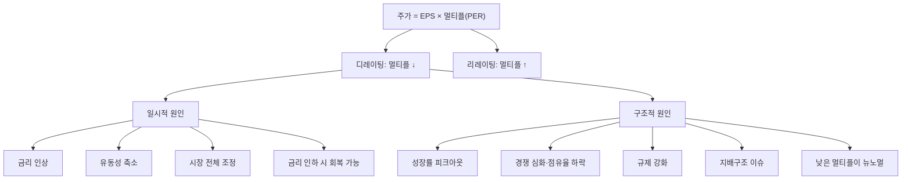

# 디레이팅 뜻 — 시장이 가치를 깎아 내릴 때

## 한 줄 정의

디레이팅(De-rating)은 기업의 밸류에이션 멀티플이 하향 조정되는 현상으로, 이익이 유지되거나 늘어도 시장 기대 하락으로 주가가 떨어지는 것을 말합니다.

## 아주 쉽게 말하면

프로야구 선수가 올해도 3할을 쳤는데, "내년부터는 체력이 떨어져서 2할대로 내려갈 것 같다"는 전망이 나오면 FA 몸값이 떨어집니다. 현재 실력은 그대론데 '미래에 대한 기대'가 줄었기 때문입니다.

기업도 똑같습니다. 올해 이익이 좋아도 "내년부터 성장이 둔화될 것"이라는 시각이 퍼지면, 시장이 부여하는 멀티플(PER, PBR 등)이 내려갑니다. 주가 = EPS × PER이니까, EPS가 올라도 PER이 더 크게 떨어지면 주가는 하락합니다. 이게 바로 "실적 좋은데 왜 주가가 빠지지?"의 정체입니다.

## 왜 중요한가

디레이팅을 이해해야 하는 이유는 세 가지입니다.

**첫째, '실적 착시'를 피할 수 있습니다.** 분기 실적이 좋다고 매수했는데 주가가 빠지는 경험을 한 번쯤 해봤을 겁니다. 대부분 디레이팅이 원인입니다.

**둘째, 손절·보유 판단의 근거가 됩니다.** 디레이팅 원인이 일시적(금리 인상)이면 버틸 수 있지만, 구조적(성장 영구 둔화)이면 멀티플이 더 떨어질 수 있어 대응이 달라야 합니다.

**셋째, 역발상 기회를 포착할 수 있습니다.** 일시적 디레이팅으로 과도하게 멀티플이 내려간 기업은 리레이팅 시 큰 수익을 줄 수 있습니다.

## 그림으로 이해하기

## 숫자로 보는 예시

> ⚠️ 아래 숫자는 개념 설명을 위한 **가상 예시**이며, 실제 투자 데이터가 아닙니다.

**가상 기업 '하이그로스 테크' — 성장 둔화로 인한 디레이팅**

| 연도 | EPS | EPS 성장률 | 시장 부여 PER | 주가 | 주가 변동 |
|------|-----|-----------|-------------|------|----------|
| 2022 | 2,000원 | +50% | 35배 | 70,000원 | - |
| 2023 | 3,000원 | +50% | 35배 | 105,000원 | +50% |
| 2024 | 4,000원 | +33% | 25배 | 100,000원 | -5% |
| 2025 | 4,500원 | +12% | 15배 | 67,500원 | -32% |

해석:
- 2024년: EPS는 33% 성장했지만, 성장률이 50%에서 33%로 '둔화'되자 PER이 35 → 25로 하락. 결과적으로 주가는 -5% (이익 증가를 멀티플 하락이 상쇄)
- 2025년: EPS 12% 성장에도 PER이 25 → 15로 급락 → 주가 -32%. 시장이 "고성장주에서 중성장주로 재분류"한 것

**수학적으로 보면:**
- 주가 변동률 ≈ EPS 성장률 + 멀티플 변동률
- 2025년: +12% + (-40%) = **-28%** (근사치, 실제 -32%)

멀티플 변동의 위력이 이익 성장을 압도할 수 있음을 보여줍니다.

## 표로 비교하기

| 디레이팅 유형 | 원인 | 회복 가능성 | 대응 전략 |
|-------------|------|-----------|----------|
| 시장 전체 (매크로) | 금리 인상, 유동성 축소 | 높음 (정책 전환 시) | 우량주 보유 유지 또는 추가 매수 |
| 산업 재평가 | 규제 강화, 기술 대체 | 중간 (규제 완화 시 일부 회복) | 규제 방향 모니터링 |
| 개별 기업 구조적 | 성장 피크아웃, 경쟁력 약화 | 낮음 (턴어라운드 필요) | 포지션 축소 고려 |
| 이벤트성 | 횡령, 사고, 소송 | 불확실 (신뢰 회복 기간 필요) | 원인 심각도 평가 후 판단 |
| 밸류에이션 버블 해소 | 과열 후 정상화 | 높음 (적정 수준에서 안정) | 적정 멀티플 밴드 확인 |

## 초보자가 자주 하는 오해

1. **"이익이 늘면 주가도 반드시 오른다"**
   → 주가 = EPS × 멀티플입니다. 이익 증가 < 멀티플 하락이면 주가는 떨어집니다. 시장은 '현재 이익'보다 '미래 기대치 변화'에 더 민감하게 반응합니다.

2. **"디레이팅된 주식은 저평가라 사야 한다"**
   → 디레이팅에 구조적 이유가 있으면 멀티플이 더 떨어질 수 있습니다. PER 20에서 15로 떨어졌다고 싸다고 사면, PER 10까지 추가 하락할 수 있습니다. 원인 분석이 매수보다 우선입니다.

3. **"PER이 낮아졌으니 바닥이다"**
   → '밸류 트랩'이라는 함정이 있습니다. 만성적으로 성장이 없는 기업은 PER 5~8배가 뉴노멀이 됩니다. 낮은 PER 자체가 바닥을 보장하지 않습니다.

4. **"디레이팅은 한 번에 끝난다"**
   → 디레이팅은 수분기에 걸쳐 점진적으로 진행될 수 있습니다. 특히 성장주의 '성장 → 가치주' 재분류 과정은 1~2년 이상 걸리기도 합니다.

## 고수는 이렇게 봅니다

숙련된 투자자는 디레이팅을 세 단계로 분석합니다.

**1단계: 원인 분류** — 일시적(매크로, 센티먼트)인가, 구조적(펀더멘털 변화)인가? 금리 인상기에 시장 전체 PER이 내려간 것과, 개별 기업의 성장률이 피크아웃한 것은 대응이 완전히 다릅니다.

**2단계: 적정 멀티플 추정** — 현재 멀티플이 과도하게 내려간 것인지, 아직 하락 여지가 있는지 판단합니다. 유사 성장률의 글로벌 동종 기업 멀티플과 비교합니다.

**3단계: 리레이팅 트리거 존재 여부** — 멀티플을 다시 올릴 수 있는 촉매(신사업, 구조조정, 규제 완화)가 있는지 확인합니다. 트리거가 없으면 장기 저평가 상태(밸류 트랩)가 지속됩니다.

## 기업분석에서는 이렇게 씁니다

애널리스트가 적정 주가를 하향할 때의 로직:

1. 실적 추정치는 유지하면서 타겟 PER을 하향 조정
2. 근거: "성장률 둔화(YoY +40% → +15%)로 고성장 프리미엄 소멸"
3. 비교: "동종 업계 중성장 기업 평균 PER 15배 적용"
4. 적정 주가: EPS 4,500원 × PER 15배 = 67,500원 (기존 목표 대비 -30%)

반대로 디레이팅이 과도하다고 판단할 때는 "역사적 PER 밴드 하단 근접, 추가 하방 제한적"이라는 논리로 매수 의견을 유지하기도 합니다.

## 함께 보면 좋은 용어

- [리레이팅](./rerating.md) — 디레이팅의 반대 (멀티플 상향)
- [멀티플](./multiple.md) — 디레이팅의 대상
- [피크아웃](../level-08-industry-macro/peak-out.md) — 성장 정점 통과가 디레이팅 촉발
- [어닝 쇼크](../level-08-industry-macro/earnings-shock.md) — 기대 미달이 디레이팅 가속
- [밸류 트랩](../level-10-company-analysis/value-trap.md) — 만성 디레이팅 상태의 기업

## 정리

디레이팅은 시장 기대 하락으로 멀티플이 낮아지는 현상입니다. 이익이 늘어도 주가가 떨어지는 핵심 원인이며, 일시적 원인(매크로)과 구조적 원인(펀더멘털 악화)을 구분하는 것이 투자 판단의 핵심입니다. 멀티플 변동의 위력은 이익 성장을 쉽게 압도할 수 있으므로, 실적만 보고 투자하면 함정에 빠질 수 있습니다.

## 한 줄 요약

> 디레이팅은 '실적은 괜찮은데 시장이 덜 쳐주는 것'이며, 원인이 구조적이면 저가 매수가 아닌 리스크 관리 대상입니다.

---

이 글은 투자 권유가 아니라 주식 용어와 기업분석 방법을 설명하기 위한 교육 콘텐츠입니다. 특정 종목의 매수·매도 판단은 독자 본인의 책임입니다.

Tags: 디레이팅, 밸류에이션, 멀티플하락, 주가수익비율하향, 주가하락
