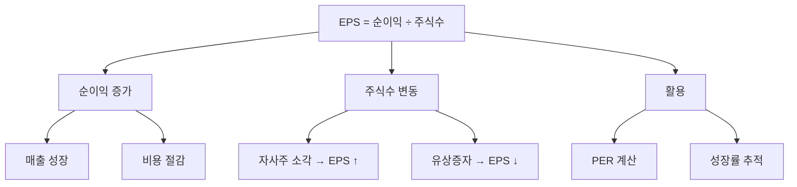

# EPS 뜻 — 주식 1주가 벌어들인 이익

## 한 줄 정의

EPS(Earnings Per Share)는 당기순이익을 발행주식수로 나눈 값으로, 주식 1주당 귀속되는 순이익입니다.

## 아주 쉽게 말하면

회사가 1년에 100억 원을 벌었고, 주식이 1,000만 주 있다면 주식 1주당 1,000원을 번 셈입니다. 이 1,000원이 EPS입니다. 내가 1주를 가지고 있으면 1,000원어치의 이익이 내 몫입니다.

## 왜 중요한가

EPS는 PER 계산의 분모이자, 기업의 이익 성장을 주당 기준으로 추적하는 핵심 지표입니다. 매출이나 순이익이 늘어도 주식수가 더 많이 늘면(유상증자) 주당 가치는 오히려 줄어들 수 있습니다.

## 그림으로 이해하기

## 숫자로 보는 예시

> ⚠️ 아래 숫자는 개념 설명을 위한 **가상 예시**이며, 실제 투자 데이터가 아닙니다.

T기업 3개년 EPS 추이:
| 연도 | 순이익 | 주식수 | EPS | 성장률 |
|------|--------|--------|-----|--------|
| 2023 | 500억 | 5,000만주 | 1,000원 | - |
| 2024 | 700억 | 5,000만주 | 1,400원 | +40% |
| 2025 | 800억 | 8,000만주* | 1,000원 | -29% |

*유상증자로 주식수 증가 → 순이익↑인데 EPS↓ (희석)

## 표로 비교하기

| 구분 | 기본 EPS | 희석 EPS |
|------|---------|---------|
| 분자 | 당기순이익 | 당기순이익 (조정) |
| 분모 | 가중평균 주식수 | + 전환사채·스톡옵션 등 잠재 주식 |
| 용도 | 현재 기준 | 최악 시나리오 (완전 희석) |
| 보수성 | 보통 | 더 보수적 |
| 공시 | 필수 | 필수 (차이 클 때 중요) |

> ⚠️ 밸류에이션 지표는 투자 판단의 **참고 자료**일 뿐, 특정 수치가 매수·매도 시점을 의미하지 않습니다. 반드시 다른 지표·정성 분석과 함께 종합적으로 판단하세요.

## 초보자가 자주 하는 오해

1. **"EPS가 높으면 무조건 좋은 주식이다"**
   → EPS 절대값은 주가 수준에 따라 의미가 다릅니다. EPS 10,000원이어도 주가가 50만 원이면 PER 50배로 비쌉니다. EPS는 반드시 주가와 함께(PER) 봐야 합니다.

2. **"EPS 성장 = 순이익 성장이다"**
   → 자사주 매입·소각으로 주식수가 줄면 순이익이 같아도 EPS가 올라갑니다. 반대로 유상증자로 주식수 늘면 순이익↑인데 EPS↓가 가능합니다.

## 고수는 이렇게 봅니다

숙련된 투자자는 '희석 EPS'를 기본으로 봅니다. 전환사채(CB), 스톡옵션이 많은 기업은 기본 EPS보다 희석 EPS가 크게 낮을 수 있습니다. 또한 컨센서스(시장 예상) EPS 대비 실적 EPS를 비교해 서프라이즈·쇼크를 판단합니다.

## 기업분석에서는 이렇게 씁니다

EPS 추정이 밸류에이션의 출발점입니다. 매출 전망 → 영업이익률 → 순이익률 → 주식수 조정 순서로 미래 EPS를 추정하고, 여기에 타겟 PER을 곱해 목표주가를 산출합니다.

## 함께 보면 좋은 용어

- [PER](./per.md) — 주가 ÷ EPS = 이익 기준 밸류에이션
- [순이익](../level-03-financial-statements/net-income.md) — EPS의 분자
- [BPS](./bps.md) — 주당순자산 (자산 기준 주당 가치)
- [컨센서스](../level-08-industry-macro/consensus.md) — 시장 예상 EPS
- [어닝 서프라이즈](../level-08-industry-macro/earnings-surprise.md) — EPS가 예상을 뛰어넘을 때

## 정리

EPS는 주식 1주당 순이익으로, PER·목표주가 산정의 핵심 입력값입니다. 순이익뿐 아니라 주식수 변동(증자·자사주 소각)에 따라 달라지므로, 희석 EPS까지 함께 확인하세요.

## 한 줄 요약

> EPS는 '주식 1주가 1년에 벌어준 순이익'이며, 성장 추세와 희석 가능성을 함께 봐야 합니다.

---

이 글은 투자 권유가 아니라 주식 용어와 기업분석 방법을 설명하기 위한 교육 콘텐츠입니다. 특정 종목의 매수·매도 판단은 독자 본인의 책임입니다.

Tags: 주당순이익, 순이익, 희석주당순이익, 수익성, 기업분석
