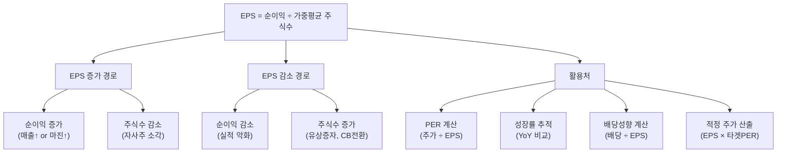

# EPS 뜻 — 주식 1주가 벌어들인 이익

## 한 줄 정의

EPS(Earnings Per Share)는 당기순이익을 발행주식수로 나눈 값으로, 주식 1주당 귀속되는 순이익입니다.

## 아주 쉽게 말하면

피자 한 판을 8조각으로 잘랐을 때 한 조각의 크기가 있고, 12조각으로 잘랐을 때 한 조각의 크기가 있습니다. 피자 크기(순이익)가 같아도 조각수(주식수)에 따라 한 조각의 몫이 달라집니다.

EPS는 바로 이 '내 주식 1주에 돌아오는 이익의 크기'입니다. 회사가 1년에 1,000억 원을 벌었고 주식이 1억 주 있다면, EPS는 1,000원입니다. 내가 100주를 가지고 있다면 10만 원어치의 이익이 내 몫인 셈이죠.

## 왜 중요한가

EPS가 주식 투자의 핵심인 이유는 세 가지입니다.

**첫째, 밸류에이션의 출발점입니다.** PER(주가수익비율) = 주가 ÷ EPS이므로, EPS를 모르면 주가가 비싼지 싼지 판단할 수 없습니다. 애널리스트의 적정 주가 산출도 '미래 EPS × 타겟 PER'이 기본 공식입니다.

**둘째, 성장을 '주당 기준'으로 추적합니다.** 순이익이 50% 늘어도 같은 기간 유상증자로 주식수가 2배가 되면, EPS는 오히려 -25%입니다. 주주 입장에서 의미 있는 성장은 '총 이익'이 아니라 '주당 이익'입니다.

**셋째, 배당의 원천을 보여줍니다.** 배당성향 = 배당금 ÷ EPS이므로, EPS가 클수록 배당 여력이 커집니다.

## 그림으로 이해하기

## 숫자로 보는 예시

> ⚠️ 아래 숫자는 개념 설명을 위한 **가상 예시**이며, 실제 투자 데이터가 아닙니다.

**가상 기업 '넥스트웨어'의 EPS 변동 분석**

| 연도 | 순이익 | 주식수 | 기본 EPS | 이벤트 |
|------|--------|--------|---------|--------|
| 2023 | 500억 | 5,000만 주 | 1,000원 | 기준 |
| 2024 | 700억 | 5,000만 주 | 1,400원 | 실적 성장 (+40%) |
| 2025 | 800억 | 8,000만 주 | 1,000원 | 유상증자 3,000만 주 |

해석:
- 2024년: 순이익 +40%, 주식수 변동 없음 → EPS +40% (이익 성장이 온전히 주당 가치에 반영)
- 2025년: 순이익 +14%인데 주식수 +60% → EPS -29% (희석 효과가 이익 성장을 압도)

**희석 EPS 예시:**

넥스트웨어가 2025년에 전환사채(CB) 1,000만 주 전환 가능분을 보유하고 있다면:
- 기본 EPS: 800억 ÷ 8,000만 = 1,000원
- 희석 EPS: 800억 ÷ 9,000만 = 889원 (잠재 주식까지 반영)

투자자는 희석 EPS 기준으로 밸류에이션해야 '최악 시나리오'에서도 적정한 가격인지 판단할 수 있습니다.

## 표로 비교하기

| 구분 | 기본 EPS | 희석 EPS |
|------|---------|---------|
| 분자 | 당기순이익 | 당기순이익 + 전환 시 이자 절감분 |
| 분모 | 가중평균 보통주식수 | + 전환사채·스톡옵션·신주인수권 등 잠재 주식 |
| 의미 | 현재 기준 주당 이익 | 모든 잠재 주식 전환 시 주당 이익 |
| 보수성 | 보통 | 더 보수적 (실제보다 낮게 나옴) |
| 공시 | 필수 | 필수 (차이 클 때 특히 중요) |
| 활용 시점 | CB·SO 적을 때 | CB·SO 많은 성장 기업 분석 시 |

> ⚠️ 밸류에이션 지표는 투자 판단의 **참고 자료**일 뿐, 특정 수치가 매수·매도 시점을 의미하지 않습니다.

## 초보자가 자주 하는 오해

1. **"EPS가 높으면 무조건 좋은 주식이다"**
   → EPS 절대값은 주가 수준에 따라 의미가 다릅니다. EPS 10,000원이어도 주가가 50만 원이면 PER 50배로 비쌉니다. EPS는 반드시 주가와 함께(PER) 봐야 합니다.

2. **"EPS 성장 = 순이익 성장이다"**
   → 자사주 매입·소각으로 주식수가 줄면 순이익이 같아도 EPS가 올라갑니다. 반대로 유상증자·CB 전환으로 주식수가 늘면 순이익이 늘어도 EPS가 떨어질 수 있습니다.

3. **"분기 EPS × 4 = 연간 EPS다"**
   → 계절성이 강한 업종(에어컨, 아이스크림)은 분기별 EPS 편차가 큽니다. 4분기 합산이나 TTM(최근 4분기 합계)을 사용해야 합니다.

4. **"EPS가 마이너스면 볼 가치가 없다"**
   → 적자 기업도 적자 축소 추세라면 투자 가치가 있을 수 있습니다. 이 경우 PSR(매출 기준 밸류에이션)이나 흑자 전환 시점의 예상 EPS로 분석합니다.

## 고수는 이렇게 봅니다

숙련된 투자자는 EPS를 세 가지 버전으로 관리합니다.

**첫째, 과거 EPS(Trailing EPS).** 최근 4분기 실적 합산. 확정된 팩트.

**둘째, 컨센서스 EPS(Forward EPS).** 시장(애널리스트 평균)이 예상하는 향후 12개월 EPS. 주가는 미래 EPS에 더 민감하게 반응합니다.

**셋째, 조정 EPS(Adjusted EPS).** 일회성 항목(구조조정 비용, 자산 매각익)을 제거한 반복 가능한 EPS. 기업의 진짜 수익 체력을 보여줍니다.

또한 컨센서스 EPS 대비 실적 EPS의 차이로 '어닝 서프라이즈/쇼크'를 판단합니다. 컨센서스를 3% 이상 상회하면 서프라이즈, 3% 이상 하회하면 쇼크로 분류하며, 이는 주가에 즉각적인 영향을 미칩니다.

## 기업분석에서는 이렇게 씁니다

EPS 추정이 밸류에이션의 전체 프로세스를 관통합니다:

1. **매출 전망**: 시장 규모 × 점유율 또는 사업부별 적층
2. **영업이익률 가정**: 원가 구조, 고정비 레버리지
3. **순이익률 적용**: 이자비용, 법인세율 가정
4. **주식수 조정**: CB 전환, 스톡옵션 행사, 자사주 소각 반영
5. **EPS 산출**: 순이익 ÷ 희석 주식수
6. **적정 주가**: EPS × 타겟 PER (동종 업체 또는 역사적 평균)

예: "2026E EPS 2,000원 × 타겟 PER 20배 = 적정 주가 40,000원"

## 함께 보면 좋은 용어

- [PER](./per.md) — 주가 ÷ EPS = 이익 기준 밸류에이션
- [순이익](../level-03-financial-statements/net-income.md) — EPS의 분자
- [BPS](./bps.md) — 주당순자산 (자산 기준 주당 가치)
- [컨센서스](../level-08-industry-macro/consensus.md) — 시장 예상 EPS
- [어닝 서프라이즈](../level-08-industry-macro/earnings-surprise.md) — EPS가 예상을 뛰어넘을 때

## 정리

EPS는 주식 1주당 순이익으로, PER·목표주가 산정의 핵심 입력값입니다. 순이익 변동뿐 아니라 주식수 변동(유상증자·CB전환·자사주 소각)에 따라 크게 달라지므로, 기본 EPS와 희석 EPS를 모두 확인하고 컨센서스 대비 실적 서프라이즈 여부까지 챙기면 한층 정밀한 투자 판단이 가능합니다.

## 한 줄 요약

> EPS는 '주식 1주가 1년에 벌어준 순이익'이며, 성장 추세·희석 가능성·컨센서스 대비 실적을 함께 봐야 합니다.

---

이 글은 투자 권유가 아니라 주식 용어와 기업분석 방법을 설명하기 위한 교육 콘텐츠입니다. 특정 종목의 매수·매도 판단은 독자 본인의 책임입니다.

Tags: 주당순이익, 순이익, 희석주당순이익, 수익성, 기업분석
