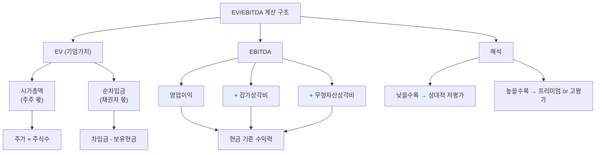

# EV/EBITDA 뜻 — 기업 전체를 사면 몇 년에 회수하나

## 한 줄 정의

EV/EBITDA는 기업가치(EV)를 세전·이자·감가상각 전 이익(EBITDA)으로 나눈 값으로, 기업 전체를 인수했을 때 현금 창출력 기준 몇 년에 투자금을 회수하는지를 보여줍니다.

## 아주 쉽게 말하면

카페를 인수한다고 생각해 보세요. 사장님 지분(시가총액)만 사는 게 아니라, 카페에 걸려 있는 대출(부채)까지 떠안아야 합니다. 그래서 실제 인수 비용은 '지분 가격 + 빚 - 금고에 있는 현금'입니다. 이게 EV(기업가치)입니다.

그리고 카페가 1년에 벌어들이는 현금(세금, 이자, 감가상각 빼기 전)이 EBITDA입니다. EV/EBITDA = 5배라면, "이 카페를 통째로 인수한 뒤 현금 수익으로 5년이면 투자금을 회수할 수 있다"는 뜻입니다.

PER이 '주주 입장'의 밸류에이션이라면, EV/EBITDA는 '기업 통째 인수자 입장'의 밸류에이션입니다.

## 왜 중요한가

EV/EBITDA가 중요한 이유는 세 가지입니다.

**첫째, 자본구조에 중립적입니다.** PER은 부채가 많으면 이자비용이 커져 왜곡되지만, EV/EBITDA는 부채를 EV에 반영하고 이자를 EBITDA에서 제외하므로, 차입 비율이 다른 기업도 공정하게 비교할 수 있습니다.

**둘째, M&A의 공용 언어입니다.** 실제 인수합병 거래에서 "EBITDA 몇 배에 인수했다"가 가격 협상의 핵심 기준입니다. 과거 유사 거래 멀티플과 비교해 비싼지 싼지 즉시 판단할 수 있습니다.

**셋째, 감가상각 차이를 제거합니다.** 같은 업종이라도 설비 투자 시점에 따라 감가상각비가 크게 다를 수 있는데, EBITDA는 이 차이를 제거해 '실제 돈 버는 능력'만 비교합니다.

## 그림으로 이해하기

## 숫자로 보는 예시

> ⚠️ 아래 숫자는 개념 설명을 위한 **가상 예시**이며, 실제 투자 데이터가 아닙니다.

**가상 기업 비교: '라이트캡 테크' vs '헤비론 산업'**

| 항목 | 라이트캡 테크 | 헤비론 산업 |
|------|-------------|-----------|
| 시가총액 | 8,000억 원 | 5,000억 원 |
| 차입금 | 500억 원 | 4,000억 원 |
| 보유 현금 | 1,500억 원 | 500억 원 |
| 순차입금 | -1,000억 원 (순현금) | 3,500억 원 |
| **EV** | **7,000억 원** | **8,500억 원** |
| 영업이익 | 1,000억 원 | 1,000억 원 |
| 감가상각비 | 200억 원 | 700억 원 |
| **EBITDA** | **1,200억 원** | **1,700억 원** |
| PER | 16배 | 10배 |
| **EV/EBITDA** | **5.8배** | **5.0배** |

해석:
- PER만 보면 헤비론(10배)이 라이트캡(16배)보다 훨씬 싸 보입니다
- 하지만 EV/EBITDA로 보면 5.8배 vs 5.0배로 비슷합니다
- 헤비론의 낮은 PER은 높은 부채(이자비용)와 높은 감가상각 때문이지, 진짜 저평가가 아닐 수 있습니다
- EV/EBITDA가 자본구조 차이를 제거한 더 공정한 비교를 해줍니다

## 표로 비교하기

| 구분 | PER | EV/EBITDA | EV/FCF |
|------|-----|-----------|--------|
| 분자 | 시가총액 | EV (시총+순차입금) | EV |
| 분모 | 순이익 | EBITDA | 잉여현금흐름 |
| 부채 반영 | × (자본만) | ○ (전체) | ○ (전체) |
| 감가상각 | 반영(차감) | 미반영(더함) | 반영(차감) |
| 설비투자 | 미반영 | 미반영 | 반영(차감) |
| 세금 | 반영 | 미반영 | 반영 |
| 적합 상황 | 일반 주식 비교 | M&A, 자본구조 다른 기업 | 가장 보수적 비교 |
| 한계 | 레버리지 왜곡 | 설비투자 무시 | 변동성 큼 |

> ⚠️ 밸류에이션 지표는 투자 판단의 **참고 자료**일 뿐, 특정 수치가 매수·매도 시점을 의미하지 않습니다.

## 초보자가 자주 하는 오해

1. **"EV/EBITDA가 PER보다 항상 정확하다"**
   → 감가상각이 큰 업종(통신, 항공, 해운)에서는 EBITDA가 실제 현금흐름을 과대평가합니다. 설비 교체가 필수인 기업은 감가상각을 '비용 아닌 현금 유보'로 보면 안 됩니다.

2. **"EV/EBITDA 5배면 5년이면 원금 회수다"**
   → EBITDA에서 세금(20~25%), 설비 재투자(CAPEX), 이자비용을 빼야 실제 잉여 현금입니다. 실제 회수 기간은 EV/EBITDA의 1.5~2배가 현실적입니다.

3. **"EV에 시가총액만 포함된다"**
   → EV = 시가총액 + 순차입금입니다. 부채가 많으면 시총이 작아도 EV가 클 수 있고, 현금이 많으면 시총이 커도 EV가 작을 수 있습니다.

4. **"업종 상관없이 EV/EBITDA를 비교해도 된다"**
   → 업종별 적정 배수가 다릅니다. 통신(6~8배), IT(15~25배), 유틸리티(8~12배) 등 동일 업종 내에서만 의미 있는 비교가 됩니다.

## 고수는 이렇게 봅니다

숙련된 투자자는 EV/EBITDA를 세 가지 방식으로 활용합니다.

**첫째, 목표주가 역산.** 타겟 EV/EBITDA × 예상 EBITDA = 적정 EV → EV - 순차입금 = 적정 시가총액 → ÷ 주식수 = 적정 주가. PER 방식과 교차 검증합니다.

**둘째, M&A 프리미엄 분석.** 과거 동종 업종 인수 거래의 EV/EBITDA 멀티플을 수집해, 현재 기업이 인수 대상이 될 경우 예상 인수가를 추정합니다.

**셋째, EBITDA 마진 추이 분석.** EV/EBITDA가 같은 두 기업이라도 EBITDA 마진이 개선되는 기업은 향후 멀티플 상승(리레이팅) 여지가 있고, 악화되는 기업은 디레이팅 위험이 있습니다.

## 기업분석에서는 이렇게 씁니다

M&A 밸류에이션 프로세스:

1. 대상 기업의 정상화(Normalized) EBITDA 산출 (일회성 항목 제거)
2. 유사 거래 사례(Comparable Transactions) EV/EBITDA 수집 (최근 3년)
3. 대상 기업 특성(시장 지위, 성장성) 반영해 적정 배수 범위 설정
4. EBITDA × 적정 배수 = 적정 EV 범위
5. EV - 순차입금 = 지분가치(Equity Value) → 주당 가치 산출

예: "정상 EBITDA 2,000억 × 유사 거래 평균 8배 = 적정 EV 16,000억 → 순차입금 3,000억 차감 → 지분가치 13,000억 → 주당 65,000원"

## 함께 보면 좋은 용어

- [PER](./per.md) — 이익 기준 밸류에이션 (주주 관점)
- [영업이익](../level-03-financial-statements/operating-income.md) — EBITDA의 출발점
- [FCF](../level-03-financial-statements/fcf.md) — EBITDA보다 보수적인 현금 지표
- [멀티플](./multiple.md) — EV/EBITDA도 멀티플의 한 종류
- [부채비율](../level-04-ratios/debt-ratio.md) — EV에 반영되는 부채 수준

## 정리

EV/EBITDA는 부채를 포함한 기업 전체 가치를 현금 기준 이익으로 나눈 밸류에이션 지표입니다. 자본구조에 중립적이라 M&A와 업종 내 비교에 적합하며, PER과 함께 쓰면 레버리지 효과를 제거한 입체적 판단이 가능합니다. 다만 설비투자가 큰 업종에서는 FCF 기반 지표로 보완해야 합니다.

## 한 줄 요약

> EV/EBITDA는 '빚까지 포함해 기업을 통째로 사면 현금 이익으로 몇 년에 회수하나'를 보여주는 M&A의 공용 언어입니다.

---

이 글은 투자 권유가 아니라 주식 용어와 기업분석 방법을 설명하기 위한 교육 콘텐츠입니다. 특정 종목의 매수·매도 판단은 독자 본인의 책임입니다.

Tags: 기업가치배수, 기업가치, 상각전영업이익, 밸류에이션, 인수가치
