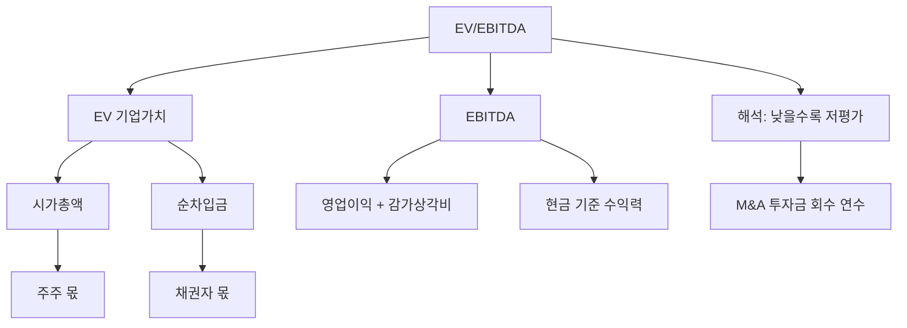

# EV/EBITDA 뜻 — 기업 전체를 사면 몇 년에 회수하나

## 한 줄 정의

EV/EBITDA는 기업가치(EV)를 세전·이자·감가상각 전 이익(EBITDA)으로 나눈 값으로, 기업 전체를 인수했을 때 현금 창출력 기준 몇 년에 투자금을 회수하는지를 보여줍니다.

## 아주 쉽게 말하면

치킨집을 빚까지 포함해 2억에 인수했는데, 감가상각·이자·세금 빼기 전 연간 현금 수익이 5,000만 원이면 EV/EBITDA는 4배(4년 회수)입니다. PER과 비슷하지만 부채까지 포함한 '통째 인수' 관점입니다.

## 왜 중요한가

PER은 자본구조(부채 비중)에 따라 왜곡되지만, EV/EBITDA는 부채를 포함한 기업 전체 가치를 현금 이익으로 나누므로 자본구조에 중립적입니다. M&A 시 실제 인수 가격 판단에 가장 많이 쓰입니다.

## 그림으로 이해하기


```

## 숫자로 보는 예시

> ⚠️ 아래 숫자는 개념 설명을 위한 **가상 예시**이며, 실제 투자 데이터가 아닙니다.

V기업:
- 시가총액: 8,000억 원
- 차입금: 3,000억 원
- 보유 현금: 1,000억 원
- 순차입금: 3,000 - 1,000 = 2,000억 원
- **EV = 8,000 + 2,000 = 10,000억 원**
- 영업이익: 1,500억 원
- 감가상각비: 500억 원
- **EBITDA = 1,500 + 500 = 2,000억 원**
- **EV/EBITDA = 10,000 ÷ 2,000 = 5배**

## 표로 비교하기

| 구분 | PER | EV/EBITDA |
|------|-----|-----------|
| 분자 | 시가총액(주가) | EV(시총+순차입금) |
| 분모 | 순이익 | EBITDA |
| 부채 반영 | × (자본만) | ○ (전체) |
| 감가상각 | 반영(차감) | 미반영(더함) |
| 세금 | 반영 | 미반영 |
| 적합 상황 | 일반 비교 | M&A, 자본구조 다른 기업 비교 |

> ⚠️ 밸류에이션 지표는 투자 판단의 **참고 자료**일 뿐, 특정 수치가 매수·매도 시점을 의미하지 않습니다. 반드시 다른 지표·정성 분석과 함께 종합적으로 판단하세요.

## 초보자가 자주 하는 오해

1. **"EV/EBITDA가 PER보다 항상 정확하다"**
   → 감가상각이 큰 업종(통신, 항공)에서는 EBITDA가 실제 현금흐름을 과대평가할 수 있습니다. 설비 교체가 필수인 기업은 감가상각을 무시하면 안 됩니다.

2. **"EV/EBITDA 5배면 5년이면 원금 회수다"**
   → EBITDA에서 세금·설비투자·이자를 빼야 실제 잉여 현금입니다. 실제 회수 기간은 EV/EBITDA보다 길어집니다. 대략적 비교 도구로 이해하세요.

## 고수는 이렇게 봅니다

숙련된 투자자는 EV/EBITDA를 업종 내 상대 비교에 활용합니다. 같은 업종에서 A사 6배, B사 10배이면 A사가 상대적 저평가로 볼 수 있습니다. 또한 '타겟 EV/EBITDA × 예상 EBITDA - 순차입금 = 적정 시가총액'으로 목표주가를 역산합니다.

## 기업분석에서는 이렇게 씁니다

M&A 거래에서 "이 기업을 EBITDA 몇 배에 인수했나?"가 핵심 협상 포인트입니다. 과거 유사 거래의 EV/EBITDA를 참고해 적정 인수가를 산정하며, 시너지 효과를 반영한 프리미엄을 가감합니다.

## 함께 보면 좋은 용어

- [PER](./per.md) — 이익 기준 밸류에이션 (주주 관점)
- [영업이익](../level-03-financial-statements/operating-income.md) — EBITDA의 출발점
- [FCF](../level-03-financial-statements/fcf.md) — EBITDA보다 보수적인 현금 지표
- [멀티플](./multiple.md) — EV/EBITDA도 멀티플의 한 종류
- [부채비율](../level-04-ratios/debt-ratio.md) — EV에 반영되는 부채 수준

## 정리

EV/EBITDA는 부채를 포함한 기업 전체 가치를 현금 기준 이익으로 나눈 밸류에이션 지표입니다. 자본구조에 중립적이라 M&A와 업종 간 비교에 적합하며, PER과 함께 쓰면 입체적 판단이 가능합니다.

## 한 줄 요약

> EV/EBITDA는 '빚까지 포함해 기업을 통째로 사면 현금 이익으로 몇 년에 회수하나'입니다.

---

*면책 조항: 이 글은 투자 권유가 아니라 주식 용어와 기업분석 방법을 설명하기 위한 교육 콘텐츠입니다. 특정 종목의 매수·매도 판단은 독자 본인의 책임입니다.*

Tags: EV/EBITDA, 기업가치, EBITDA, 밸류에이션, 인수가치
