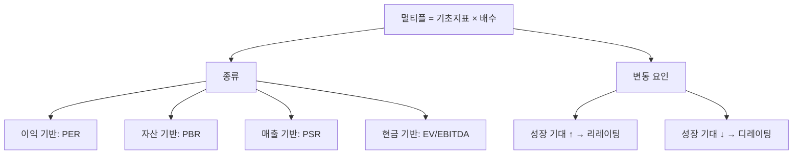

# 멀티플 뜻 — 가치 평가의 '배수'

## 한 줄 정의

멀티플(Multiple)은 기업의 이익·자산·매출 등 기초 지표에 곱하는 배수로, 시장이 해당 기업에 부여하는 프리미엄 수준을 나타냅니다.

## 아주 쉽게 말하면

"이 기업 이익의 20배를 주가로 인정해 줄게"라고 할 때 '20배'가 멀티플입니다. PER, PBR, EV/EBITDA 모두 멀티플의 종류입니다. 시장 기대가 높으면 멀티플이 높고, 낮으면 멀티플이 낮습니다.

## 왜 중요한가

멀티플은 상대 밸류에이션의 핵심 도구입니다. 같은 이익을 내더라도 성장성·시장 지배력·브랜드에 따라 받는 멀티플이 다릅니다. 멀티플 변화(리레이팅/디레이팅)가 주가를 크게 움직입니다.

## 그림으로 이해하기


```

## 숫자로 보는 예시

> ⚠️ 아래 숫자는 개념 설명을 위한 **가상 예시**이며, 실제 투자 데이터가 아닙니다.

같은 업종 기업 비교:
| 기업 | EPS | 멀티플(PER) | 주가 | 이유 |
|------|-----|-----------|------|------|
| A사 | 5,000원 | 10배 | 50,000원 | 저성장, 안정 |
| B사 | 5,000원 | 20배 | 100,000원 | 고성장 기대 |
| C사 | 5,000원 | 30배 | 150,000원 | 시장 지배력 |

→ EPS 동일인데 멀티플 차이로 주가 3배 차이

## 표로 비교하기

| 멀티플 결정 요인 | 높은 멀티플 | 낮은 멀티플 |
|----------------|-----------|-----------|
| 이익 성장률 | 높음 (20%+) | 낮음 (5% 이하) |
| 이익 안정성 | 변동 작음 | 경기 민감, 변동 큼 |
| 시장 지배력 | 1등 기업 | 후발 주자 |
| 산업 전망 | 성장 산업 | 사양 산업 |
| 국가 프리미엄 | 선진국 | 신흥국 (디스카운트) |

> ⚠️ 밸류에이션 지표는 투자 판단의 **참고 자료**일 뿐, 특정 수치가 매수·매도 시점을 의미하지 않습니다. 반드시 다른 지표·정성 분석과 함께 종합적으로 판단하세요.

## 초보자가 자주 하는 오해

1. **"멀티플은 고정된 수치다"**
   → 시장 심리, 금리, 산업 전망에 따라 계속 변합니다. 금리 상승기에는 전체 시장 멀티플이 하락하고, 하락기에는 상승합니다.

2. **"멀티플이 높으면 항상 거품이다"**
   → 성장이 빠르면 높은 멀티플이 정당합니다. 문제는 '성장 기대 대비 과도한 멀티플'이며, PEG로 검증할 수 있습니다.

## 고수는 이렇게 봅니다

숙련된 투자자는 '멀티플 밴드'를 그립니다. 과거 5년간 해당 기업 또는 업종의 PER 고점·저점을 확인하고, 현재 위치를 판단합니다. 하단에 있으면 저평가 가능성을, 상단이면 고평가 가능성을 검토합니다.

## 기업분석에서는 이렇게 씁니다

증권사 리포트에서 "타겟 멀티플 15배 부여"라고 할 때, 그 15배의 근거가 핵심입니다. 동종 업계 평균, 과거 밴드, 글로벌 피어 그룹을 비교해 타겟 멀티플을 설정하고, 여기에 예상 EPS를 곱해 목표주가를 산출합니다.

## 함께 보면 좋은 용어

- [PER](./per.md) — 가장 대표적인 이익 기반 멀티플
- [PBR](./pbr.md) — 자산 기반 멀티플
- [EV/EBITDA](./ev-ebitda.md) — 현금 기반 멀티플
- [리레이팅](./rerating.md) — 멀티플 상향 조정
- [디레이팅](./derating.md) — 멀티플 하향 조정

## 정리

멀티플은 기초 재무 지표에 곱하는 배수로, 시장이 기업에 부여하는 기대(프리미엄)입니다. 같은 업종·유사 기업과 비교하고, 과거 밴드 내 위치를 확인해 적정성을 판단하세요.

## 한 줄 요약

> 멀티플은 '시장이 이 기업에 몇 배를 쳐주느냐'이며, 성장·안정성·시장지위에 따라 결정됩니다.

---

*면책 조항: 이 글은 투자 권유가 아니라 주식 용어와 기업분석 방법을 설명하기 위한 교육 콘텐츠입니다. 특정 종목의 매수·매도 판단은 독자 본인의 책임입니다.*

Tags: 멀티플, 배수, PER, PBR, 밸류에이션
