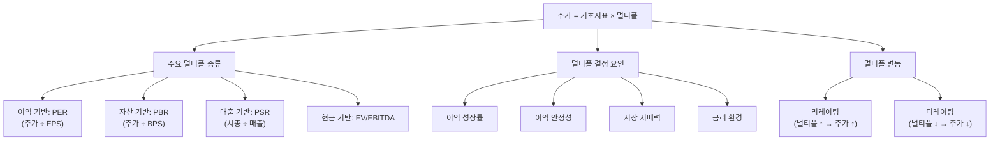

# 멀티플 뜻 — 가치 평가의 '배수'

## 한 줄 정의

멀티플(Multiple)은 기업의 이익·자산·매출 등 기초 지표에 곱하는 배수로, 시장이 해당 기업에 부여하는 프리미엄 수준을 나타냅니다.

## 아주 쉽게 말하면

부동산으로 비유하면, 같은 크기의 아파트라도 강남은 평당 5,000만 원이고 지방은 평당 1,000만 원입니다. 같은 '면적(기초 지표)'인데 '평당 가격(멀티플)'이 다릅니다. 왜? 강남은 입지·학군·미래 발전 가능성이 높으니까요.

주식도 마찬가지입니다. "이 기업 이익의 20배를 주가로 인정하겠다"할 때 '20배'가 바로 멀티플입니다. PER 20배, PBR 3배, EV/EBITDA 10배 — 모두 멀티플의 종류입니다. 시장이 기업에 붙이는 '프리미엄 라벨'이라고 생각하면 됩니다.

## 왜 중요한가

멀티플이 중요한 이유는 세 가지입니다.

**첫째, 주가 변동의 절반을 설명합니다.** 주가 = 기초지표(EPS, BPS 등) × 멀티플이므로, 이익이 그대로여도 멀티플이 2배로 뛰면 주가도 2배입니다. 실적 발표 시즌에 "실적은 좋은데 주가가 빠진다"의 원인이 바로 멀티플 하락(디레이팅)입니다.

**둘째, 상대 비교의 공용 언어입니다.** "이 기업이 비싼가 싼가?"를 판단하려면 비교 대상이 필요합니다. 동종 업계 평균 멀티플, 역사적 멀티플 밴드가 비교의 기준선입니다.

**셋째, 시장 심리의 온도계입니다.** 멀티플이 높으면 시장이 미래를 낙관하고 있고, 낮으면 비관하고 있다는 뜻입니다. 멀티플 추이는 곧 시장 센티먼트의 역사입니다.

## 그림으로 이해하기

## 숫자로 보는 예시

> ⚠️ 아래 숫자는 개념 설명을 위한 **가상 예시**이며, 실제 투자 데이터가 아닙니다.

**같은 업종(온라인 플랫폼) 기업 비교**

| 기업 | EPS | PER(멀티플) | 주가 | 시장이 부여한 이유 |
|------|-----|-----------|------|-----------------|
| A사 | 5,000원 | 10배 | 50,000원 | 성장 정체, 경쟁 심화 |
| B사 | 5,000원 | 20배 | 100,000원 | 안정적 15% 성장 |
| C사 | 5,000원 | 35배 | 175,000원 | 독점적 시장 지위, 30% 성장 |

핵심: EPS가 동일한데 멀티플 차이로 주가가 3.5배 벌어집니다. 투자자가 판단해야 할 것은 "이 멀티플이 정당한가? 과도한가? 부족한가?"입니다.

**멀티플 변동의 위력:**
- B사의 EPS가 5,000 → 5,500원으로 10% 성장
- 동시에 경쟁 심화 우려로 PER이 20배 → 16배로 하락
- 주가: 5,500 × 16 = 88,000원 (기존 100,000원 대비 -12%)
- 이익은 늘었는데 주가는 하락 — 디레이팅의 힘

## 표로 비교하기

| 멀티플 결정 요인 | 높은 멀티플 받는 기업 | 낮은 멀티플 받는 기업 |
|----------------|-------------------|-------------------|
| 이익 성장률 | 20% 이상 고성장 | 5% 이하 저성장 |
| 이익 안정성 | 경기 무관 안정적 | 경기 민감, 변동 큼 |
| 시장 지배력 | 독과점, 1등 기업 | 후발 주자, 점유율 낮음 |
| 산업 전망 | 성장 산업 (AI, 바이오) | 사양 산업 (석탄, 인쇄) |
| 국가 프리미엄 | 선진국 시장 | 신흥국 (코리아 디스카운트 등) |
| 지배구조 | 투명하고 건전 | 불투명, 오너 리스크 |
| 금리 환경 | 저금리 (미래 가치 ↑) | 고금리 (현재 가치 ↑) |

> ⚠️ 밸류에이션 지표는 투자 판단의 **참고 자료**일 뿐, 특정 수치가 매수·매도 시점을 의미하지 않습니다.

## 초보자가 자주 하는 오해

1. **"멀티플은 고정된 수치다"**
   → 시장 심리, 금리, 산업 전망에 따라 계속 변합니다. 동일 기업도 6개월 사이에 PER이 15배에서 25배로 뛸 수 있습니다. "적정 멀티플"은 환경에 따라 달라지는 동적 개념입니다.

2. **"멀티플이 높으면 항상 거품이다"**
   → 이익이 매년 30% 성장하는 기업에 PER 30배는 정당할 수 있습니다. 문제는 '성장 기대 대비 과도한 멀티플'이며, PEG(PER ÷ 성장률)로 검증합니다.

3. **"업종 관계없이 멀티플을 비교해도 된다"**
   → 은행(PER 5~8배)과 IT플랫폼(PER 30~50배)을 직접 비교하면 안 됩니다. 멀티플은 반드시 동종 업계 내에서 비교해야 의미가 있습니다.

4. **"과거 평균 멀티플이 미래에도 적용된다"**
   → 산업 구조가 변하면 멀티플 밴드 자체가 이동합니다. 예를 들어 전통 제조업이 AI 서비스로 전환하면, 과거 PER 10배가 아니라 새로운 밴드(PER 20~30배)가 형성됩니다.

## 고수는 이렇게 봅니다

숙련된 투자자는 멀티플을 세 가지 프레임으로 분석합니다.

**첫째, 역사적 밴드 분석.** 해당 기업의 과거 5년간 PER 상단·하단을 확인하고, 현재 위치를 파악합니다. 하단 20% 구간이면 저평가 가능성을, 상단 20%이면 고평가 가능성을 검토합니다.

**둘째, 피어 그룹(Peer Group) 비교.** 동종 업계 글로벌 기업들의 멀티플 분포와 비교합니다. 한국 기업이 글로벌 피어 대비 할인받고 있다면, 그 할인 폭이 정당한지(코리아 디스카운트) 검토합니다.

**셋째, 멀티플 드라이버 식별.** "왜 이 멀티플인가?"의 핵심 변수를 찾습니다. 예: "이 기업의 PER을 결정하는 핵심 변수는 해외 매출 비중이다. 해외 비중이 30% → 50%로 오르면 PER이 15 → 20배로 리레이팅될 수 있다."

## 기업분석에서는 이렇게 씁니다

증권사 리포트의 적정 주가 산출 과정:

1. **피어 그룹 선정**: 유사 사업 모델·규모·성장률 기업 5~10개
2. **멀티플 조사**: 각 피어의 Forward PER 수집
3. **프리미엄/디스카운트 조정**: 성장률 차이, 시장 지위, 국가 할인 반영
4. **타겟 멀티플 확정**: "동종 평균 18배에서 성장률 프리미엄 2배 적용 → 타겟 PER 20배"
5. **적정 주가 산출**: 예상 EPS × 타겟 멀티플 = 적정 주가

"타겟 멀티플 15배 부여"라고 할 때, 그 15배의 근거(피어 평균, 성장률, 리스크 요인)가 리포트의 핵심 논리입니다.

## 함께 보면 좋은 용어

- [PER](./per.md) — 가장 대표적인 이익 기반 멀티플
- [PBR](./pbr.md) — 자산 기반 멀티플
- [EV/EBITDA](./ev-ebitda.md) — 현금 기반 멀티플
- [리레이팅](./rerating.md) — 멀티플 상향 조정
- [디레이팅](./derating.md) — 멀티플 하향 조정

## 정리

멀티플은 기초 재무 지표에 곱하는 배수로, 시장이 기업에 부여하는 기대(프리미엄)입니다. 주가 변동의 절반은 멀티플 변동에서 옵니다. 같은 업종·유사 기업과 비교하고, 역사적 밴드 내 위치를 확인하며, 멀티플을 움직이는 핵심 드라이버를 식별하는 것이 밸류에이션의 정수입니다.

## 한 줄 요약

> 멀티플은 '시장이 이 기업에 몇 배를 쳐주느냐'이며, 성장·안정성·시장지위·금리 환경에 따라 끊임없이 변합니다.

---

이 글은 투자 권유가 아니라 주식 용어와 기업분석 방법을 설명하기 위한 교육 콘텐츠입니다. 특정 종목의 매수·매도 판단은 독자 본인의 책임입니다.

Tags: 멀티플, 배수, 주가수익비율, 주가순자산비율, 밸류에이션
