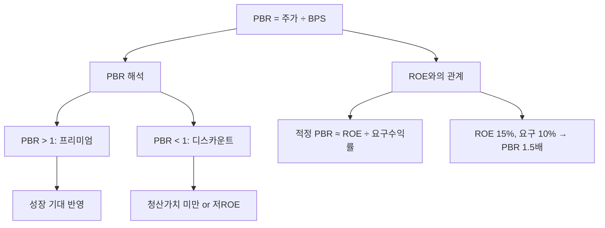

# PBR 뜻 — 자산 대비 주가가 몇 배인가

## 한 줄 정의

PBR(Price to Book Ratio)은 주가를 주당순자산(BPS)으로 나눈 값으로, 기업의 장부상 자산가치 대비 시장이 매기는 가격 배수입니다.

## 아주 쉽게 말하면

회사를 지금 당장 청산하면 주당 10,000원이 돌아오는데, 주가가 15,000원이면 PBR은 1.5배입니다. 1배 미만이면 회사를 해산해서 나눠 갖는 게 주식 사는 것보다 이득이라는 뜻입니다.

## 왜 중요한가

PBR 1배 미만은 시장이 기업의 자산가치조차 인정하지 않는다는 의미로, 극단적 저평가이거나 미래 이익 전망이 암울하다는 뜻입니다. 한국 시장의 '코리아 디스카운트' 논의의 핵심 지표이기도 합니다.

## 그림으로 이해하기


```

## 숫자로 보는 예시

> ⚠️ 아래 숫자는 개념 설명을 위한 **가상 예시**이며, 실제 투자 데이터가 아닙니다.

R기업:
- 주가: 40,000원
- 자본총계: 2조 원
- 발행주식수: 1억 주
- BPS = 2조 ÷ 1억 = 20,000원
- **PBR = 40,000 ÷ 20,000 = 2.0배**

→ 시장이 장부가치의 2배를 지불 (성장성·수익성 프리미엄)

## 표로 비교하기

| PBR 수준 | 일반적 해석 | 대표 사례 |
|----------|-----------|----------|
| 0.5배 미만 | 극단적 저평가 or 구조적 문제 | 만년 저ROE 기업 |
| 0.5~1.0배 | 자산가치 미만 거래 | 한국 은행·지주사 |
| 1.0~2.0배 | 적정 수준 | 대부분 우량 대기업 |
| 2.0~5.0배 | 성장 프리미엄 | 고ROE 소비재·IT |
| 5배 이상 | 높은 성장 기대 | 플랫폼, 바이오 |

> ⚠️ 밸류에이션 지표는 투자 판단의 **참고 자료**일 뿐, 특정 수치가 매수·매도 시점을 의미하지 않습니다. 반드시 다른 지표·정성 분석과 함께 종합적으로 판단하세요.

## 초보자가 자주 하는 오해

1. **"PBR 1배 미만이면 무조건 저평가다"**
   → ROE가 자본비용보다 낮으면 PBR 1배 미만이 정당합니다. 매년 자본을 까먹는 기업은 청산가치도 계속 줄어듭니다.

2. **"PBR은 모든 업종에 동일하게 적용된다"**
   → 자산 중심 업종(은행, 부동산)은 PBR이 의미 있지만, 무형자산 중심(IT, 바이오)은 장부가 자산을 과소 반영해 PBR이 높게 나옵니다.

## 고수는 이렇게 봅니다

숙련된 투자자는 ROE-PBR 맵을 그립니다. 같은 업종에서 ROE는 비슷한데 PBR이 유독 낮은 기업을 찾으면 저평가 후보입니다. 또한 PBR 밴드(과거 5년 PBR 고점·저점)를 그려 현재 위치를 판단합니다.

## 기업분석에서는 이렇게 씁니다

금융주·지주사 밸류에이션에서 핵심 지표입니다. "목표 PBR × BPS = 적정 주가"로 산정하며, 목표 PBR은 ROE 전망, 배당성향, 자사주 정책을 반영해 설정합니다. 밸류업 프로그램 수혜주 선별에도 활용합니다.

## 함께 보면 좋은 용어

- [BPS](./bps.md) — PBR의 분모, 주당순자산
- [ROE](../level-04-ratios/roe.md) — PBR의 이론적 결정 요인
- [PER](./per.md) — 이익 기준 밸류에이션 (PBR과 보완 관계)
- [자본](../level-03-financial-statements/equity.md) — BPS 계산의 기초
- [밸류 트랩](../level-10-company-analysis/value-trap.md) — 낮은 PBR의 함정

## 정리

PBR은 자산가치 대비 주가 수준을 보여주며, ROE와 밀접한 관계가 있습니다. PBR이 낮다고 무조건 저평가가 아니라, ROE 대비 PBR이 부당하게 낮은 기업을 찾는 것이 핵심입니다.

## 한 줄 요약

> PBR은 '장부가 자산 대비 주가 배수'이며, ROE가 높은데 PBR이 낮은 기업이 진짜 저평가 후보입니다.

---

*면책 조항: 이 글은 투자 권유가 아니라 주식 용어와 기업분석 방법을 설명하기 위한 교육 콘텐츠입니다. 특정 종목의 매수·매도 판단은 독자 본인의 책임입니다.*

Tags: PBR, 주가순자산비율, BPS, 밸류에이션, 자산가치
