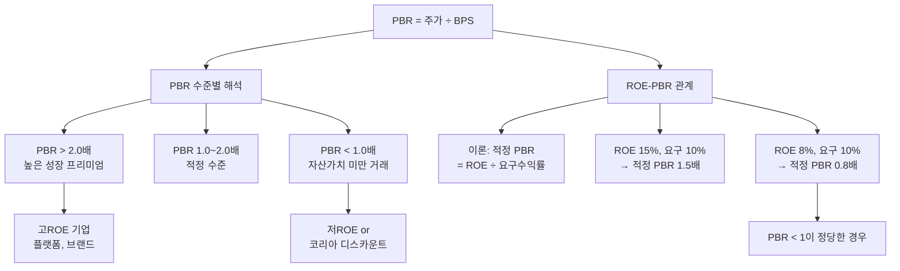

# PBR 뜻 — 자산 대비 주가가 몇 배인가

## 한 줄 정의

PBR(Price to Book Ratio)은 주가를 주당순자산(BPS)으로 나눈 값으로, 기업의 장부상 자산가치 대비 시장이 매기는 가격 배수입니다.

## 아주 쉽게 말하면

중고차를 살 때를 생각해 보세요. 차량의 '잔존 가치'(장부가)가 2,000만 원인데, 인기 차종이라 중고 시장에서 2,500만 원에 거래됩니다. 이 차의 PBR은 1.25배입니다. 반대로 비인기 차종은 잔존 가치 2,000만 원인데 1,500만 원에도 안 팔리면 PBR 0.75배입니다.

주식도 마찬가지입니다. 회사를 지금 당장 정리하면 주당 10,000원(BPS)이 돌아오는데, 주가가 15,000원이면 PBR 1.5배 — 시장이 미래 수익 가능성까지 더 인정해주는 것입니다. 주가가 8,000원이면 PBR 0.8배 — 시장이 장부가치조차 인정해주지 않는 것입니다.

## 왜 중요한가

PBR이 중요한 이유는 세 가지입니다.

**첫째, 가치 평가의 '바닥선'을 보여줍니다.** PBR 1배 미만은 시장이 기업의 순자산가치조차 인정하지 않는다는 뜻입니다. 극단적 저평가이거나, 미래 이익 전망이 암울해 자산 가치가 더 줄어들 것이라는 시장의 판단입니다.

**둘째, 한국 시장의 구조적 이슈(코리아 디스카운트)의 핵심 지표입니다.** 한국 상장사의 상당수가 PBR 1배 미만에서 거래되며, 밸류업 프로그램의 목표가 바로 이 PBR 개선입니다.

**셋째, ROE와의 관계로 저평가를 판별합니다.** 이론적으로 적정 PBR ≈ ROE ÷ 주주 요구수익률입니다. ROE가 높은데 PBR이 낮은 기업은 시장이 아직 가치를 인식하지 못한 저평가 후보입니다.

## 그림으로 이해하기

## 숫자로 보는 예시

> ⚠️ 아래 숫자는 개념 설명을 위한 **가상 예시**이며, 실제 투자 데이터가 아닙니다.

**가상 기업 비교: ROE-PBR 맵 활용**

| 기업 | ROE | BPS | 주가 | PBR | 판단 |
|------|-----|-----|------|-----|------|
| A은행 | 9% | 50,000원 | 35,000원 | 0.7배 | ROE가 요구수익률(10%) 미만 → PBR<1 정당 |
| B지주 | 12% | 80,000원 | 56,000원 | 0.7배 | ROE 12%인데 PBR 0.7 → 저평가 가능성 |
| C플랫폼 | 25% | 15,000원 | 60,000원 | 4.0배 | 높은 ROE → 높은 PBR 정당 |
| D제조 | 5% | 30,000원 | 18,000원 | 0.6배 | 만년 저ROE → 밸류 트랩 가능성 |

핵심 발견: B지주가 가장 흥미롭습니다. ROE 12%(요구수익률 10% 초과)인데 PBR이 0.7배로 이론 적정(1.2배) 대비 42% 할인 → 코리아 디스카운트 or 숨은 리스크 확인 필요.

**PBR 밴드 활용:**
- B지주의 과거 5년 PBR 밴드: 0.5~1.0배
- 현재 0.7배는 밴드 중간 → 역사적으로는 적정 수준
- 그러나 ROE 개선 추세(8% → 12%)를 감안하면 밴드 자체가 상향 이동해야 할 수도

## 표로 비교하기

| PBR 수준 | 일반적 해석 | 대표 사례 | ROE 조건 |
|----------|-----------|----------|---------|
| 0.3~0.5배 | 극단적 디스카운트 | 만성 적자, 구조조정 기업 | ROE < 3% |
| 0.5~1.0배 | 자산가치 미만 거래 | 은행, 지주사, 중후장대 | ROE 5~10% |
| 1.0~2.0배 | 적정 프리미엄 | 대부분 우량 대기업 | ROE 10~15% |
| 2.0~5.0배 | 성장 프리미엄 | 고ROE 소비재, IT | ROE 15~30% |
| 5배 이상 | 미래 기대 프리미엄 | 플랫폼, 바이오 | ROE 30%+ or 성장 기대 |

> ⚠️ 밸류에이션 지표는 투자 판단의 **참고 자료**일 뿐, 특정 수치가 매수·매도 시점을 의미하지 않습니다.

## 초보자가 자주 하는 오해

1. **"PBR 1배 미만이면 무조건 저평가다"**
   → ROE가 자본비용(주주 요구수익률)보다 낮으면 PBR < 1이 이론적으로 정당합니다. "자본을 투입해도 기대만큼 못 버는 기업"은 청산가치 이하로 거래되는 게 합리적입니다.

2. **"PBR은 모든 업종에 동일하게 적용된다"**
   → 자산 중심 업종(은행, 부동산, 보험)은 PBR이 핵심 밸류에이션 도구이지만, 무형자산 중심 업종(IT, 바이오, 게임)은 핵심 자산(기술, 인력, 데이터)이 장부에 반영되지 않아 PBR이 높게 나옵니다.

3. **"PBR이 낮아지면 매수 타이밍이다"**
   → 이익이 줄면 BPS도 감소해 PBR이 계속 높아질 수 있습니다(분모 감소). 반대로 주가 하락 속도가 BPS 감소 속도보다 빠르면 PBR이 낮아지면서 동시에 펀더멘털도 악화될 수 있습니다.

4. **"PBR = 실제 청산 시 받는 비율이다"**
   → BPS는 장부가치일 뿐입니다. 실제 청산 시 공장은 헐값에 팔리고, 브랜드 가치는 산정이 어렵습니다. PBR은 이론적 참고치이지 실제 청산 시나리오가 아닙니다.

## 고수는 이렇게 봅니다

숙련된 투자자는 PBR을 세 가지 도구로 활용합니다.

**첫째, ROE-PBR 산점도.** 동일 업종 기업들을 ROE(X축)-PBR(Y축)에 찍어, 회귀선 아래에 있는 기업(ROE 대비 PBR이 낮은 기업)을 저평가 후보로 식별합니다.

**둘째, PBR 밴드 분석.** 해당 기업의 5년간 PBR 고점·저점을 밴드로 그리고, 현재 위치를 확인합니다. 밴드 하단은 역사적 저평가 구간이고, 상단은 고평가 구간입니다. 단, 밴드 자체가 이동할 수 있음을 인식합니다.

**셋째, 밸류업 카탈리스트 확인.** PBR < 1인 기업 중 자사주 매입·소각, 배당 확대, ROE 개선 계획을 발표하는 기업은 PBR 리레이팅의 트리거를 갖춘 것입니다.

## 기업분석에서는 이렇게 씁니다

금융주·지주사 밸류에이션의 표준 방법:

1. 대상 기업의 지속 가능 ROE 추정
2. 동종 글로벌 피어 ROE-PBR 회귀 분석
3. 한국 디스카운트 반영 (통상 20~30% 할인)
4. 목표 PBR 설정 (예: "지속 ROE 12%, 목표 PBR 0.9배")
5. 적정 주가 = 목표 PBR × 예상 BPS

밸류업 프로그램 수혜주 선별:
- 기준: PBR < 1 + ROE > 10% + 자사주 매입/소각 계획 + 배당성향 확대
- 이 조건을 모두 충족하면 PBR 리레이팅 기대감으로 시장 관심을 받습니다

## 함께 보면 좋은 용어

- [BPS](./bps.md) — PBR의 분모, 주당순자산
- [ROE](../level-04-ratios/roe.md) — PBR의 이론적 결정 요인
- [PER](./per.md) — 이익 기준 밸류에이션 (PBR과 보완 관계)
- [자본](../level-03-financial-statements/equity.md) — BPS 계산의 기초
- [밸류 트랩](../level-10-company-analysis/value-trap.md) — 낮은 PBR의 함정

## 정리

PBR은 자산가치 대비 주가 수준을 보여주며, ROE와 밀접한 관계가 있습니다. PBR이 낮다고 무조건 저평가가 아니라, ROE 대비 PBR이 부당하게 낮은 기업을 찾는 것이 핵심입니다. ROE-PBR 산점도, PBR 밴드, 밸류업 카탈리스트를 종합하면 진짜 저평가 기회를 식별할 수 있습니다.

## 한 줄 요약

> PBR은 '장부가 자산 대비 주가 배수'이며, ROE가 높은데 PBR이 낮은 기업이 진짜 저평가 후보입니다.

---

이 글은 투자 권유가 아니라 주식 용어와 기업분석 방법을 설명하기 위한 교육 콘텐츠입니다. 특정 종목의 매수·매도 판단은 독자 본인의 책임입니다.

Tags: 주가순자산비율, 순자산가치, 주당순자산, 저평가, 밸류에이션
