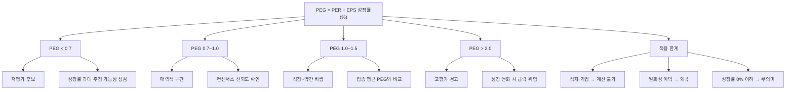

# PEG 뜻 — 성장률 대비 PER이 적정한가

## 한 줄 정의

PEG(Price/Earnings to Growth)는 PER을 EPS 성장률로 나눈 값으로, 성장 속도를 감안한 밸류에이션 적정성을 판단하는 지표입니다.

## 아주 쉽게 말하면

PER 30배 기업이 비싸 보여도, 이익이 매년 30%씩 성장한다면 PEG는 1배로 적정합니다. "비싼지 싼지" PER만으로 판단이 어려울 때, 성장률을 분모에 넣어서 가격의 타당성을 확인하는 도구라고 보면 됩니다. 피터 린치가 "PER이 이익성장률과 같으면 적정"이라고 말한 데서 유래한, 직관적이면서도 강력한 기준입니다.

## 왜 중요한가

성장주 투자에서 가장 흔한 실수는 "PER이 높으니까 비싸다"라는 단순 판단입니다. 매년 40% 성장하는 기업의 PER 40배는 PEG 1.0으로 적정 수준이지만, 5% 성장하는 기업의 PER 20배는 PEG 4.0으로 상당히 비쌉니다. PEG는 이 차이를 한 숫자로 보여줍니다. 특히 고성장 섹터(IT, 바이오, 2차전지) 종목을 비교할 때, PER 단독보다 PEG를 함께 보면 "성장에 비해 어떤 종목이 더 저평가인지" 빠르게 스크리닝할 수 있습니다.

## 그림으로 이해하기

## 숫자로 보는 예시

> ⚠️ 아래 숫자는 개념 설명을 위한 **가상 예시**이며, 실제 투자 데이터가 아닙니다.

가상 기업 '퓨처소프트'를 통해 PEG 활용 과정을 살펴보겠습니다.

**퓨처소프트 기본 정보**
- 현재 주가: 60,000원
- 최근 12개월 EPS: 2,000원 → PER = 30배
- 향후 3년 컨센서스 EPS 성장률: 연평균 35%

**PEG 계산**
- PEG = 30 ÷ 35 = 0.86

PER 30배만 보면 "비싸다"고 느낄 수 있지만, 35% 성장률을 감안하면 PEG 0.86으로 오히려 저평가 구간입니다.

**동일 업종 비교**

| 기업 | PER | EPS 성장률 | PEG | 해석 |
|------|-----|-----------|-----|------|
| 퓨처소프트 | 30배 | 35% | 0.86 | 성장 대비 저평가 |
| A소프트 | 15배 | 5% | 3.00 | 저성장 대비 비쌈 |
| B클라우드 | 45배 | 50% | 0.90 | 고성장 반영 적정 |
| C테크 | 25배 | 10% | 2.50 | 성장 둔화 우려 |

→ PER만 보면 A소프트가 가장 싸지만, PEG로 보면 퓨처소프트와 B클라우드가 성장 대비 매력적입니다.

## 표로 비교하기

| 구분 | PER 단독 판단 | PEG 보완 판단 |
|------|-------------|-------------|
| 성장주 평가 | 항상 비싸 보임 | 성장 반영 후 재평가 가능 |
| 가치주 평가 | 항상 싸 보임 | 저성장 반영 후 재평가 |
| 업종 간 비교 | 업종 특성 무시 | 성장률 차이 반영 |
| 시간 요소 | 현재 이익만 반영 | 미래 성장 기대 반영 |
| 한계 | 성장 무시 | 성장률 추정에 의존 |
| 최적 활용 대상 | 이익 안정 기업 | 이익 성장 중인 기업 |

> ⚠️ 밸류에이션 지표는 투자 판단의 **참고 자료**일 뿐, 특정 수치가 매수·매도 시점을 의미하지 않습니다. 반드시 다른 지표·정성 분석과 함께 종합적으로 판단하세요.

## 초보자가 자주 하는 오해

1. **"PEG 1 미만이면 무조건 저평가다"**
   → 성장률 추정이 과도하면 PEG가 낮게 산출됩니다. 증권사 컨센서스가 지나치게 낙관적이진 않은지, 일회성 이익이 성장률을 부풀리지 않았는지 반드시 검증해야 합니다.

2. **"PEG는 적자 기업에도 쓸 수 있다"**
   → 적자이면 PER이 음수라 PEG 계산 자체가 불가능합니다. EPS가 양수이고 지속적으로 성장 중인 기업에만 유의미합니다.

3. **"성장률은 과거 실적만 보면 된다"**
   → 과거 성장률이 미래에도 유지된다는 보장이 없습니다. 시장 포화, 경쟁 심화, 기저효과 소멸 등으로 성장률이 급감하면 PEG도 급등합니다.

4. **"PEG가 낮으면 바로 매수해도 된다"**
   → PEG는 스크리닝 도구이지 최종 판단 근거가 아닙니다. 사업 모델의 지속 가능성, 경쟁 우위, 재무 건전성을 함께 확인해야 합니다.

## 고수는 이렇게 봅니다

숙련된 투자자는 **'어떤 성장률을 쓰느냐'**에 가장 민감합니다. 같은 기업이라도 과거 3년 CAGR, 향후 1년 추정치, 향후 3년 컨센서스 평균 중 어느 것을 쓰느냐에 따라 PEG가 0.7에서 2.0까지 달라질 수 있습니다.

실무적으로는 **향후 2~3년 컨센서스 평균 EPS 성장률**을 기본으로 사용하면서, "만약 성장률이 절반으로 줄면 PEG가 얼마가 되는가?"라는 보수적 시나리오를 함께 점검합니다. 또한 PEG를 동일 업종 내 상대 비교에 활용하되, 업종이 다르면 적정 PEG 수준도 달라진다는 점을 인지합니다(예: IT 섹터 PEG 1.5 vs 유틸리티 PEG 2.5는 의미가 다릅니다).

## 기업분석에서는 이렇게 씁니다

성장주 스크리닝 단계에서 "PEG 1.0 미만 + 매출 성장률 20% 이상 + 영업이익 흑자 전환" 같은 조합 필터를 적용합니다. 이렇게 걸러진 종목 리스트에서 사업 모델, 경쟁 구도, 경영진 역량을 정성적으로 분석하여 최종 후보를 좁힙니다.

반대로 기존 보유 종목의 PEG가 2.0을 초과하기 시작하면, 시장이 성장률 대비 과도한 프리미엄을 부여하고 있을 가능성을 점검합니다. 이때 "실제 성장률이 기대에 부합하고 있는가?"를 분기 실적마다 확인하는 것이 핵심입니다.

## 함께 보면 좋은 용어

- [PER](./per.md) — PEG의 분자
- [EPS](./eps.md) — 성장률 계산의 기초
- [컨센서스](../level-08-industry-macro/consensus.md) — EPS 성장률 예상치
- [멀티플](./multiple.md) — PEG도 멀티플 판단의 보조 도구
- [리레이팅](./rerating.md) — PEG 개선이 리레이팅의 원인

## 정리

PEG는 PER을 성장률로 나눠 '성장 대비 가격'을 판단하는 도구입니다. 1 미만이면 저평가 후보이지만, 핵심은 분모인 성장률 추정의 신뢰도입니다. 과거 실적과 미래 컨센서스를 교차 검증하고, 보수적 시나리오에서도 PEG가 합리적인지 확인하는 습관이 필요합니다.

## 한 줄 요약

> PEG는 'PER이 성장 속도에 비해 싼지 비싼지'를 판단하며, 1 미만이면 저평가 후보이되 성장률 추정의 신뢰도가 핵심입니다.

---

이 글은 투자 권유가 아니라 주식 용어와 기업분석 방법을 설명하기 위한 교육 콘텐츠입니다. 특정 종목의 매수·매도 판단은 독자 본인의 책임입니다.

Tags: 주가수익성장비율, 주가수익비율, 성장률, 밸류에이션, 피터린치
