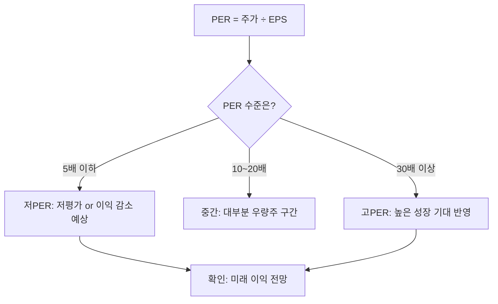

# PER 뜻 — 이익 대비 주가가 몇 배인가

## 한 줄 정의

PER(Price to Earnings Ratio, 주가수익비율)은 주가를 주당순이익(EPS)으로 나눈 값으로, 현재 이익 기준 투자금 회수에 몇 년 걸리는지를 나타냅니다.

## 아주 쉽게 말하면

치킨집을 1억 원에 인수했는데 연 순이익이 2,000만 원이면, 본전 뽑는 데 5년 걸립니다. 이때 PER은 5배입니다.

PER이 낮을수록 현재 이익 대비 주가가 싸다는 뜻이지만, "왜 싼지"를 반드시 확인해야 합니다.

## 왜 중요한가

- **가장 보편적인 밸류에이션 도구**: 증권사 리포트 대부분이 PER을 기본 지표로 사용합니다.
- **비교 기준**: 같은 업종 기업끼리 PER을 비교하면 상대적 고평가·저평가를 가늠할 수 있습니다.
- **기대 반영**: 성장 기대가 높은 기업은 PER이 높고, 낮은 기업은 PER이 낮습니다.

## 그림으로 이해하기

_PER 숫자 자체보다 "왜 그 수준인지"를 확인하는 것이 핵심입니다._

## 숫자로 보는 예시

> ⚠️ 아래 숫자는 개념 설명을 위한 **가상 예시**이며, 실제 투자 데이터가 아닙니다.

Q기업(가상):
- 주가: 50,000원
- EPS(주당순이익): 5,000원
- **PER = 50,000 ÷ 5,000 = 10배**

동종 업계 평균 PER이 15배라면:
- 업계 평균 기준 적정 주가 = 5,000 × 15 = 75,000원
- 현재 50,000원은 업계 대비 상대적으로 낮은 밸류에이션

## 표로 비교하기

| PER 수준 | 일반적 해석 | 주의점 |
|----------|-----------|--------|
| 5배 미만 | 매우 낮은 밸류에이션 | 이익 급감 예상일 수 있음 (밸류 트랩) |
| 5~10배 | 저평가 후보 | 성숙·저성장 업종인 경우가 많음 |
| 10~20배 | 시장 평균 수준 | 대부분 우량주가 이 구간에 위치 |
| 20~40배 | 성장 기대 반영 | 기대만큼 실적이 따라와야 정당화됨 |
| 40배 이상 | 높은 성장 프리미엄 | 실적 미달 시 급락 가능성 |

> ⚠️ 밸류에이션 지표는 투자 판단의 **참고 자료**일 뿐, 특정 수치가 매수·매도 시점을 의미하지 않습니다. 반드시 다른 지표·정성 분석과 함께 종합적으로 판단하세요.

## 초보자가 자주 하는 오해

**오해 1: PER이 낮으면 좋은 주식이다**

PER이 낮은 데는 이유가 있습니다. 내년 이익이 급감할 것으로 예상되면 시장이 미리 할인합니다. 이를 '밸류 트랩(Value Trap)'이라 합니다. 미래 이익 전망과 함께 봐야 합니다.

**오해 2: 적자 기업은 PER이 0이다**

적자 기업은 EPS가 음수이므로 PER을 계산할 수 없습니다(N/A). 이 경우 PSR(매출 기준)이나 PBR(자산 기준) 등 다른 지표를 사용합니다.

## 고수는 이렇게 봅니다

- **선행 PER(Forward PER)**: 과거 실적이 아닌 향후 12개월 예상 EPS로 계산합니다. 미래 가치를 더 잘 반영합니다.
- **PEG 비율**: PER ÷ 이익 성장률. PER이 30이어도 성장률이 30%면 PEG는 1로 적정 수준입니다.
- **PER 밴드 분석**: 과거 5년간 PER 범위를 보고, 현재가 역사적으로 어느 위치인지 확인합니다.

## 기업분석에서는 이렇게 씁니다

적정 주가를 추정할 때 "타겟 PER × 예상 EPS = 적정 주가" 공식을 사용합니다.

- 타겟 PER: 업종 평균, 과거 밴드, 성장률을 고려해 설정
- 예상 EPS: 애널리스트 컨센서스 또는 자체 추정치
- 증권사 리포트 대부분이 이 방식으로 목표 가격대를 제시합니다

## 함께 보면 좋은 용어

- [EPS](./eps.md): PER의 분모, 주당순이익
- [PBR](./pbr.md): 자산 기준 밸류에이션
- [PSR](./psr.md): 매출 기준 밸류에이션 (적자 기업 대안)
- [PEG](./peg.md): PER ÷ 성장률로 성장 반영
- [밸류 트랩](../level-10-company-analysis/value-trap.md): 낮은 PER의 함정
- [파이썬으로 계산해보기](./per-data-practice.md): 실제 데이터로 PER 직접 계산

## 정리

- PER은 "이익 대비 주가 수준"을 한 숫자로 보여주는 밸류에이션 지표이다.
- 절대 수치보다 동종 업계 비교, 역사적 밴드, 미래 이익 전망과 함께 판단해야 의미가 있다.
- 낮은 PER이 항상 좋은 것은 아니다. "왜 낮은지"가 핵심이다.

## 한 줄 요약

> PER은 '이익 기준 몇 년이면 투자금을 회수하나'이며, 낮다고 좋은 게 아니라 '왜 낮은지'를 확인하는 것이 핵심입니다.

---

이 글은 투자 권유가 아니라 주식 용어와 기업분석 방법을 설명하기 위한 교육 콘텐츠입니다. 특정 종목의 매수·매도 판단은 독자 본인의 책임입니다.

Tags: 주가수익비율, 주당순이익, 밸류에이션, 적정주가, 기업분석
