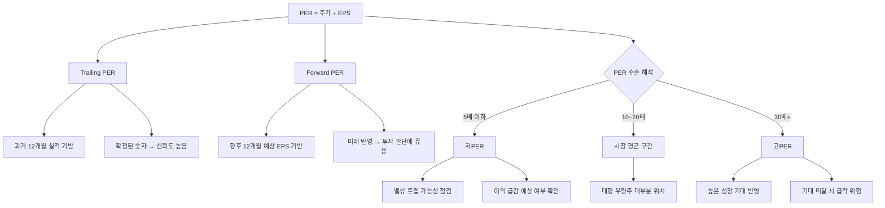

# PER 뜻 — 이익 대비 주가가 몇 배인가

## 한 줄 정의

PER(Price to Earnings Ratio, 주가수익비율)은 주가를 주당순이익(EPS)으로 나눈 값으로, 현재 이익 기준 투자금 회수에 몇 년 걸리는지를 나타냅니다.

## 아주 쉽게 말하면

치킨집을 1억 원에 인수했는데 연 순이익이 2,000만 원이면, 본전 뽑는 데 5년 걸립니다. 이때 PER은 5배입니다. 같은 골목에 있는 피자집은 1억 원에 순이익 1,000만 원이라 PER 10배입니다. 누가 더 "이익 대비 싸게 산 건가"를 보여주는 숫자, 그게 PER입니다.

다만 PER이 낮다고 무조건 좋은 건 아닙니다. "왜 싼지"를 반드시 확인해야 합니다. 내년에 손님이 반으로 줄 치킨집이라 싼 것일 수도 있으니까요.

## 왜 중요한가

PER은 주식 세계의 '만능 자'입니다. 증권사 리포트 10편을 열면 10편 모두 PER을 언급합니다. 이유는 세 가지입니다.

첫째, **비교가 쉽습니다**. 같은 업종 기업끼리 PER을 나란히 놓으면 누가 상대적으로 싸고 비싼지 직관적으로 드러납니다. 둘째, **시장의 기대를 읽을 수 있습니다**. 고성장이 기대되는 기업은 PER이 높고, 성장 둔화가 예상되면 PER이 낮아집니다. 셋째, **적정 주가 추정의 출발점**이 됩니다. "업종 평균 PER × 예상 EPS = 적정 주가"라는 가장 기본적인 밸류에이션 공식의 핵심 변수입니다.

## 그림으로 이해하기

## 숫자로 보는 예시

> ⚠️ 아래 숫자는 개념 설명을 위한 **가상 예시**이며, 실제 투자 데이터가 아닙니다.

가상 기업 '코리아반도체'로 PER 활용 과정을 살펴보겠습니다.

**코리아반도체 기본 정보**
- 현재 주가: 80,000원
- 최근 12개월 EPS: 4,000원
- Trailing PER = 80,000 ÷ 4,000 = **20배**

**Forward PER 계산**
- 내년 예상 EPS(컨센서스): 6,000원
- Forward PER = 80,000 ÷ 6,000 = **13.3배**

Trailing으로 보면 20배로 "보통"이지만, Forward로 보면 13.3배로 "저평가 후보"입니다. 이 차이는 시장이 이미 내년 이익 성장을 기대하고 있다는 신호입니다.

**동종 업계 비교**

| 기업 | 주가 | EPS | PER | Forward PER | 해석 |
|------|------|-----|-----|------------|------|
| 코리아반도체 | 80,000 | 4,000 | 20배 | 13.3배 | 성장 기대 반영 |
| A칩 | 30,000 | 5,000 | 6배 | 7배 | 이익 감소 예상(밸류 트랩 주의) |
| B메모리 | 120,000 | 3,000 | 40배 | 20배 | 회복 기대 높음 |
| C파운드리 | 50,000 | 2,500 | 20배 | 15배 | 업계 평균 수준 |

→ PER만 보면 A칩이 싸지만, Forward PER도 낮아지지 않는다면 성장 없이 싼 것(밸류 트랩)일 가능성이 있습니다.

## 표로 비교하기

| 구분 | Trailing PER | Forward PER |
|------|-------------|-------------|
| 기반 데이터 | 과거 12개월 확정 실적 | 향후 12개월 예상 실적 |
| 장점 | 확정 수치, 왜곡 적음 | 미래 이익 변화 선반영 |
| 단점 | 과거만 반영, 전환점 놓침 | 추정치 의존, 오류 가능 |
| 활용 시점 | 안정적 이익 기업 평가 | 성장·회복 기업 평가 |
| 주의점 | 일회성 이익으로 왜곡 가능 | 컨센서스 신뢰도 검증 필요 |

> ⚠️ 밸류에이션 지표는 투자 판단의 **참고 자료**일 뿐, 특정 수치가 매수·매도 시점을 의미하지 않습니다. 반드시 다른 지표·정성 분석과 함께 종합적으로 판단하세요.

## 초보자가 자주 하는 오해

1. **"PER이 낮으면 좋은 주식이다"**
   → PER이 낮은 데는 이유가 있습니다. 내년 이익이 급감할 것으로 예상되면 시장이 미리 할인합니다. 이를 '밸류 트랩(Value Trap)'이라 부릅니다. 반드시 미래 이익 전망과 함께 봐야 합니다.

2. **"적자 기업은 PER이 0이다"**
   → 적자 기업은 EPS가 음수이므로 PER 자체를 계산할 수 없습니다(N/A). 이 경우 PSR(매출 기준)이나 PBR(자산 기준) 등 대체 지표를 사용합니다.

3. **"업종이 달라도 PER을 비교할 수 있다"**
   → IT(PER 30~40배)와 은행(PER 5~8배)을 직접 비교하면 안 됩니다. 업종마다 성장률과 수익 구조가 다르기 때문에, PER 비교는 반드시 동종 업계 내에서 해야 의미가 있습니다.

4. **"PER이 높으면 무조건 버블이다"**
   → 매년 50% 성장하는 기업의 PER 50배는 PEG 1.0으로 적정 수준일 수 있습니다. "왜 높은지"를 성장률과 함께 판단해야 합니다.

## 고수는 이렇게 봅니다

숙련된 투자자는 PER을 **세 가지 렌즈**로 동시에 봅니다.

첫째, **PER 밴드 분석**. 과거 5년간 해당 기업의 PER 범위(예: 8~25배)를 파악하고, 현재 PER이 역사적으로 어느 위치인지 확인합니다. 밴드 하단이면 저평가 구간일 가능성이 높습니다.

둘째, **Forward PER 활용**. 과거 실적이 아닌 향후 12개월 예상 EPS로 계산합니다. 실적 전환점에 있는 기업은 Trailing PER과 Forward PER 차이가 크므로, Forward를 우선 참고합니다.

셋째, **PEG로 성장률 보정**. PER ÷ 이익성장률을 계산해 "이 PER이 성장 속도에 비해 적절한가"를 판단합니다.

## 기업분석에서는 이렇게 씁니다

적정 주가를 추정할 때 가장 기본이 되는 공식은 "타겟 PER × 예상 EPS = 적정 주가"입니다.

- **타겟 PER 설정**: 업종 평균 PER, 과거 5년 밴드 중간값, 경쟁사 PER을 종합해 설정합니다.
- **예상 EPS**: 애널리스트 컨센서스 또는 보수적 자체 추정치를 사용합니다.
- **시나리오 분석**: 낙관(업종 상단 PER) / 중립(평균 PER) / 비관(하단 PER) 세 가지로 적정 가격대를 산출합니다.

증권사 리포트 대부분이 이 방식으로 적정 가격대를 제시하므로, PER의 작동 원리를 이해하면 리포트를 비판적으로 읽을 수 있습니다.

## 함께 보면 좋은 용어

- [EPS](./eps.md) — PER의 분모, 주당순이익
- [PBR](./pbr.md) — 자산 기준 밸류에이션
- [PSR](./psr.md) — 매출 기준 밸류에이션 (적자 기업 대안)
- [PEG](./peg.md) — PER ÷ 성장률로 성장 반영
- [밸류 트랩](../level-10-company-analysis/value-trap.md) — 낮은 PER의 함정
- [파이썬으로 계산해보기](./per-data-practice.md) — 실제 데이터로 PER 직접 계산

## 정리

PER은 "이익 대비 주가 수준"을 한 숫자로 보여주는 가장 보편적인 밸류에이션 지표입니다. 절대 수치보다 동종 업계 비교, 역사적 밴드, 미래 이익 전망과 함께 판단해야 의미가 있습니다. 낮은 PER이 항상 좋은 것은 아니며, "왜 그 수준인지"를 파악하는 것이 핵심입니다.

## 한 줄 요약

> PER은 '이익 기준 몇 년이면 투자금을 회수하나'이며, 낮다고 좋은 게 아니라 '왜 그 수준인지'를 확인하는 것이 핵심입니다.

---

이 글은 투자 권유가 아니라 주식 용어와 기업분석 방법을 설명하기 위한 교육 콘텐츠입니다. 특정 종목의 매수·매도 판단은 독자 본인의 책임입니다.

Tags: 주가수익비율, 주당순이익, 밸류에이션, 적정주가, 기업분석
