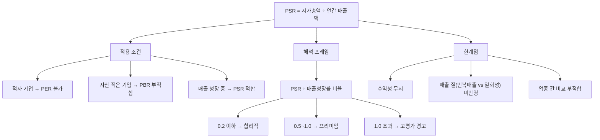

# PSR 뜻 — 매출 대비 주가가 몇 배인가

## 한 줄 정의

PSR(Price to Sales Ratio, 주가매출비율)은 시가총액을 매출액으로 나눈 값으로, 아직 이익이 나지 않는 성장 기업의 밸류에이션에 사용하는 지표입니다.

## 아주 쉽게 말하면

적자 기업은 PER을 쓸 수 없습니다. 이익이 음수니까요. 이때 "매출 규모 대비 시장이 이 회사를 얼마로 평가하는가?"를 보는 것이 PSR입니다. 동네 카페에 비유하면, 아직 적자지만 매달 매출이 2배씩 늘고 있다면 "매출 대비 인수 가격이 몇 배인가"로 비싼지 싼지 가늠하는 겁니다. 주로 SaaS, 바이오, 플랫폼처럼 "지금은 돈 못 벌지만 빠르게 크고 있는" 기업에 적용합니다.

## 왜 중요한가

테크 섹터 투자에서 PSR을 모르면 밸류에이션 대화 자체가 불가능합니다. 이유는 세 가지입니다.

첫째, **적자 기업의 유일한 가격 잣대**입니다. PER은 이익이 있어야 쓸 수 있고, PBR은 자산이 적은 기업에 적합하지 않습니다. 매출은 적자 기업에도 존재하므로 PSR이 유일한 대안이 됩니다.

둘째, **성장 속도를 반영**합니다. 같은 PSR 10배라도 매출이 연 80% 성장하는 기업과 10% 성장하는 기업은 의미가 전혀 다릅니다. PSR과 성장률을 함께 보면 "이 프리미엄이 정당한가"를 판단할 수 있습니다.

셋째, **IPO·스타트업 밸류에이션의 표준**입니다. 상장 전 기업이나 초기 상장 기업의 적정 가치를 산정할 때, 글로벌 유사 기업의 PSR 멀티플을 벤치마크로 사용하는 것이 업계 관행입니다.

## 그림으로 이해하기

## 숫자로 보는 예시

> ⚠️ 아래 숫자는 개념 설명을 위한 **가상 예시**이며, 실제 투자 데이터가 아닙니다.

가상 기업 '클라우드넷'으로 PSR 활용 과정을 살펴보겠습니다.

**클라우드넷 기본 정보**
- 시가총액: 8,000억 원
- 연간 매출: 800억 원 (전년 대비 +70% 성장)
- 영업이익: -150억 원 (적자)
- 매출총이익률: 65%
- PSR = 8,000 ÷ 800 = **10배**

PER은 적자이므로 산출 불가. PSR 10배가 비싼 걸까요?

**핵심 판단: PSR ÷ 매출성장률**
- 10 ÷ 70% = 0.14 → 성장 속도 대비 합리적

**동일 섹터 비교**

| 기업 | 시가총액 | 매출 | PSR | 매출성장률 | PSR÷성장률 | 해석 |
|------|---------|------|-----|----------|-----------|------|
| 클라우드넷 | 8,000억 | 800억 | 10배 | 70% | 0.14 | 고성장 반영 적정 |
| A플랫폼 | 3,000억 | 600억 | 5배 | 15% | 0.33 | 성장 둔화 반영 |
| B소프트 | 12,000억 | 600억 | 20배 | 50% | 0.40 | 프리미엄 구간 |
| C데이터 | 2,000억 | 400억 | 5배 | 5% | 1.00 | 성장 정체, 고평가 |

→ PSR만 보면 A플랫폼과 C데이터가 동일한 5배이지만, 성장률을 감안하면 A플랫폼이 훨씬 매력적입니다.

## 표로 비교하기

| 구분 | PER | PSR | PBR |
|------|-----|-----|-----|
| 분모 | 순이익 | 매출액 | 순자산 |
| 적자 기업 적용 | 불가 | 가능 | 가능 |
| 반영 요소 | 수익성 | 매출 규모·성장 | 자산가치 |
| 최적 대상 | 흑자 안정 기업 | 적자 성장 기업 | 자산 중심 기업 |
| 조작 가능성 | 이익 조정 위험 | 상대적으로 낮음 | 자산 재평가 이슈 |
| 한계 | 일회성 이익 왜곡 | 수익성 무시 | 무형자산 미반영 |

> ⚠️ 밸류에이션 지표는 투자 판단의 **참고 자료**일 뿐, 특정 수치가 매수·매도 시점을 의미하지 않습니다. 반드시 다른 지표·정성 분석과 함께 종합적으로 판단하세요.

## 초보자가 자주 하는 오해

1. **"PSR이 낮으면 저평가다"**
   → 매출은 있지만 영원히 이익을 못 내는 기업도 있습니다. PSR이 낮아도 매출총이익률이 마이너스이거나, 흑자 전환 로드맵이 없다면 의미 없는 숫자입니다.

2. **"PSR은 모든 기업에 적용 가능하다"**
   → 이미 이익이 안정적인 기업에 PSR을 쓰면 정보 손실이 큽니다. PER이 계산 가능한 기업에는 PER이 더 정확합니다. PSR은 "PER을 쓸 수 없을 때"의 차선책입니다.

3. **"매출이 크면 무조건 좋다"**
   → 매출의 '질'이 중요합니다. 반복 매출(구독형)인지, 일회성 프로젝트 매출인지에 따라 같은 PSR이라도 가치가 다릅니다. SaaS 기업의 ARR(연간반복매출)과 일반 매출을 동일 선상에 놓으면 안 됩니다.

4. **"업종이 달라도 PSR을 비교할 수 있다"**
   → SaaS(PSR 15~30배)와 제조업(PSR 0.5~2배)은 마진 구조가 완전히 다릅니다. 반드시 동일 업종 내에서 비교해야 합니다.

## 고수는 이렇게 봅니다

숙련된 투자자는 PSR 단독이 아닌 **'미래 PER 역산'** 방식을 함께 사용합니다. 예를 들어 "3년 후 매출 3,000억, 목표 영업이익률 20%를 달성하면 순이익 약 450억. 그때 PER 25배 적용 시 적정 시총 1.1조"처럼, PSR에서 출발해 미래 수익성까지 연결합니다.

또한 **매출의 질적 분해**를 수행합니다. 반복매출(구독) 비중이 80%인 기업과 프로젝트성 매출 비중이 80%인 기업은 같은 PSR이라도 가치가 다릅니다. 반복매출 비중이 높을수록 더 높은 PSR 프리미엄을 정당화할 수 있습니다.

## 기업분석에서는 이렇게 씁니다

IPO 기업이나 초기 성장주의 적정 가치를 산정할 때 "글로벌 유사 기업 PSR 멀티플 × 우리 매출 = 적정 시총" 공식을 사용합니다.

실무 프로세스는 다음과 같습니다:
1. 글로벌 Peer Group(유사 상장 기업 5~10개) 선정
2. 매출 성장률·매출총이익률·반복매출 비중을 기준으로 우리 기업의 위치 파악
3. Peer 중간값 PSR에 성장률 프리미엄/할인을 적용해 타겟 PSR 산출
4. 타겟 PSR × 향후 12개월 예상 매출 = 적정 시총

## 함께 보면 좋은 용어

- [매출액](../level-03-financial-statements/revenue.md) — PSR의 분모
- [PER](./per.md) — 이익 기반 밸류에이션 (흑자 기업용)
- [PBR](./pbr.md) — 자산 기반 밸류에이션
- [매출총이익률](../level-04-ratios/gross-margin.md) — 흑자 전환 가능성 판단 보조
- [멀티플](./multiple.md) — PSR도 멀티플의 한 종류

## 정리

PSR은 적자 성장 기업의 밸류에이션에 쓰는 핵심 도구입니다. 매출 성장률과 매출의 질(반복성·마진)을 함께 고려하지 않으면 단순 숫자 비교에 그칩니다. "PSR ÷ 매출성장률" 비율과 미래 수익성 역산을 병행하면 보다 정교한 판단이 가능합니다.

## 한 줄 요약

> PSR은 '매출 대비 시장가치 배수'이며, 적자 성장 기업의 가격 판단에 쓰되 매출 성장률과 수익성 전환 가능성을 반드시 함께 봐야 합니다.

---

이 글은 투자 권유가 아니라 주식 용어와 기업분석 방법을 설명하기 위한 교육 콘텐츠입니다. 특정 종목의 매수·매도 판단은 독자 본인의 책임입니다.

Tags: 주가매출비율, 매출액, 밸류에이션, 성장주, 기업분석
