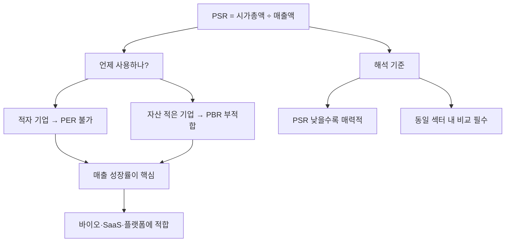

# PSR 뜻 — 매출 대비 주가가 몇 배인가

## 한 줄 정의

PSR(Price to Sales Ratio)은 시가총액을 매출액으로 나눈 값으로, 아직 이익이 나지 않는 성장 기업의 밸류에이션에 사용하는 지표입니다.

## 아주 쉽게 말하면

적자 기업은 PER을 쓸 수 없습니다(이익이 음수). 이때 "매출 규모 대비 시장가치가 몇 배인가?"로 가격을 판단하는 것이 PSR입니다. 아직 돈은 못 벌지만 빠르게 성장 중인 기업에 적용합니다.

## 왜 중요한가

바이오, SaaS, 플랫폼처럼 초기 투자가 크고 적자가 지속되는 고성장 기업은 PER을 적용할 수 없습니다. PSR은 매출 성장 속도를 반영하는 유일한 밸류에이션 도구이며, 테크 섹터에서 널리 사용됩니다.

## 그림으로 이해하기

## 숫자로 보는 예시

> ⚠️ 아래 숫자는 개념 설명을 위한 **가상 예시**이며, 실제 투자 데이터가 아닙니다.

S기업 (SaaS 스타트업):
- 시가총액: 5,000억 원
- 매출액: 500억 원 (전년 대비 +80% 성장)
- 순이익: -200억 원 (적자)
- **PSR = 5,000 ÷ 500 = 10배**

업계 평균 PSR: 8배
- 매출 성장률 80%로 업계 평균(40%)의 2배
- → PSR 10배도 정당화될 수 있음

## 표로 비교하기

| PSR 수준 | 해석 | 적합 업종 |
|----------|------|----------|
| 1배 미만 | 극단적 저평가 or 성장 정체 | 전통 제조업 |
| 1~3배 | 보통 | 일반 IT, 유통 |
| 3~10배 | 높은 성장 기대 | SaaS, 플랫폼 |
| 10~20배 | 매우 높은 기대 | 하이퍼그로스 기업 |
| 20배 이상 | 거품 가능성 | 검증 필요 |

> ⚠️ 밸류에이션 지표는 투자 판단의 **참고 자료**일 뿐, 특정 수치가 매수·매도 시점을 의미하지 않습니다. 반드시 다른 지표·정성 분석과 함께 종합적으로 판단하세요.

## 초보자가 자주 하는 오해

1. **"PSR이 낮으면 저평가다"**
   → 매출은 있지만 영원히 이익을 못 내는 기업도 있습니다. PSR이 낮아도 흑자 전환 가능성이 없으면 의미 없습니다. 매출총이익률과 함께 봐야 합니다.

2. **"PSR은 모든 기업에 적용 가능하다"**
   → 이미 이익이 안정적인 기업에는 PER이 더 정확합니다. PSR은 적자이거나 이익 변동이 큰 초기 성장 기업에 적합한 보조 지표입니다.

## 고수는 이렇게 봅니다

숙련된 투자자는 'PSR ÷ 매출성장률' 비율을 봅니다. PSR 10배에 성장률 50%면 비율 0.2로 합리적이지만, PSR 10배에 성장률 10%면 비율 1.0으로 고평가로 볼 수 있습니다. 또한 목표 영업이익률을 가정해 "미래 PER"로 역산합니다.

## 기업분석에서는 이렇게 씁니다

IPO(상장) 기업이나 초기 성장주의 적정 가치를 산정할 때 "글로벌 유사 기업 PSR 멀티플 × 우리 매출 = 적정 시총"으로 계산합니다. 매출 성장률, 매출총이익률, TAM(전체 시장 규모)을 함께 고려해 멀티플을 조정합니다.

## 함께 보면 좋은 용어

- [매출액](../level-03-financial-statements/revenue.md) — PSR의 분모
- [PER](./per.md) — 이익 기반 밸류에이션 (흑자 기업용)
- [PBR](./pbr.md) — 자산 기반 밸류에이션
- [매출총이익률](../level-04-ratios/gross-margin.md) — 흑자 전환 가능성 판단 보조
- [멀티플](./multiple.md) — PSR도 멀티플의 한 종류

## 정리

PSR은 적자 성장 기업의 밸류에이션 도구로, 매출 성장 속도와 흑자 전환 가능성을 함께 고려해야 합니다. PER을 쓸 수 없을 때의 차선책이며, 매출 성장률 대비 PSR이 합리적인지를 판단하세요.

## 한 줄 요약

> PSR은 '매출 대비 시장가치 배수'이며, 적자 성장 기업의 가격 판단에 쓰는 보조 밸류에이션입니다.

---

*면책 조항: 이 글은 투자 권유가 아니라 주식 용어와 기업분석 방법을 설명하기 위한 교육 콘텐츠입니다. 특정 종목의 매수·매도 판단은 독자 본인의 책임입니다.*

Tags: PSR, 주가매출비율, 매출액, 밸류에이션, 성장주
