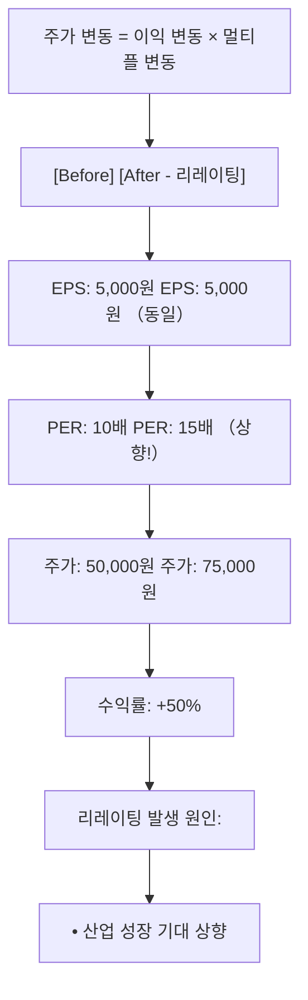

# 리레이팅 뜻 — 시장이 더 높은 가치를 인정할 때

## 한 줄 정의

리레이팅(Re-rating)은 기업의 밸류에이션 멀티플이 상향 조정되는 현상으로, 이익 증가 없이도 시장 기대 변화만으로 주가가 오르는 것을 말합니다.

## 아주 쉽게 말하면

같은 연봉인데 승진 전망이 좋아져서 대출 한도가 올라가는 것과 비슷합니다. 기업도 이익은 그대로인데 "앞으로 더 잘할 것 같다"는 기대가 커지면 멀티플이 올라가고 주가가 상승합니다.

## 왜 중요한가

주가 상승은 ①이익 증가 ②멀티플 상승 두 가지로 분해됩니다. 이익이 10% 늘고 멀티플이 20% 올라가면 주가는 32% 상승합니다. 리레이팅은 이익보다 훨씬 빠르게 주가를 끌어올릴 수 있어, 대박 수익의 핵심 동력입니다.

## 그림으로 이해하기

## 숫자로 보는 예시

> ⚠️ 아래 숫자는 개념 설명을 위한 **가상 예시**이며, 실제 투자 데이터가 아닙니다.

W기업 주가 분해:
| 구분 | EPS | PER | 주가 | 변동 |
|------|-----|-----|------|------|
| 2024초 | 4,000원 | 8배 | 32,000원 | - |
| 2024말 | 5,000원 | 12배 | 60,000원 | +87.5% |

- 이익 기여: (5,000-4,000)/4,000 = +25%
- 멀티플 기여: (12-8)/8 = +50%
- **주가 상승의 2/3가 리레이팅 효과**

## 표로 비교하기

| 구분 | 리레이팅 | 디레이팅 |
|------|---------|---------|
| 멀티플 방향 | 상향 ↑ | 하향 ↓ |
| 주가 효과 | 이익 이상 상승 | 이익 증가에도 주가 하락 가능 |
| 전형적 상황 | 성장 가속, 정책 변화 | 성장 둔화, 규제 강화 |
| 투자자 심리 | 낙관 확대 | 비관 확대 |
| 지속 기간 | 수개월~수년 | 수개월~수년 |

## 초보자가 자주 하는 오해

1. **"리레이팅은 실적과 무관하다"**
   → 완전히 무관하지는 않습니다. 실적 서프라이즈가 "이 기업이 예상보다 좋다"는 인식을 만들어 멀티플 상향을 촉발합니다. 실적이 기대감의 트리거 역할을 합니다.

2. **"한번 리레이팅되면 계속 오른다"**
   → 멀티플 상승은 한계가 있습니다. 기대가 실적으로 확인되지 않으면 다시 디레이팅됩니다. 리레이팅 이후 실적 검증이 따라와야 지속됩니다.

## 고수는 이렇게 봅니다

숙련된 투자자는 리레이팅의 '카탈리스트(촉매)'를 미리 예측합니다. 밸류업 프로그램 발표, 신사업 진출, 실적 턴어라운드 등 시장 인식을 바꿀 이벤트를 찾아 멀티플 확장 전에 매수합니다.

## 기업분석에서는 이렇게 씁니다

목표주가를 상향할 때 "타겟 PER을 12배 → 15배로 상향합니다"라고 표현합니다. 이 경우 EPS 추정은 동일한데 멀티플 부여만 올린 것이므로, 리레이팅 근거(산업 전망 개선, 피어 대비 할인 해소 등)를 명확히 제시합니다.

## 함께 보면 좋은 용어

- [디레이팅](./derating.md) — 리레이팅의 반대 (멀티플 하향)
- [멀티플](./multiple.md) — 리레이팅의 대상
- [PER](./per.md) — 가장 흔히 리레이팅되는 멀티플
- [어닝 서프라이즈](../level-08-industry-macro/earnings-surprise.md) — 리레이팅의 촉매
- [밸류 트랩](../level-10-company-analysis/value-trap.md) — 리레이팅이 안 되는 저평가주
- [모멘텀](../level-10-company-analysis/momentum.md) — 리레이팅이 모멘텀을 강화하는 요인

## 정리

리레이팅은 시장이 기업에 부여하는 멀티플이 올라가는 현상으로, 이익 증가와 별도로 주가를 크게 끌어올립니다. 카탈리스트를 미리 포착하면 초과 수익의 기회가 됩니다.

## 한 줄 요약

> 리레이팅은 '시장이 이 기업을 더 높게 쳐주기 시작하는 것'이며, 주가 대박의 핵심 동력입니다.

---

*면책 조항: 이 글은 투자 권유가 아니라 주식 용어와 기업분석 방법을 설명하기 위한 교육 콘텐츠입니다. 특정 종목의 매수·매도 판단은 독자 본인의 책임입니다.*

Tags: 리레이팅, 밸류에이션, 멀티플, PER상향, 주가상승
