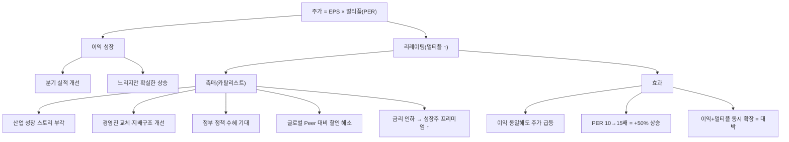

# 리레이팅 뜻 — 시장이 더 높은 가치를 인정할 때

## 한 줄 정의

리레이팅(Re-rating)은 기업의 밸류에이션 멀티플이 상향 조정되는 현상으로, 이익 증가 없이도 시장 기대 변화만으로 주가가 오르는 것을 말합니다.

## 아주 쉽게 말하면

같은 연봉인데 "이 사람은 곧 임원 될 거야"라는 평판이 퍼지면 헤드헌터들이 모시려 옵니다. 기업도 마찬가지입니다. 이익은 아직 그대로인데 "이 회사 앞으로 확 좋아질 거야"라는 시장 인식이 바뀌면, 투자자들이 더 비싼 값을 내고 사기 시작합니다. 이때 PER이 10배에서 15배로 올라가는 현상이 리레이팅입니다.

핵심은 **"실적이 아니라 기대가 먼저 움직인다"**는 점입니다.

## 왜 중요한가

주가 상승을 분해하면 딱 두 가지입니다: ①이익 증가 ②멀티플 상승. 그런데 이익은 분기에 10~20% 늘기도 쉽지 않지만, 멀티플은 몇 달 만에 50~100% 확장되기도 합니다.

예를 들어 이익이 10% 늘고 멀티플이 50% 올라가면 주가는 65% 상승합니다. 주가 대부분의 상승분이 리레이팅에서 나온 것입니다. 역사적으로 대형 성장주의 '대박 구간'은 거의 항상 리레이팅이 동반됩니다.

반대로 말하면, 리레이팅이 없는 종목은 이익이 늘어도 주가 상승폭이 제한됩니다. "왜 이 종목은 실적 좋은데 안 오르지?"의 답이 대부분 "리레이팅이 안 되고 있어서"입니다.

## 그림으로 이해하기

## 숫자로 보는 예시

> ⚠️ 아래 숫자는 개념 설명을 위한 **가상 예시**이며, 실제 투자 데이터가 아닙니다.

가상 기업 '그린에너지'로 리레이팅 과정을 살펴보겠습니다.

**배경**: 그린에너지는 태양광 부품 기업. 2024년 초 PER 8배로 거래 중(업종 평균 15배 대비 할인). 정부가 '2030 재생에너지 확대 로드맵'을 발표하면서 업종 전체에 관심이 쏠림.

**주가 분해 (2024년 1월 → 12월)**

| 시점 | EPS | PER | 주가 | 변화 요인 |
|------|-----|-----|------|----------|
| 1월 | 3,000원 | 8배 | 24,000원 | 시장 무관심 |
| 6월 | 3,200원 | 11배 | 35,200원 | 정책 발표 → 멀티플 확대 시작 |
| 12월 | 3,500원 | 14배 | 49,000원 | 수주 확보 → 기대 확인 |

**수익률 분해**
- 총 수익률: +104% (24,000 → 49,000)
- 이익 기여: (3,500-3,000)/3,000 = **+17%**
- 멀티플 기여: (14-8)/8 = **+75%**
- → 수익의 약 4/5가 리레이팅에서 발생

**핵심 교훈**: EPS가 17%만 늘었는데 주가가 2배 된 이유는 시장이 "이 기업의 미래가 좋다"고 인식을 바꿨기 때문입니다.

## 표로 비교하기

| 구분 | 리레이팅 | 디레이팅 |
|------|---------|---------|
| 멀티플 방향 | 상향 ↑ | 하향 ↓ |
| 주가 효과 | 이익 성장 이상으로 상승 | 이익 증가에도 주가 하락 가능 |
| 전형적 촉매 | 성장 가속, 정책 수혜, 구조 개선 | 성장 둔화, 규제 강화, 경쟁 심화 |
| 투자자 심리 | "이 회사 더 좋아질 거야" | "이 회사 전성기 지났어" |
| 지속 조건 | 기대가 실적으로 확인될 때 | 실적이 기대에 못 미칠 때 |
| 대응 전략 | 카탈리스트 선점 매수 | 멀티플 하락 원인 파악 후 판단 |

> ⚠️ 밸류에이션 지표는 투자 판단의 **참고 자료**일 뿐, 특정 수치가 매수·매도 시점을 의미하지 않습니다. 반드시 다른 지표·정성 분석과 함께 종합적으로 판단하세요.

## 초보자가 자주 하는 오해

1. **"리레이팅은 실적과 무관하다"**
   → 완전히 무관하지는 않습니다. 실적 서프라이즈가 "이 기업이 예상보다 좋다"는 인식을 만들어 멀티플 상향을 촉발합니다. 실적이 기대감의 '트리거' 역할을 하는 경우가 많습니다.

2. **"한번 리레이팅되면 계속 오른다"**
   → 멀티플 상승에는 천장이 있습니다. 기대가 실적으로 확인되지 않으면 다시 디레이팅됩니다. "기대 → 확인 → 유지 or 이탈"의 사이클을 인지해야 합니다.

3. **"PER이 낮으면 리레이팅 대상이다"**
   → PER이 낮은 데는 이유가 있습니다(밸류 트랩). 리레이팅이 발생하려면 "시장 인식을 바꿀 카탈리스트"가 필요합니다. 단순히 싸다고 올라가지 않습니다.

4. **"리레이팅은 예측할 수 없다"**
   → 완벽한 예측은 불가능하지만, 카탈리스트를 미리 식별할 수 있습니다. 정책 변화, 경영진 교체, 업종 트렌드 전환 등 "시장 인식을 바꿀 이벤트"를 추적하면 확률을 높일 수 있습니다.

## 고수는 이렇게 봅니다

숙련된 투자자는 **"멀티플 갭 + 카탈리스트 타이밍"** 두 가지를 동시에 봅니다.

첫째, **멀티플 갭 분석**. 해당 기업의 PER이 업종 평균이나 글로벌 Peer 대비 얼마나 할인되어 있는지 확인합니다. 할인율이 30% 이상이면 리레이팅 여지가 크다고 봅니다.

둘째, **카탈리스트 타이밍**. 밸류업 프로그램, 실적 턴어라운드, 대규모 수주, 신사업 발표 등 "시장 인식이 바뀔 계기"가 6개월 내에 존재하는지 점검합니다.

셋째, **리레이팅 속도 관리**. 멀티플이 급격히 올라간 후에는 "이 멀티플이 실적으로 정당화될 수 있는가?"를 냉정하게 점검합니다. 기대만으로 올라간 멀티플은 실적 확인 실패 시 급격히 디레이팅됩니다.

## 기업분석에서는 이렇게 씁니다

증권사 리포트에서 적정 가격대를 상향할 때 "타겟 PER을 12배 → 15배로 상향합니다"라고 표현합니다. 이 경우 EPS 추정은 동일한데 멀티플 부여만 올린 것이므로, 리레이팅 근거를 반드시 명시합니다.

대표적 리레이팅 근거:
- "동종 업계 대비 할인율이 과도하며, 구조 개선으로 Peer 수준 회복 예상"
- "신사업 매출 기여도가 가시화되어 성장주로 재분류"
- "배당 확대·자사주 매입으로 주주환원 정책 변화"

## 함께 보면 좋은 용어

- [디레이팅](./derating.md) — 리레이팅의 반대 (멀티플 하향)
- [멀티플](./multiple.md) — 리레이팅의 대상
- [PER](./per.md) — 가장 흔히 리레이팅되는 멀티플
- [어닝 서프라이즈](../level-08-industry-macro/earnings-surprise.md) — 리레이팅의 촉매
- [밸류 트랩](../level-10-company-analysis/value-trap.md) — 리레이팅이 안 되는 저평가주

## 정리

리레이팅은 시장이 기업에 부여하는 멀티플이 올라가는 현상으로, 이익 증가와 별도로(혹은 동시에) 주가를 크게 끌어올립니다. "멀티플 갭이 큰 종목 + 가까운 미래의 카탈리스트"를 식별하면 초과 수익의 기회가 됩니다. 다만 기대만으로 올라간 멀티플은 실적 확인이 따라와야 지속됩니다.

## 한 줄 요약

> 리레이팅은 '시장이 이 기업을 더 높게 쳐주기 시작하는 것'이며, 카탈리스트 선점이 핵심입니다.

---

이 글은 투자 권유가 아니라 주식 용어와 기업분석 방법을 설명하기 위한 교육 콘텐츠입니다. 특정 종목의 매수·매도 판단은 독자 본인의 책임입니다.

Tags: 리레이팅, 밸류에이션, 멀티플, 주가수익비율상향, 주가상승
