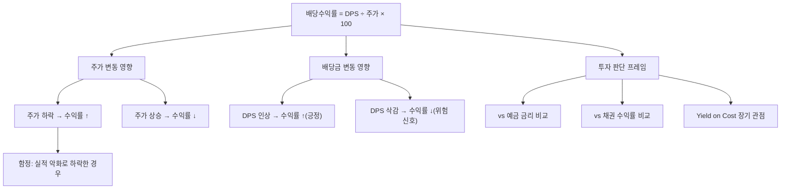

# 배당수익률 뜻 — 주가 대비 배당금 비율

## 한 줄 정의

배당수익률은 주당 배당금을 현재 주가로 나눈 비율로, 투자금 대비 배당으로 얼마를 돌려받는지를 보여줍니다.

## 아주 쉽게 말하면

50,000원짜리 주식이 매년 2,500원 배당을 주면 배당수익률은 5%입니다. 은행에 5,000만 원을 넣고 연 250만 원 이자를 받는 것과 동일한 구조입니다. 차이점은 은행 이자는 거의 고정이지만, 주식 배당수익률은 주가와 배당금이 모두 변한다는 것입니다.

핵심 공식: **배당수익률(%) = 주당 배당금(DPS) ÷ 현재 주가 × 100**

## 왜 중요한가

배당수익률은 "내 돈이 매년 몇 %의 현금을 만들어주는가"를 직접 보여주는 지표입니다.

첫째, **투자 대안 비교의 기준**입니다. 예금 금리 3.5%인데 A주식 배당수익률이 5%라면, 주가 하락 리스크를 감수할 유인이 됩니다. 반대로 예금 금리가 6%인데 배당수익률 4%라면, 굳이 주식을 들고 있을 이유가 약해집니다.

둘째, **하락장 방어력**을 제공합니다. 배당수익률이 높아지면(주가 하락 시) "이 가격이면 배당만으로 충분하다"고 판단하는 투자자들이 매수에 참여해 추가 하락을 막아주는 '배당 바닥' 효과가 작동합니다.

셋째, **복리 효과의 시작점**입니다. 받은 배당금을 재투자하면 보유 주식수가 늘어나고, 다음 해 배당도 늘어나는 복리 구조가 형성됩니다.

## 그림으로 이해하기

## 숫자로 보는 예시

> ⚠️ 아래 숫자는 개념 설명을 위한 **가상 예시**이며, 실제 투자 데이터가 아닙니다.

가상 기업 '코리아텔레콤'과 '테크스타트'를 비교해보겠습니다.

**시나리오 A: 코리아텔레콤 (안정 배당주)**
- 주가: 50,000원 / DPS: 3,000원 / 배당수익률: 6.0%
- 5년 연속 배당 유지, FCF 대비 배당 비율 50%

**시나리오 B: 테크스타트 (성장주)**
- 주가: 200,000원 / DPS: 2,000원 / 배당수익률: 1.0%
- 이익을 R&D에 재투자, 주가 상승으로 수익 창출

**시나리오 C: 위험 신호 — 급락한 D건설**
- 작년 주가 80,000원 / DPS 4,000원 → 수익률 5%
- 올해 주가 40,000원(실적 악화) → 수익률 10%로 급등
- 하지만 내년 배당 삭감 가능성 높음 → 함정!

**배당수익률 비교표**

| 투자처 | 투자금 | 연간 수익 | 수익률 | 리스크 |
|--------|--------|----------|--------|--------|
| 코리아텔레콤 | 50,000원 | 3,000원 | 6.0% | 주가 변동+배당 컷 |
| 테크스타트 | 200,000원 | 2,000원 | 1.0% | 주가 변동 |
| D건설(급락) | 40,000원 | 4,000원? | 10.0%? | 배당 삭감 높음 |
| 정기예금 | 자유 | - | 3.5% | 거의 없음 |
| 국채 3년 | 자유 | - | 3.2% | 거의 없음 |

→ 배당수익률 10%의 D건설이 가장 매력적으로 보이지만, 배당 지속성을 확인하면 가장 위험할 수 있습니다.

## 표로 비교하기

| 배당수익률 수준 | 일반적 평가 | 점검 포인트 |
|---------------|-----------|-----------|
| 1% 미만 | 매우 낮음 | 성장 재투자 우선 기업(정상) |
| 1~3% | 보통 | 대형 성장주 평균 수준 |
| 3~5% | 양호 | 배당 투자 매력 구간 |
| 5~7% | 높음 | 지속성·FCF 커버리지 확인 필수 |
| 7% 이상 | 매우 높음 | 주가 급락 or 일회성 특별배당 의심 |

> ⚠️ 밸류에이션 지표는 투자 판단의 **참고 자료**일 뿐, 특정 수치가 매수·매도 시점을 의미하지 않습니다. 반드시 다른 지표·정성 분석과 함께 종합적으로 판단하세요.

## 초보자가 자주 하는 오해

1. **"배당수익률이 높을수록 좋다"**
   → 주가가 급락해서 배당수익률이 높아진 경우가 가장 흔합니다. 주가 50% 하락 → 배당수익률 2배. 이 경우 곧 배당 삭감이 뒤따를 가능성이 높습니다. "왜 높은지"를 반드시 확인하세요.

2. **"배당수익률 = 확정 수익률이다"**
   → 기업이 배당을 줄이거나 중단할 수 있습니다. 과거 DPS 기반 수익률이지, 미래를 보장하지 않습니다. 또한 주가가 20% 하락하면 배당 5% 받아도 총수익은 -15%입니다.

3. **"예금보다 배당수익률 높으면 무조건 유리하다"**
   → 예금은 원금이 보장되지만 주식은 아닙니다. 배당수익률 6%라도 주가가 10% 하락하면 총수익은 -4%입니다. 리스크 대비 수익률을 비교해야 합니다.

4. **"배당수익률은 매수 시점에 고정된다"**
   → 내가 산 가격 기준 수익률(Yield on Cost)은 고정이지만, 기업이 DPS를 올리거나 내리면 실질 수익률은 변합니다. 배당 성장 기업은 시간이 갈수록 YoC가 올라갑니다.

## 고수는 이렇게 봅니다

숙련된 투자자는 **Yield on Cost(YoC)** 관점으로 장기 투자합니다. 오늘 배당수익률 4%짜리 주식을 샀는데 매년 DPS가 8%씩 오르면, 10년 뒤 매입가 기준 수익률은 약 8.6%가 됩니다.

또한 **'배당수익률 밴드'**를 활용합니다. 해당 종목의 과거 5년간 배당수익률 범위(예: 3~6%)를 파악하고, 현재 밴드 상단(6% 근처)이면 주가가 역사적으로 저점에 있다는 신호로 읽습니다.

그리고 **세후 실질 수익률**을 계산합니다. 배당소득세 15.4%를 빼면 명목 5%도 실질 4.2%입니다. 금융소득 2,000만 원 초과 시 종합소득세가 추가되므로, 세금까지 고려한 실질 수익률로 비교합니다.

## 기업분석에서는 이렇게 씁니다

배당주 스크리닝에서 "배당수익률 4% 이상 + 배당성향 60% 이하 + 5년 연속 DPS 유지·인상 + FCF 양수" 같은 복합 조건을 적용합니다.

총주주수익률(TSR) = 배당수익률 + 주가상승률로 종합 매력도를 판단하며, 배당 성장 기업은 TSR이 시장 평균을 꾸준히 상회하는 경향이 있습니다.

## 함께 보면 좋은 용어

- [배당](./dividend.md) — 배당수익률의 기초 개념
- [배당성향](./payout-ratio.md) — 이익 대비 배당 비율 (지속성 판단)
- [배당락](./ex-dividend.md) — 배당 받은 후 주가 조정
- [기준일](./record-date.md) — 배당받으려면 이 날 주식 보유
- [FCF](../level-03-financial-statements/fcf.md) — 배당 지속 가능성의 근거

## 정리

배당수익률은 투자금 대비 배당 수익 비율로, 높을수록 좋아 보이지만 "왜 높은지"가 핵심입니다. 주가 하락으로 높아진 건 위험 신호이고, DPS 인상으로 높아진 건 긍정 신호입니다. 장기 관점에서는 Yield on Cost와 배당 성장률을 함께 추적하세요.

## 한 줄 요약

> 배당수익률은 '투자금 대비 매년 받는 현금 비율'이며, 높은 이유가 주가 하락인지 DPS 인상인지를 반드시 구분하세요.

---

이 글은 투자 권유가 아니라 주식 용어와 기업분석 방법을 설명하기 위한 교육 콘텐츠입니다. 특정 종목의 매수·매도 판단은 독자 본인의 책임입니다.

Tags: 배당수익률, 배당금, 주가, 배당투자, 인컴투자
