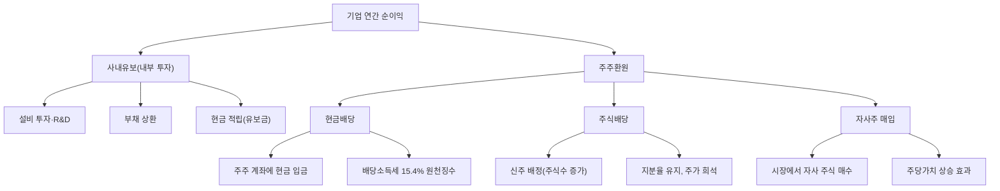

# 배당 뜻 — 기업이 주주에게 나눠주는 이익

## 한 줄 정의

배당은 기업이 벌어들인 이익의 일부를 주주에게 현금이나 주식으로 돌려주는 것입니다.

## 아주 쉽게 말하면

친구 5명이 공동으로 치킨집을 열어 1년에 5,000만 원을 벌었습니다. 이 중 2,000만 원은 가게 확장에 쓰고, 나머지 3,000만 원을 각자 600만 원씩 나눠 가지기로 했습니다. 이 600만 원이 바로 배당입니다.

주식도 마찬가지입니다. 기업이 이익을 내면 일부를 '사내유보'(재투자)로 남기고, 나머지를 주주들에게 보유 주식수에 비례해서 나눠줍니다. 정기적으로 현금이 들어온다는 점에서 월세 받는 것과 비슷한 느낌입니다.

## 왜 중요한가

주식 투자 수익은 두 가지입니다: ①주가 상승(시세차익) ②배당(인컴). 배당은 주가가 횡보하더라도 매년 현금을 받을 수 있어, 변동성이 큰 시장에서 심리적 안정감을 제공합니다.

최근 한국 증시에서 '밸류업 프로그램'이 화두인 이유도 배당입니다. 기업이 벌어들인 돈을 주주에게 적극 환원하면 외국인 투자자가 유입되고, 기업의 멀티플이 올라가는(리레이팅) 선순환이 발생합니다.

배당 정책은 경영진이 "우리 기업의 미래 현금흐름에 자신 있다"는 신호이기도 합니다. 안정적으로 배당을 늘려온 기업은 실적의 예측 가능성이 높다는 의미입니다.

## 그림으로 이해하기

## 숫자로 보는 예시

> ⚠️ 아래 숫자는 개념 설명을 위한 **가상 예시**이며, 실제 투자 데이터가 아닙니다.

가상 기업 '한국식품'으로 배당 구조를 살펴보겠습니다.

**한국식품 기본 정보**
- 당기순이익: 2,000억 원
- 배당성향: 40% (이익의 40%를 배당으로 지급)
- 배당 총액: 800억 원
- 발행주식수: 2억 주
- 주당 배당금(DPS): 800억 ÷ 2억 = **4,000원**
- 현재 주가: 80,000원
- 배당수익률: 4,000 ÷ 80,000 = **5.0%**

**3년간 배당 성장 추이**

| 연도 | 순이익 | 배당성향 | DPS | 주가 | 배당수익률 |
|------|--------|---------|-----|------|----------|
| 2022 | 1,500억 | 35% | 2,625원 | 65,000원 | 4.0% |
| 2023 | 1,800억 | 38% | 3,420원 | 72,000원 | 4.8% |
| 2024 | 2,000억 | 40% | 4,000원 | 80,000원 | 5.0% |

→ 배당성향도 올리면서 DPS가 매년 증가. 이런 기업은 '배당 성장주'로 분류됩니다.

**투자자 관점 계산**
- 2022년에 65,000원에 100주 매수 → 투자금 650만 원
- 2024년 기준: 배당 수익 4,000원 × 100주 = 40만 원/년
- 시세차익: (80,000-65,000) × 100 = 150만 원
- 3년 총수익: 배당 약 100만 원 + 시세차익 150만 원 = 250만 원 (수익률 38%)

## 표로 비교하기

| 구분 | 현금배당 | 주식배당 | 자사주 매입 |
|------|---------|---------|-----------|
| 지급 형태 | 현금 입금 | 신주 지급 | 시장 매수(간접) |
| 주주 효과 | 즉시 현금 확보 | 보유 주식수 증가 | 주당가치 상승 |
| 세금 시점 | 즉시 과세(15.4%) | 즉시 과세(15.4%) | 매도 시 양도세 |
| 기업 현금 | 감소 | 유지 | 감소 |
| 발행 주식수 | 불변 | 증가(희석) | 감소(소각 시) |
| 주주 선호 | 안정적 인컴 추구 | 성장 재투자 선호 | 세금 이연 선호 |

> ⚠️ 밸류에이션 지표는 투자 판단의 **참고 자료**일 뿐, 특정 수치가 매수·매도 시점을 의미하지 않습니다. 반드시 다른 지표·정성 분석과 함께 종합적으로 판단하세요.

## 초보자가 자주 하는 오해

1. **"배당을 받으면 공짜로 돈을 버는 것이다"**
   → 배당 지급일에 주가가 배당금만큼 하락합니다(배당락). 4,000원 배당을 받으면 주가도 4,000원 빠지므로, 그 순간 총 자산은 동일합니다. 장기적으로 이익 성장이 이 갭을 메워야 진짜 수익이 됩니다.

2. **"배당을 많이 주는 기업이 항상 좋다"**
   → 성장 기회가 풍부한 기업은 배당 대신 재투자하는 것이 주주에게 더 유리합니다. 배당성향 100%는 "더 이상 투자할 곳이 없다"는 신호일 수 있습니다. 성장주와 배당주는 역할이 다릅니다.

3. **"배당수익률만 보고 투자하면 된다"**
   → 배당수익률이 높은 이유가 '주가 급락' 때문일 수 있습니다. 실적 악화로 주가가 반토막 나면 배당수익률은 2배로 올라가지만, 곧 배당 삭감(배당 컷)이 뒤따를 수 있습니다.

4. **"배당은 한 번 정해지면 계속 나온다"**
   → 기업 실적이 악화되면 배당을 줄이거나 없앨 수 있습니다. 특히 경기 민감 업종은 불황기에 배당을 삭감하는 경우가 흔합니다. FCF(잉여현금흐름) 대비 배당 비율을 확인해야 합니다.

## 고수는 이렇게 봅니다

숙련된 투자자는 배당의 **'지속 가능성'과 '성장성'**을 동시에 봅니다.

첫째, **FCF 커버리지**. 영업활동현금흐름(또는 FCF) 대비 배당 지급액 비율이 60% 이하면 여유 있고, 80% 초과면 무리한 배당일 수 있습니다.

둘째, **배당 성장률(DPS CAGR)**. 최근 5년간 매년 배당금을 올려온 기업은 '배당 귀족주'로 프리미엄을 받습니다. 단순히 높은 배당수익률보다 꾸준히 올리는 기업이 장기 성과가 좋습니다.

셋째, **총주주환원율**. 배당 + 자사주 매입을 합산한 총환원율로 기업의 진짜 주주 친화도를 판단합니다.

## 기업분석에서는 이렇게 씁니다

배당 투자 분석은 'DPS 전망 → 배당수익률 → 총주주수익률(TSR)' 순서로 진행합니다.

1. **DPS 전망**: 향후 3년 순이익 추정 × 예상 배당성향으로 DPS를 산출합니다.
2. **배당수익률 비교**: 동종 업계, 채권 금리, 예금 이자와 비교해 매력도를 판단합니다.
3. **배당 컷 리스크 점검**: FCF 추이, 부채비율, 이자보상배율로 배당 삭감 가능성을 점검합니다.
4. **TSR 추정**: 배당수익률 + 예상 주가 상승률로 총수익률을 예측합니다.

## 함께 보면 좋은 용어

- [배당수익률](./dividend-yield.md) — 주가 대비 배당금 비율
- [배당성향](./payout-ratio.md) — 순이익 중 배당 비율
- [배당락](./ex-dividend.md) — 배당 기준일 이후 주가 조정
- [자사주 매입](./share-buyback.md) — 배당 외 주주환원 방법
- [FCF](../level-03-financial-statements/fcf.md) — 배당 지급 원천

## 정리

배당은 기업 이익을 주주에게 돌려주는 행위로, 현금배당·주식배당·자사주 매입 세 가지 형태가 있습니다. 배당수익률보다 중요한 것은 배당의 지속 가능성(FCF 커버리지)과 성장성(DPS 증가 추이)입니다. 배당락 효과를 이해하고, 배당 컷 리스크를 점검하는 습관이 필요합니다.

## 한 줄 요약

> 배당은 '기업이 주주에게 이익을 나눠주는 것'이며, 금액보다 지속 가능성과 성장성이 핵심입니다.

---

이 글은 투자 권유가 아니라 주식 용어와 기업분석 방법을 설명하기 위한 교육 콘텐츠입니다. 특정 종목의 매수·매도 판단은 독자 본인의 책임입니다.

Tags: 배당, 배당금, 주주환원, 현금배당, 주식배당
