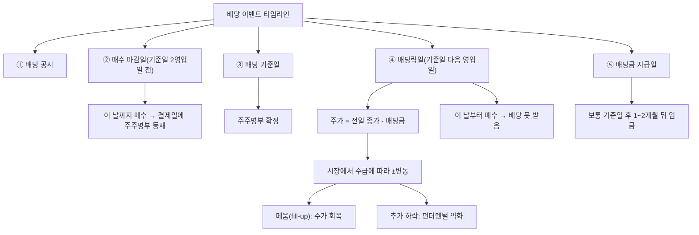

# 배당락 뜻 — 배당 권리가 빠진 날

## 한 줄 정의

배당락은 배당 기준일이 지나 배당받을 권리가 사라진 상태로, 해당 일에 주가가 배당금만큼 하향 조정되는 현상입니다.

## 아주 쉽게 말하면

마트에서 "오늘까지 구매 시 5,000원 상품권 증정"이라고 합니다. 내일부터 산 사람은 상품권을 못 받으니, 상품의 실질 가치가 상품권만큼 줄어드는 셈입니다.

주식도 마찬가지입니다. "12월 31일까지 주식을 가진 사람에게 배당금 2,000원을 줍니다." 1월 2일(배당락일)부터 산 사람은 그 배당을 못 받으므로, 시장이 주가를 2,000원 낮춰서 시작합니다. 쿠폰이 떨어진 상품의 가격이 내려가는 것과 동일한 원리입니다.

## 왜 중요한가

배당락을 모르면 "배당 받았는데 왜 주가가 빠졌지? 손해 아닌가?"라고 당황합니다. 결론부터 말하면, 배당 + 주가 하락을 합치면 총 자산은 변하지 않습니다. 배당은 "기업 가치의 일부를 현금으로 꺼내온 것"이지 공짜 수익이 아닙니다.

이 원리를 이해하면 두 가지 판단이 가능합니다:
1. **배당락 전 매수 vs 후 매수**: 배당소득세(15.4%)를 내고 배당을 받을지, 배당을 포기하고 낮은 가격에 살지 선택할 수 있습니다.
2. **배당락 후 메움 속도 예측**: 기업 펀더멘털이 좋으면 주가가 빠르게 회복되고, 나쁘면 추가 하락합니다.

## 그림으로 이해하기

## 숫자로 보는 예시

> ⚠️ 아래 숫자는 개념 설명을 위한 **가상 예시**이며, 실제 투자 데이터가 아닙니다.

가상 기업 '한국전력우선주'로 배당락 전후를 비교합니다.

**기본 정보**
- 배당 기준일: 12월 31일(화)
- 매수 마감일: 12월 27일(금) — 결제(T+2) 감안
- 배당락일: 12월 30일(월)
- DPS: 3,000원 / 12월 27일 종가: 60,000원

**투자자 A: 배당락 전 보유 (배당 수령)**
- 배당 수령: 3,000원
- 배당소득세: 3,000 × 15.4% = 462원
- 세후 배당: 2,538원
- 배당락일 기준가: 57,000원
- 총 자산: 57,000 + 2,538 = **59,538원** (세금으로 462원 감소)

**투자자 B: 배당락일 매수 (배당 포기)**
- 매수가: 57,000원 (배당 미수령)
- 배당소득세: 없음
- 주가가 60,000원으로 회복되면: +3,000원 시세차익
- 양도세 대상 아닌 경우(소액 개인) 실질 수익 3,000원

→ 세금 관점에서는 B가 유리할 수 있지만, 주가 회복이 보장되지 않는다는 리스크가 있습니다.

**배당락 후 메움 시나리오**

| 시점 | 주가 | 상황 |
|------|------|------|
| 12/27(금) | 60,000원 | 배당 포함 가격 |
| 12/30(월) 배당락 | 57,200원 | 기준가 57,000 + 매수세 유입 |
| 1/3(금) | 58,500원 | 부분 메움 진행 |
| 1/15(수) | 60,000원 | 완전 메움 (약 2주 소요) |

## 표로 비교하기

| 전략 | 배당락 전 매수 | 배당락 후 매수 |
|------|-------------|-------------|
| 배당 수령 | ○ | × |
| 매입 가격 | 높음(배당 포함) | 낮음(배당 제외) |
| 배당소득세 | 15.4% 원천징수 | 없음 |
| 총수익 구조 | 배당 - 세금 ± 주가변동 | 순수 주가 변동만 |
| 적합 투자자 | 현금 흐름 필요, 장기 보유 | 세금 최적화, 단기 매매 |
| 리스크 | 배당락 후 추가 하락 | 주가 미회복 시 기회비용 |

> ⚠️ 밸류에이션 지표는 투자 판단의 **참고 자료**일 뿐, 특정 수치가 매수·매도 시점을 의미하지 않습니다. 반드시 다른 지표·정성 분석과 함께 종합적으로 판단하세요.

## 초보자가 자주 하는 오해

1. **"배당락 전날 사서 배당 받고 바로 팔면 이득이다"**
   → 배당받는 만큼 주가가 빠지므로 세전 손익은 0원입니다. 여기에 배당소득세 15.4%와 매매 수수료까지 내면 오히려 확정 손실입니다.

2. **"배당락으로 빠진 주가는 반드시 회복된다"**
   → 회복을 보장하는 규칙은 없습니다. 기업 펀더멘털이 좋고 시장 환경이 우호적이면 빠르게 메우지만, 실적 악화 시 배당락 후 추가 하락도 흔합니다.

3. **"배당락일에 주가가 정확히 배당금만큼 빠진다"**
   → 배당금만큼 '기준가'가 조정되지만, 실제 시가는 수급에 따라 다릅니다. 매수세가 강하면 기준가보다 높게, 매도세가 강하면 더 낮게 열릴 수 있습니다.

4. **"결제일 개념 없이 기준일 당일에 사면 된다"**
   → 한국 주식은 T+2 결제이므로, 기준일 2영업일 전까지 매수해야 기준일에 주주명부에 등재됩니다. 기준일 당일 매수는 배당을 받을 수 없습니다.

## 고수는 이렇게 봅니다

숙련된 투자자는 배당락을 **매매 기회**로 활용합니다.

첫째, **'배당락 후 매수' 전략**. 고배당주(수익률 5%+)의 배당락일에 3~5% 낮아진 가격에 매수하고, 1~2개월 내 메움을 기대합니다. 배당소득세를 절약하면서 시세차익을 노리는 방식입니다.

둘째, **연말 배당 시즌 패턴 활용**. 12월 말 배당락은 연초 효과(1월 자금 유입)와 결합해 메움이 빠른 경향이 있습니다. 중간배당(6월) 대비 메움 속도가 더 빠른 편입니다.

셋째, **배당락 규모 대비 실제 하락 분석**. 배당락일 실제 하락폭이 배당금보다 작으면 시장이 긍정적이라는 의미이고, 더 크면 다른 악재가 겹쳤다는 신호입니다.

## 기업분석에서는 이렇게 씁니다

배당주 투자 보고서에서 '배당락 전 매수 vs 배당락 후 매수' 백테스트를 수행합니다. 최근 5년간 해당 종목의 배당락 후 메움에 걸린 평균 기간과 메움 성공률을 분석해, 세금·수수료를 고려한 최적 매매 시점을 제시합니다.

## 함께 보면 좋은 용어

- [배당](./dividend.md) — 배당락의 원인이 되는 현금 지급
- [기준일](./record-date.md) — 배당 권리 확정일
- [배당수익률](./dividend-yield.md) — 배당락 규모의 기준
- [권리락](./ex-rights.md) — 유무상증자 시 유사한 가격 조정
- [배당성향](./payout-ratio.md) — 배당 규모 결정 요인

## 정리

배당락은 배당 기준일 이후 배당금만큼 주가가 조정되는 자연스러운 현상입니다. 배당 수령이 "공짜 이익"이 아님을 이해하고, T+2 결제일 규칙·세금·메움 가능성을 종합 고려해 매매 시점을 결정하세요.

## 한 줄 요약

> 배당락은 '배당금만큼 주가가 빠지는 정상적 조정'이며, 배당을 받아도 총 자산은 변하지 않습니다.

---

이 글은 투자 권유가 아니라 주식 용어와 기업분석 방법을 설명하기 위한 교육 콘텐츠입니다. 특정 종목의 매수·매도 판단은 독자 본인의 책임입니다.

Tags: 배당락, 배당기준일, 권리락, 주가조정, 배당투자
