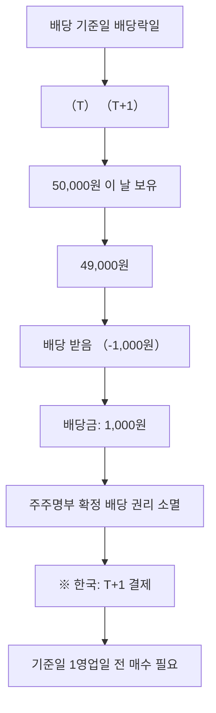

# 배당락 뜻 — 배당 권리가 빠진 날

## 한 줄 정의

배당락은 배당 기준일이 지나 배당받을 권리가 사라진 상태로, 해당 일에 주가가 배당금만큼 하향 조정되는 현상입니다.

## 아주 쉽게 말하면

"12월 31일까지 주식을 가진 사람에게 배당을 줍니다." 1월 2일(배당락일)부터 산 사람은 배당을 못 받으므로, 그만큼 주가가 빠집니다. 쿠폰이 떨어진 상품과 비슷합니다.

## 왜 중요한가

배당락을 모르면 "배당 받았는데 왜 주가가 빠졌지?"라고 당황합니다. 배당락은 자연스러운 가격 조정이며, 배당 투자의 매매 타이밍을 결정하는 핵심 개념입니다.

## 그림으로 이해하기

## 숫자로 보는 예시

> ⚠️ 아래 숫자는 개념 설명을 위한 **가상 예시**이며, 실제 투자 데이터가 아닙니다.

AA기업:
- 배당 기준일: 12월 31일
- 배당금: 2,000원/주
- 12월 30일 종가: 80,000원
- 배당락일(1월 2일) 기준가: 80,000 - 2,000 = **78,000원**
- 실제 시가: 수급에 따라 78,000원 위아래에서 형성

## 표로 비교하기

| 구분 | 배당락 전 매수 | 배당락 후 매수 |
|------|-------------|-------------|
| 배당 수령 | ○ | × |
| 매입 가격 | 높음 | 낮음 (배당금만큼) |
| 세금 | 배당소득세 15.4% | 없음 |
| 총 수익 | 배당 - 세금 - 주가하락 | 순수 주가 변동만 |
| 적합 투자자 | 배당 현금 필요 | 배당 불필요, 세금 회피 |

## 초보자가 자주 하는 오해

1. **"배당락 전날 사서 배당 받고 바로 팔면 이득이다"**
   → 배당받는 만큼 주가가 빠지므로 세전 손익은 0원입니다. 여기에 배당소득세(15.4%)와 매매 수수료까지 내면 오히려 소폭 손실입니다.

2. **"배당락으로 빠진 주가는 바로 회복된다"**
   → 반드시 회복된다는 보장이 없습니다. 시장 상황에 따라 추가 하락할 수도, 빠르게 메울 수도 있습니다. 이를 '배당락 후 메움(fill-up)'이라 합니다.

## 고수는 이렇게 봅니다

숙련된 투자자는 배당락 효과가 큰 고배당주의 '배당락 후 매수' 전략을 활용합니다. 배당을 포기하는 대신 낮아진 가격에 매수해, 배당소득세 없이 주가 회복 수익을 노립니다. 특히 12월 말 배당락은 연초 효과와 결합해 메움이 빠른 경향이 있습니다.

## 기업분석에서는 이렇게 씁니다

배당주 투자에서 '배당락 전 매수 vs 배당락 후 매수' 백테스트를 합니다. 세금·수수료를 고려한 순수익을 비교해 최적 매매 시점을 결정합니다.

## 함께 보면 좋은 용어

- [배당](./dividend.md) — 배당락의 원인이 되는 현금 지급
- [기준일](./record-date.md) — 배당 권리 확정일
- [배당수익률](./dividend-yield.md) — 배당락 규모의 기준
- [권리락](./ex-rights.md) — 유무상증자 시 유사한 가격 조정
- [배당성향](./payout-ratio.md) — 배당 규모 결정 요인

## 정리

배당락은 배당 기준일 이후 배당금만큼 주가가 조정되는 자연스러운 현상입니다. 배당 수령이 "공짜 이익"이 아님을 이해하고, 세금·회복 가능성을 고려해 매매 시점을 결정하세요.

## 한 줄 요약

> 배당락은 '배당금만큼 주가가 빠지는 것'이며, 배당을 받아도 총 자산은 변하지 않습니다.

---

*면책 조항: 이 글은 투자 권유가 아니라 주식 용어와 기업분석 방법을 설명하기 위한 교육 콘텐츠입니다. 특정 종목의 매수·매도 판단은 독자 본인의 책임입니다.*

Tags: 배당락, 배당기준일, 권리락, 주가조정, 배당투자
