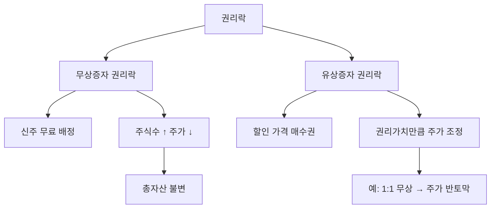

# 권리락 뜻 — 증자 권리가 빠진 날

## 한 줄 정의

권리락은 유상증자나 무상증자의 신주 배정 기준일이 지나, 신주를 받을 권리가 사라진 상태로 주가가 조정되는 현상입니다.

## 아주 쉽게 말하면

"기존 주주에게 1주당 0.5주를 공짜로 줍니다(무상증자)." 기준일 이후엔 이 혜택이 없으므로, 주가가 그만큼 조정됩니다. 배당락과 같은 원리이지만, 배당 대신 '신주 받을 권리'가 빠지는 것입니다.

## 왜 중요한가

권리락일에 주가가 급락하는 것처럼 보이지만, 실제로는 주식수가 늘어난 만큼 주가가 나눠진 것입니다. 권리락을 모르면 "갑자기 주가가 반토막났다"고 오해할 수 있습니다.

## 그림으로 이해하기

## 숫자로 보는 예시

> ⚠️ 아래 숫자는 개념 설명을 위한 **가상 예시**이며, 실제 투자 데이터가 아닙니다.

BB기업 무상증자 50% (2주당 1주 배정):
- 권리락 전 주가: 90,000원
- 권리락 후 기준가: 90,000 ÷ 1.5 = **60,000원**
- 보유 주식: 100주 → 150주
- 총 자산: 900만 원 → 150주 × 60,000 = **900만 원 (동일)**

## 표로 비교하기

| 구분 | 배당락 | 권리락 |
|------|--------|--------|
| 원인 | 배당금 지급 | 유·무상증자 |
| 조정 방식 | 배당금만큼 차감 | 증자 비율로 나눔 |
| 주식수 변화 | 불변 | 증가 |
| 총 자산 변화 | 불변 (현금 수령) | 불변 (주식수 증가) |
| 발생 시기 | 배당 기준일 다음날 | 증자 기준일 다음날 |

## 초보자가 자주 하는 오해

1. **"권리락이면 주가가 반토막 나서 손해다"**
   → 주가가 반이 되지만 주식수가 2배가 됩니다. 총 자산은 동일합니다. 차트에서 급락으로 보이지만 실제 손실이 아닙니다.

2. **"권리락 전에 팔아야 한다"**
   → 권리(신주)를 받든, 팔든 경제적 가치는 같습니다. 무상증자는 기업 가치 변화 없이 주식 분할과 유사한 효과입니다.

## 고수는 이렇게 봅니다

숙련된 투자자는 무상증자 발표를 긍정 신호로 봅니다. 이익잉여금이 풍부해야 무상증자가 가능하기 때문입니다. 또한 유상증자의 경우 할인율, 조달 목적(시설투자 vs 부채상환)에 따라 투자 판단이 갈립니다.

## 기업분석에서는 이렇게 씁니다

유상증자 발표 시 '희석 효과'를 계산합니다. 기존 주주가 신주인수권을 행사하지 않으면 지분율이 줄어드므로, 신주 발행가와 현재 주가의 차이(권리가치)를 산출해 투자 의사결정에 반영합니다.

## 함께 보면 좋은 용어

- [배당락](./ex-dividend.md) — 유사한 가격 조정 메커니즘
- [유상증자](../level-07-earnings/paid-in-capital-increase.md) — 권리락을 유발하는 이벤트
- [무상증자](../level-07-earnings/free-capital-increase.md) — 공짜 신주 배정
- [기준일](./record-date.md) — 권리 확정 기준
- [자본](../level-03-financial-statements/equity.md) — 증자의 회계적 효과

## 정리

권리락은 증자 기준일 이후 신주 받을 권리가 소멸하면서 주가가 조정되는 현상입니다. 총 자산 가치는 변하지 않으며, 차트의 급락처럼 보이는 것은 착시입니다.

## 한 줄 요약

> 권리락은 '증자로 주식수가 늘어난 만큼 주가가 나눠진 것'이며, 실제 손실이 아닙니다.

---

*면책 조항: 이 글은 투자 권유가 아니라 주식 용어와 기업분석 방법을 설명하기 위한 교육 콘텐츠입니다. 특정 종목의 매수·매도 판단은 독자 본인의 책임입니다.*

Tags: 권리락, 유상증자, 무상증자, 신주인수권, 주가조정
