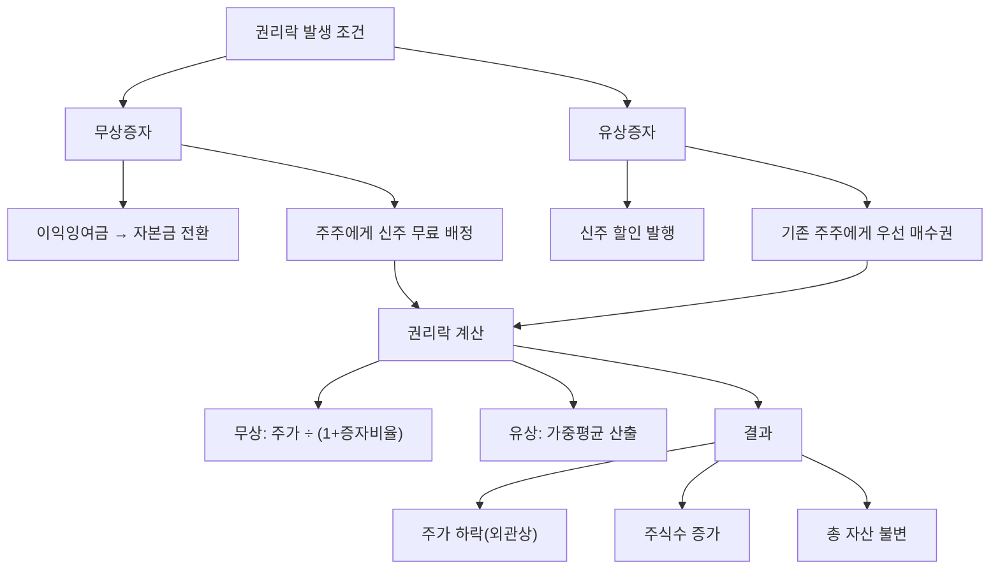

# 권리락 뜻 — 증자 권리가 빠진 날

## 한 줄 정의

권리락은 유상증자나 무상증자의 신주 배정 기준일이 지나, 신주를 받을 권리가 사라진 상태로 주가가 조정되는 현상입니다.

## 아주 쉽게 말하면

피자 한 판(8조각)을 4명이 나눠 먹고 있었는데, 가게에서 "오늘까지 온 손님에게 피자 한 판을 더 줍니다"라고 합니다. 내일 오는 손님은 추가 피자를 못 받으니, 실질 가치가 달라집니다.

주식도 마찬가지입니다. "기존 주주 1주당 0.5주를 공짜로 줍니다(무상증자 50%)." 기준일 이후에 산 사람은 이 혜택을 못 받으므로, 시장이 주가를 조정합니다. 90,000원짜리 주식이 60,000원으로 내려가지만, 주식수가 1.5배로 늘어나 총 가치는 동일합니다.

## 왜 중요한가

권리락을 모르면 차트에서 주가가 갑자기 30~50% 급락한 것처럼 보여 "큰 사고가 났나?" 하고 당황합니다. 하지만 실제로는 주식이 쪼개진 것이지 가치가 줄어든 게 아닙니다.

권리락을 제대로 이해하면 세 가지를 판단할 수 있습니다:
1. **무상증자**: 이익잉여금이 풍부하다는 긍정 신호 + 주가 부담 완화 효과
2. **유상증자**: 신주 발행가 할인율에 따른 권리가치 산정
3. **투자 타이밍**: 기준일 전후 매매 전략 수립

## 그림으로 이해하기

## 숫자로 보는 예시

> ⚠️ 아래 숫자는 개념 설명을 위한 **가상 예시**이며, 실제 투자 데이터가 아닙니다.

**사례 1: 무상증자 50% (2주당 1주 배정)**

가상 기업 '코리아바이오':
- 권리락 전 주가: 90,000원 / 보유 100주
- 권리락 후 기준가: 90,000 ÷ 1.5 = **60,000원**
- 보유 주식수: 100주 → **150주**
- 총 자산: 900만 원 → 150주 × 60,000 = **900만 원 (동일)**

**사례 2: 유상증자 (주주배정, 신주 발행가 50,000원)**

가상 기업 '미래건설':
- 현재 주가: 80,000원 / 증자 비율 1:0.3 (10주당 3주 배정)
- 신주 발행가: 50,000원 (현재가 대비 37.5% 할인)
- 권리가치: (80,000 - 50,000) × 0.3 = **9,000원/주**
- 권리락 후 기준가: 80,000 - 9,000 = **71,000원**

→ 기존 주주는 71,000원 주식을 보유 + 50,000원에 신주를 살 수 있는 권리(가치 9,000원) 보유. 합계 80,000원으로 동일.

**핵심**: 두 경우 모두 권리락 전후로 총 자산 가치는 변하지 않습니다.

## 표로 비교하기

| 구분 | 배당락 | 무상증자 권리락 | 유상증자 권리락 |
|------|--------|-------------|-------------|
| 원인 | 배당금 지급 | 이익잉여금→자본 전환 | 신주 할인 발행 |
| 조정 방식 | 배당금 차감 | 증자비율로 나눔 | 권리가치만큼 차감 |
| 주식수 변화 | 불변 | 증가 | 증가(청약 시) |
| 현금 유출 | 기업→주주 | 없음 | 주주→기업 |
| 총 자산 | 불변(현금 수령) | 불변(주식 증가) | 불변(권리 보유) |
| 기업 입장 | 현금 유출 | 자본 재분류 | 자금 조달 |

> ⚠️ 밸류에이션 지표는 투자 판단의 **참고 자료**일 뿐, 특정 수치가 매수·매도 시점을 의미하지 않습니다. 반드시 다른 지표·정성 분석과 함께 종합적으로 판단하세요.

## 초보자가 자주 하는 오해

1. **"권리락이면 주가가 반토막 나서 손해다"**
   → 주가가 반이 되지만 주식수가 2배가 됩니다. 총 자산은 동일합니다. 차트에서 급락으로 보이는 것은 착시이며, 수정주가 차트에서는 이 조정이 반영되어 연속적으로 표시됩니다.

2. **"권리락 전에 팔아야 한다"**
   → 권리(신주)를 받든, 팔든 경제적 가치는 같습니다. 무상증자는 액면분할과 유사한 효과로 기업 가치 자체에 영향을 주지 않습니다.

3. **"무상증자 = 유상증자, 다 같은 증자다"**
   → 무상증자는 기업의 현금이 늘지 않고 자본 계정만 재분류됩니다(잉여금→자본금). 유상증자는 주주가 돈을 내고 새 주식을 사는 것이므로 기업에 실제 자금이 유입됩니다. 성격이 완전히 다릅니다.

4. **"유상증자는 항상 악재다"**
   → 조달 자금이 성장 투자(시설 확장, M&A)에 쓰이면 장기적으로 긍정적입니다. 부채 상환이나 운영 자금 부족 때문이면 부정적 신호일 수 있습니다. 목적이 핵심입니다.

## 고수는 이렇게 봅니다

숙련된 투자자는 **무상증자**와 **유상증자**를 완전히 다른 이벤트로 봅니다.

무상증자는 이익잉여금이 충분하다는 시그널이며, 주가 부담 완화(가격 낮아져 매수 심리 개선)와 거래량 증가 효과를 기대합니다. 실질적 기업 가치 변화는 없지만 시장 심리에 긍정적입니다.

유상증자는 **할인율, 증자 목적, 희석 규모** 세 가지를 봅니다. 발행가 할인율이 클수록 기존 주주에게 유리하지만(권리가치 증가), 희석 규모가 크면 주당 이익(EPS) 감소 우려가 있습니다. 시설투자 목적이면 미래 성장을, 운영자금 목적이면 재무 불안을 의심합니다.

## 기업분석에서는 이렇게 씁니다

유상증자 발표 시 **희석 효과 분석**을 수행합니다:
1. 증자 후 총 주식수 산출
2. 기존 EPS → 증자 후 EPS(희석) 계산
3. 조달 자금의 예상 수익률 반영(투자 회수 시점)
4. 희석 후에도 적정 밸류에이션인지 판단

기존 주주가 신주인수권을 행사하지 않으면 지분율이 줄어드므로, 실권 시 주가 추가 하락 가능성도 점검합니다.

## 함께 보면 좋은 용어

- [배당락](./ex-dividend.md) — 유사한 가격 조정 메커니즘
- [기준일](./record-date.md) — 권리 확정 기준
- [자본](../level-03-financial-statements/equity.md) — 증자의 회계적 효과
- [EPS](../level-05-valuation/eps.md) — 증자 시 희석 효과의 핵심
- [자사주 소각](./share-cancellation.md) — 증자와 반대 효과(주식수 감소)

## 정리

권리락은 증자 기준일 이후 신주 받을 권리가 소멸하면서 주가가 조정되는 현상입니다. 무상증자든 유상증자든 권리락 전후로 총 자산 가치는 변하지 않습니다. 차트의 급락은 착시이며, 핵심은 증자의 목적과 희석 효과를 분석하는 것입니다.

## 한 줄 요약

> 권리락은 '증자로 주식수가 늘어난 만큼 주가가 나눠진 것'이며, 총 자산 가치는 변하지 않습니다.

---

이 글은 투자 권유가 아니라 주식 용어와 기업분석 방법을 설명하기 위한 교육 콘텐츠입니다. 특정 종목의 매수·매도 판단은 독자 본인의 책임입니다.

Tags: 권리락, 유상증자, 무상증자, 신주인수권, 주가조정
