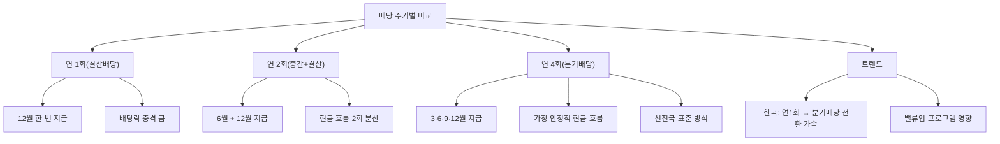

# 중간배당 뜻 — 결산 전에 미리 주는 배당

## 한 줄 정의

중간배당은 사업연도 중간(보통 반기 또는 분기)에 실시하는 배당으로, 연말 결산 배당을 기다리지 않고 주주에게 이익을 분배하는 것입니다.

## 아주 쉽게 말하면

연말에 보너스를 한꺼번에 받는 대신, 6월에 절반을 먼저 받는 것입니다. 기업도 1년에 한 번 배당하는 대신, 반기나 분기마다 나눠서 줄 수 있습니다. 월급처럼 현금이 꾸준히 들어오니 생활비 계획 세우기가 훨씬 편하겠죠? 배당 투자자에게도 같은 원리입니다.

미국은 대부분의 기업이 분기배당(연 4회)을 하지만, 한국은 아직 연 1회 결산배당이 주류입니다. 다만 최근 밸류업 트렌드와 함께 분기배당 전환 기업이 빠르게 늘고 있습니다.

## 왜 중요한가

중간배당의 확산은 한국 주식시장의 구조적 변화를 의미합니다.

첫째, **현금 흐름 안정화**입니다. 투자자 입장에서 연 1회 배당은 한 해의 수입이 12월에 집중되지만, 분기배당이면 3개월마다 현금이 들어옵니다. 은퇴 후 생활비로 배당을 쓰는 투자자에게 특히 중요합니다.

둘째, **배당락 충격 분산**입니다. 연 1회 DPS 4,000원이면 12월에 4,000원 배당락이 발생하지만, 분기배당이면 1,000원씩 4번으로 나뉘어 배당락 충격이 작아집니다.

셋째, **경영진 자신감 시그널**입니다. 분기마다 배당을 확약한다는 것은 매 분기 안정적 이익을 낼 수 있다는 자신감의 표현이며, 시장은 이를 긍정적으로 해석합니다.

## 그림으로 이해하기

## 숫자로 보는 예시

> ⚠️ 아래 숫자는 개념 설명을 위한 **가상 예시**이며, 실제 투자 데이터가 아닙니다.

가상 기업 '한국금융지주'의 분기배당 도입 전후를 비교합니다.

**도입 전: 연 1회 결산배당**
- 연간 DPS: 4,000원
- 지급 시점: 다음 해 4월 (12월 기준일, 4월 지급)
- 배당락: 12월 말 한 번에 4,000원 하락

**도입 후: 분기배당 (연 4회)**

| 분기 | DPS | 기준일 | 지급 시점 | 배당락 |
|------|-----|--------|----------|--------|
| 1분기 | 800원 | 3/31 | 5월 중 | -800원 |
| 2분기 | 1,000원 | 6/30 | 8월 중 | -1,000원 |
| 3분기 | 800원 | 9/30 | 11월 중 | -800원 |
| 4분기 | 1,400원 | 12/31 | 다음 해 4월 | -1,400원 |
| **연간** | **4,000원** | - | - | - |

→ 연간 DPS 총액은 동일하지만, 주주는 3·5·8·11월에 나눠서 현금을 수령합니다.

**복리 효과 비교 (100주 보유, 주가 50,000원)**
- 연 1회: 400,000원을 4월에 한꺼번에 수령 → 재투자 1회
- 분기 4회: 80,000~140,000원씩 분산 수령 → 재투자 4회
- 분기 재투자 시 연간 추가 수익: 약 3,000~5,000원 (미미하지만 장기 복리로 누적)

## 표로 비교하기

| 구분 | 연 1회 결산배당 | 중간배당(연 2회) | 분기배당(연 4회) |
|------|-------------|-------------|-------------|
| 현금 수취 빈도 | 연 1회 | 연 2회 | 연 4회 |
| 배당락 규모 | 크다(연 DPS 전액) | 중간 | 작다(분산) |
| 재투자 기회 | 연 1회 | 연 2회 | 연 4회 |
| 기업 부담 | 결산 후 확정 | 반기 실적 확인 | 매 분기 이사회 결의 |
| 한국 현황 | 아직 다수 | 대기업 일부 | 최근 확대 중 |
| 미국·유럽 | 극소수 | 일부 유럽 | 절대 다수 |

> ⚠️ 밸류에이션 지표는 투자 판단의 **참고 자료**일 뿐, 특정 수치가 매수·매도 시점을 의미하지 않습니다. 반드시 다른 지표·정성 분석과 함께 종합적으로 판단하세요.

## 초보자가 자주 하는 오해

1. **"중간배당을 하면 연간 배당 총액이 더 많다"**
   → 반드시 그렇지 않습니다. 중간배당은 지급 '시기'를 나누는 것이지 총액을 늘리는 것이 아닐 수 있습니다. 다만 분기배당 도입과 동시에 DPS를 올리는 기업도 많습니다.

2. **"모든 기업이 중간배당을 할 수 있다"**
   → 정관에 중간배당 규정이 있어야 하며, 이사회 결의가 필요합니다. 중간 실적이 적자이면 법적으로 중간배당이 어렵습니다.

3. **"분기배당이면 배당락을 4번 맞아서 불리하다"**
   → 배당락 합계는 동일합니다. 4,000원 한 번이나 1,000원 4번이나 총 조정폭은 같습니다. 오히려 분산되어 충격이 작다는 장점이 있습니다.

4. **"중간배당 발표 = 실적이 좋다"**
   → 중간배당 자체는 실적 양호의 필요조건이지 충분조건은 아닙니다. 전년도 이익잉여금으로 지급할 수도 있으므로, 당기 실적과 별개로 판단해야 합니다.

## 고수는 이렇게 봅니다

숙련된 투자자는 **분기배당 전환**을 밸류업 시그널로 해석합니다.

첫째, 분기배당 도입 기업은 "향후 실적에 자신 있다"는 경영진의 암묵적 약속이므로, 배당 컷 가능성이 상대적으로 낮습니다.

둘째, 분기배당 전환이 리레이팅 촉매가 됩니다. 기관·외국인 투자자는 분기배당 기업을 선호하므로(글로벌 표준에 부합) 수급이 개선됩니다.

셋째, 분기배당 기준일을 활용한 **배당 캘린더 전략**을 사용합니다. 여러 분기배당 기업에 분산 투자하면 거의 매달 배당금이 입금되는 포트폴리오를 구성할 수 있습니다.

## 기업분석에서는 이렇게 씁니다

분기배당 도입 기업의 투자 가치를 평가할 때:
1. 연간 DPS 총액이 기존 대비 늘었는지 확인(진정한 주주환원 확대인지)
2. FCF 대비 분기 배당금 비율로 지속 가능성 점검
3. 분기별 실적 변동성 확인(계절성 강한 기업은 분기배당 유지 어려움)
4. 동종 업계 대비 배당수익률·배당성향 비교

## 함께 보면 좋은 용어

- [배당](./dividend.md) — 중간배당의 상위 개념
- [배당락](./ex-dividend.md) — 중간배당에도 배당락 발생
- [배당성향](./payout-ratio.md) — 연간 기준 배당 비율
- [기준일](./record-date.md) — 분기별 기준일 확인 필수
- [특별배당](./special-dividend.md) — 일회성 추가 배당

## 정리

중간배당은 연말을 기다리지 않고 반기·분기에 실시하는 배당으로, 주주의 현금 흐름을 안정화하고 배당락 충격을 분산합니다. 한국에서 분기배당 도입 기업이 증가하는 것은 밸류업 트렌드의 핵심 흐름이며, 경영진의 실적 자신감과 주주환원 의지를 동시에 보여주는 긍정적 신호입니다.

## 한 줄 요약

> 중간배당은 '결산 전에 미리 나눠주는 배당'으로, 분기배당 전환은 주주환원 강화와 밸류업의 핵심 신호입니다.

---

이 글은 투자 권유가 아니라 주식 용어와 기업분석 방법을 설명하기 위한 교육 콘텐츠입니다. 특정 종목의 매수·매도 판단은 독자 본인의 책임입니다.

Tags: 중간배당, 분기배당, 배당, 현금흐름, 주주환원
