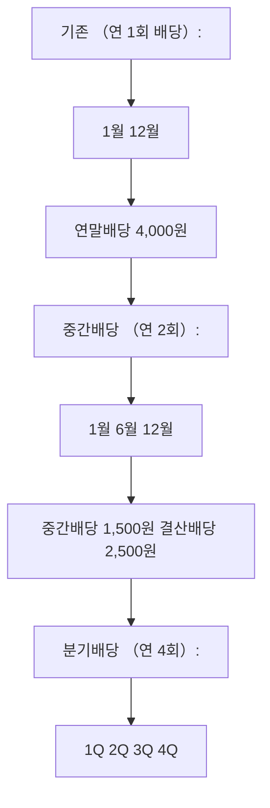

# 중간배당 뜻 — 결산 전에 미리 주는 배당

## 한 줄 정의

중간배당은 사업연도 중간(보통 반기 또는 분기)에 실시하는 배당으로, 연말 결산 배당을 기다리지 않고 주주에게 이익을 분배하는 것입니다.

## 아주 쉽게 말하면

연말 보너스만 기다리지 않고, 6월에 중간 보너스를 주는 것입니다. 기업도 1년에 한 번 배당하는 대신, 반기나 분기마다 나눠서 줄 수 있습니다.

## 왜 중요한가

중간배당은 주주에게 조기 현금 흐름을 제공하고, 기업의 안정적 이익 창출 자신감을 보여줍니다. 분기배당으로 전환하는 기업이 늘면서 한국 시장의 배당 문화가 선진화되고 있습니다.

## 그림으로 이해하기

## 숫자로 보는 예시

> ⚠️ 아래 숫자는 개념 설명을 위한 **가상 예시**이며, 실제 투자 데이터가 아닙니다.

EE기업 분기배당 도입:
| 시기 | 배당금/주 | 배당기준일 |
|------|----------|-----------|
| 1분기 | 500원 | 3월 31일 |
| 2분기 | 500원 | 6월 30일 |
| 3분기 | 500원 | 9월 30일 |
| 4분기(결산) | 1,500원 | 12월 31일 |
| **연간 합계** | **3,000원** | - |

→ 주주는 분산된 현금 흐름 확보

## 표로 비교하기

| 구분 | 연 1회 배당 | 중간/분기 배당 |
|------|-----------|-------------|
| 현금 수취 빈도 | 연 1회 | 연 2~4회 |
| 주주 현금흐름 | 집중 | 분산·안정 |
| 배당락 영향 | 연 1회 큰 폭 | 소폭 분산 |
| 기업 부담 | 결산 후 확정 | 중간 실적 확인 필요 |
| 선진국 사례 | 드묾 | 미국·유럽 대부분 분기배당 |

## 초보자가 자주 하는 오해

1. **"중간배당을 하면 연간 배당 총액이 더 많다"**
   → 반드시 그렇지 않습니다. 연간 배당 총액은 기업 정책에 따라 결정되며, 중간배당은 지급 '시기'를 나누는 것일 뿐 총액을 늘리는 것이 아닐 수 있습니다.

2. **"모든 기업이 중간배당을 할 수 있다"**
   → 정관에 중간배당 규정이 있어야 하며, 중간 실적이 적자이면 중간배당이 어렵습니다. 이사회 결의가 필요합니다.

## 고수는 이렇게 봅니다

숙련된 투자자는 분기배당 전환을 '주주환원 강화 시그널'로 봅니다. 경영진이 분기마다 배당을 확약한다는 것은 실적에 대한 자신감이며, 밸류업 정책과 맞물려 주가 리레이팅의 촉매가 됩니다.

## 기업분석에서는 이렇게 씁니다

분기배당 도입 기업의 연간 배당수익률을 재산정합니다. 분기배당은 재투자 기회(받은 배당으로 재매수)가 빨라져 복리 효과가 소폭 높아지며, 배당 투자자에게 매력도가 올라갑니다.

## 함께 보면 좋은 용어

- [배당](./dividend.md) — 중간배당의 상위 개념
- [배당락](./ex-dividend.md) — 중간배당에도 배당락 발생
- [배당성향](./payout-ratio.md) — 연간 기준 배당 비율
- [기준일](./record-date.md) — 분기별 기준일 확인 필수
- [특별배당](./special-dividend.md) — 일회성 추가 배당

## 정리

중간배당은 연말을 기다리지 않고 반기·분기에 실시하는 배당입니다. 주주의 현금 흐름 안정화와 기업의 주주환원 의지를 보여주며, 한국에서도 분기배당 도입 기업이 증가 중입니다.

## 한 줄 요약

> 중간배당은 '결산 전에 미리 나눠주는 배당'으로, 분기배당 전환은 주주환원 강화 신호입니다.

---

*면책 조항: 이 글은 투자 권유가 아니라 주식 용어와 기업분석 방법을 설명하기 위한 교육 콘텐츠입니다. 특정 종목의 매수·매도 판단은 독자 본인의 책임입니다.*

Tags: 중간배당, 분기배당, 배당, 현금흐름, 주주환원
