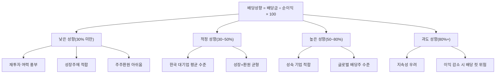

# 배당성향 뜻 — 이익 중 얼마를 배당하나

## 한 줄 정의

배당성향(Payout Ratio)은 당기순이익 중 배당금으로 지급하는 비율로, 기업이 이익을 주주환원과 재투자에 어떻게 배분하는지를 보여줍니다.

## 아주 쉽게 말하면

월급 300만 원에서 부모님께 용돈 60만 원을 드리면 "용돈 성향"은 20%입니다. 기업도 번 돈에서 주주에게 얼마나 돌려주느냐가 배당성향입니다. 나머지는 신사업 투자, 빚 갚기, 비상금 쌓기에 씁니다.

배당성향이 30%라면 "100원 벌어서 30원은 주주에게, 70원은 회사 미래를 위해 쓴다"는 뜻입니다. 이 비율이 기업의 성장 의지와 주주 친화도를 동시에 보여줍니다.

## 왜 중요한가

배당성향은 투자자에게 세 가지를 알려줍니다.

첫째, **배당의 지속 가능성**입니다. 배당성향이 90%면 이익이 조금만 줄어도 배당을 삭감해야 합니다. 40%라면 이익이 반토막 나도 배당을 유지할 여지가 있습니다.

둘째, **성장과 환원의 균형**입니다. 고성장 기업은 재투자가 유리하므로 배당성향이 낮고, 성숙 기업은 투자 기회가 적으므로 배당성향이 높습니다. 업종 대비 배당성향이 '적정한지'를 판단해야 합니다.

셋째, **미래 배당금 예측의 출발점**입니다. "예상 순이익 × 배당성향 목표 = 예상 DPS"로 미래 배당수익률을 산출할 수 있습니다.

## 그림으로 이해하기

## 숫자로 보는 예시

> ⚠️ 아래 숫자는 개념 설명을 위한 **가상 예시**이며, 실제 투자 데이터가 아닙니다.

가상 기업 '한국통신'의 배당성향 확대 과정을 살펴보겠습니다.

**한국통신 배당 정책 변화 (밸류업 프로그램 참여)**

| 연도 | 순이익 | 배당금 | 배당성향 | DPS | 주가 | 배당수익률 |
|------|--------|--------|---------|-----|------|----------|
| 2022 | 5,000억 | 1,250억 | 25% | 2,500원 | 60,000원 | 4.2% |
| 2023 | 5,500억 | 1,925억 | 35% | 3,850원 | 65,000원 | 5.9% |
| 2024 | 6,000억 | 2,700억 | 45% | 5,400원 | 80,000원 | 6.8% |

→ 순이익이 20% 성장하는 동안, 배당성향을 25%→45%로 올려 DPS는 116% 증가. 이것이 '배당 더블 부스터'(이익 성장 + 성향 확대)입니다.

**지속 가능성 점검**
- 2024년 FCF: 4,500억 원
- 배당금: 2,700억 원
- FCF 대비 배당 비율: 60% → 여유 있음(80% 이하면 양호)

**업종별 평균 배당성향 비교**

| 업종 | 한국 평균 | 글로벌 평균 | 해석 |
|------|----------|-----------|------|
| IT·반도체 | 15~25% | 25~35% | 재투자 우선 |
| 은행·보험 | 25~35% | 40~60% | 한국이 상대적 낮음 |
| 통신 | 40~60% | 60~80% | 성숙 업종 |
| 유틸리티 | 30~50% | 60~80% | 한국은 공기업 변수 |
| 소비재 | 30~45% | 40~60% | 안정적 흐름 |

## 표로 비교하기

| 배당성향 수준 | 평가 | 대표 유형 | 투자 포인트 |
|-------------|------|----------|-----------|
| 20% 이하 | 매우 낮음 | 고성장 IT, 바이오 | 재투자 수익률 검증 |
| 20~40% | 보통 | 한국 대기업 평균 | 향후 확대 여지 주목 |
| 40~60% | 양호 | 성숙 우량기업 | 이익 성장과 병행 시 매력적 |
| 60~80% | 높음 | 글로벌 배당주 수준 | FCF 커버리지 확인 필수 |
| 80% 이상 | 매우 높음 | 성장 포기 의심 | 배당 컷 리스크 점검 |
| 100% 초과 | 비정상 | 유보금 소진 | 지속 불가능, 적자 전환 시 즉시 삭감 |

> ⚠️ 밸류에이션 지표는 투자 판단의 **참고 자료**일 뿐, 특정 수치가 매수·매도 시점을 의미하지 않습니다. 반드시 다른 지표·정성 분석과 함께 종합적으로 판단하세요.

## 초보자가 자주 하는 오해

1. **"배당성향 100%가 가장 좋다"**
   → 번 돈을 전부 나눠주면 설비 투자·R&D에 쓸 돈이 없습니다. 이익이 조금만 줄어도 배당을 삭감해야 하며, 장기적으로 기업 경쟁력이 약화됩니다.

2. **"배당성향이 고정되어 있다"**
   → 기업은 매년 이사회에서 배당 규모를 결정합니다. 다만 최근 한국에서는 "중기 배당성향 목표 40~50%"처럼 3~5년 가이던스를 공시하는 추세입니다.

3. **"배당성향이 높으면 무조건 주주 친화적이다"**
   → 높은 배당성향이 '투자할 곳이 없어서' 나온 것이라면 성장 포기 신호입니다. ROE가 자본비용보다 높은 기업은 재투자가 주주에게 더 유리합니다.

4. **"배당성향만 보면 된다"**
   → 순이익 기반 배당성향보다 FCF 기반이 더 보수적입니다. 감가상각이 크거나 운전자본이 많이 묶인 기업은 순이익으로는 여유로워 보여도 실제 현금이 부족할 수 있습니다.

## 고수는 이렇게 봅니다

숙련된 투자자는 **'배당성향 확대 + 이익 성장'** 조합을 최우선으로 봅니다.

- 이익 성장률 15% + 배당성향 25%→35% 확대 = DPS 성장률 약 60%
- 이것이 가장 강력한 배당 성장 시나리오입니다.

또한 **FCF 기반 배당성향**(= 배당금 ÷ FCF)을 병행 확인합니다. 순이익 기반 성향이 40%여도 FCF 기반이 90%면 실질적으로 무리한 배당입니다.

밸류업 공시에서 "배당성향 목표 50%"를 발표한 기업의 경우, 이 목표가 달성 가능한지(이익 전망, FCF 추이) 검증한 후 투자합니다.

## 기업분석에서는 이렇게 씁니다

미래 배당 예측의 핵심 공식:
- **예상 DPS = 예상 EPS × 목표 배당성향**
- **예상 배당수익률 = 예상 DPS ÷ 현재 주가**

밸류업 공시가 있는 기업은 목표 배당성향을 그대로 적용하고, 없는 기업은 과거 3년 평균을 사용합니다. 배당성향 확대 공시 시점에 리레이팅이 발생하는 경우가 많으므로, 공시 전 선점이 핵심입니다.

## 함께 보면 좋은 용어

- [배당](./dividend.md) — 배당성향이 결정하는 지급 금액
- [배당수익률](./dividend-yield.md) — 배당성향과 주가로 결정
- [순이익](../level-03-financial-statements/net-income.md) — 배당성향의 분모
- [FCF](../level-03-financial-statements/fcf.md) — 실제 배당 여력 (순이익보다 보수적)
- [자사주 매입](./share-buyback.md) — 배당 외 주주환원 수단

## 정리

배당성향은 이익 중 주주에게 돌려주는 비율로, 성장 단계와 업종에 따라 적정 수준이 다릅니다. 너무 높으면 지속성이 의심되고, 너무 낮으면 주주환원이 부족합니다. '이익 성장 + 배당성향 확대'가 동시에 일어나는 기업이 배당 투자에서 가장 매력적입니다.

## 한 줄 요약

> 배당성향은 '번 돈 중 몇 %를 주주에게 주느냐'이며, 이익 성장과 함께 확대되면 배당 더블 부스터가 됩니다.

---

이 글은 투자 권유가 아니라 주식 용어와 기업분석 방법을 설명하기 위한 교육 콘텐츠입니다. 특정 종목의 매수·매도 판단은 독자 본인의 책임입니다.

Tags: 배당성향, 배당금, 순이익, 주주환원, 사내유보
