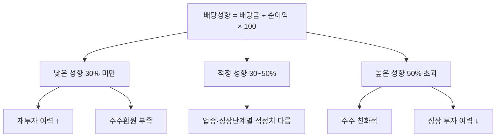

# 배당성향 뜻 — 이익 중 얼마를 배당하나

## 한 줄 정의

배당성향은 당기순이익 중 배당금으로 지급하는 비율로, 기업이 이익을 주주환원과 재투자에 어떻게 배분하는지를 보여줍니다.

## 아주 쉽게 말하면

월급 300만 원에서 부모님께 용돈 60만 원을 드리면 "용돈 성향"은 20%입니다. 기업도 번 돈에서 주주에게 얼마 비율로 나눠주는지가 배당성향입니다.

## 왜 중요한가

배당성향이 너무 낮으면 주주환원이 부족하고, 너무 높으면 재투자 여력이 부족합니다. 기업의 성장 단계와 업종에 맞는 적정 배당성향이 있으며, 이를 기준으로 배당 지속성과 증가 가능성을 판단합니다.

## 그림으로 이해하기

## 숫자로 보는 예시

> ⚠️ 아래 숫자는 개념 설명을 위한 **가상 예시**이며, 실제 투자 데이터가 아닙니다.

Z기업 배당 정책 변화:
| 연도 | 순이익 | 배당금 | 배당성향 | 정책 |
|------|--------|--------|---------|------|
| 2023 | 800억 | 200억 | 25% | 보수적 |
| 2024 | 1,000억 | 350억 | 35% | 주주환원 강화 |
| 2025 | 1,200억 | 480억 | 40% | 밸류업 정책 |

→ 배당성향 25% → 40%로 확대 = 주주환원 강화 시그널

## 표로 비교하기

| 배당성향 수준 | 평가 | 대표 유형 |
|-------------|------|----------|
| 20% 이하 | 매우 낮음 | 고성장 IT, 바이오 |
| 20~40% | 보통 | 한국 대기업 평균 |
| 40~60% | 양호 | 성숙 우량기업 |
| 60~80% | 높음 | 글로벌 배당주 수준 |
| 80% 이상 | 매우 높음 | 지속성 의심, 성장 포기? |
| 100% 초과 | 비정상 | 이익 초과 배당 (유보금 소진) |

## 초보자가 자주 하는 오해

1. **"배당성향 100%가 가장 좋다"**
   → 번 돈을 전부 나눠주면 설비 투자, 연구개발에 쓸 돈이 없습니다. 성장 기회를 포기하는 것이며, 이익이 조금만 줄어도 배당을 삭감해야 합니다.

2. **"배당성향이 고정되어 있다"**
   → 기업은 매년 배당성향을 조정할 수 있습니다. 다만 최근 한국에서는 "중기 배당성향 목표 40%"처럼 3~5년 가이던스를 제시하는 추세입니다.

## 고수는 이렇게 봅니다

숙련된 투자자는 '배당성향 + 이익성장률'을 조합합니다. 배당성향 30%이면서 이익이 매년 20% 성장하면, 배당금도 자연히 20% 늘어나 복리 효과가 발생합니다. 배당성향을 올리면서 이익도 성장하면 '배당 더블 부스터'입니다.

## 기업분석에서는 이렇게 씁니다

밸류업 공시에서 "배당성향 목표 50%"를 발표하면, 예상 EPS × 50% = 예상 DPS를 계산하고, 현재 주가 기준 미래 배당수익률을 산출합니다. 이것이 주가 리레이팅의 근거가 됩니다.

## 함께 보면 좋은 용어

- [배당](./dividend.md) — 배당성향이 결정하는 지급 금액
- [배당수익률](./dividend-yield.md) — 배당성향과 주가로 결정
- [순이익](../level-03-financial-statements/net-income.md) — 배당성향의 분모
- [FCF](../level-03-financial-statements/fcf.md) — 실제 배당 여력 (순이익보다 보수적)
- [자사주 매입](./share-buyback.md) — 배당 외 주주환원 수단

## 정리

배당성향은 이익 중 주주에게 돌려주는 비율로, 성장 단계와 업종에 따라 적정 수준이 다릅니다. 너무 높으면 지속성 의심, 너무 낮으면 주주환원 부족이며, 이익성장과 함께 배당성향이 확대되는 기업이 가장 매력적입니다.

## 한 줄 요약

> 배당성향은 '번 돈 중 몇 %를 주주에게 주느냐'이며, 이익 성장과 함께 올라가면 최고입니다.

---

*면책 조항: 이 글은 투자 권유가 아니라 주식 용어와 기업분석 방법을 설명하기 위한 교육 콘텐츠입니다. 특정 종목의 매수·매도 판단은 독자 본인의 책임입니다.*

Tags: 배당성향, 배당금, 순이익, 주주환원, 사내유보
