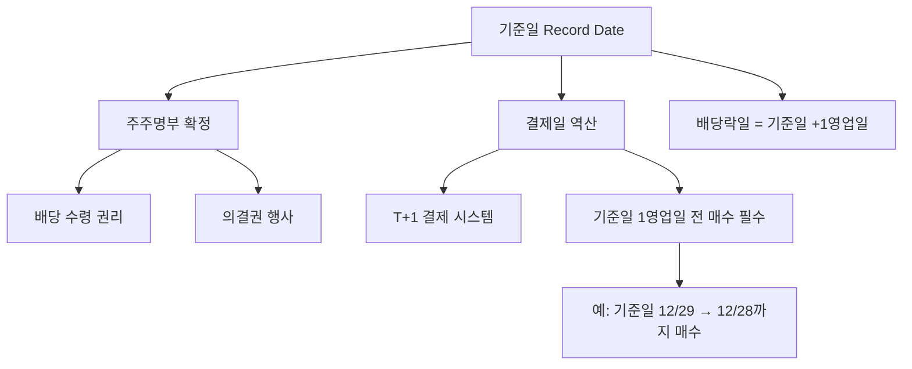

# 기준일 뜻 — 배당받을 주주를 확정하는 날

## 한 줄 정의

기준일(Record Date)은 배당·증자·의결권 등 주주 권리를 행사할 수 있는 주주를 확정하는 날짜로, 이 날 주주명부에 등재된 주주만 해당 권리를 갖습니다.

## 아주 쉽게 말하면

"12월 31일 기준으로 이름이 적혀 있는 주주에게 배당을 줍니다." 이 12월 31일이 기준일입니다. 기준일에 주식을 갖고 있어야 배당을 받을 수 있습니다.

## 왜 중요한가

기준일을 모르면 배당을 못 받을 수 있습니다. 한국은 T+1 결제 시스템(매수 후 1영업일 뒤 결제)이므로, 기준일 당일까지 주식을 보유하려면 1영업일 전에 매수해야 합니다.

## 그림으로 이해하기

## 숫자로 보는 예시

> ⚠️ 아래 숫자는 개념 설명을 위한 **가상 예시**이며, 실제 투자 데이터가 아닙니다.

GG기업 2025년 배당 일정:
| 이벤트 | 날짜 | 설명 |
|--------|------|------|
| 마지막 매수일 | 12/29(월) | 이 날까지 매수해야 |
| 결제·기준일 | 12/30(화) | 주주명부 확정 |
| 배당락일 | 12/31(수) | 배당 권리 소멸 |
| 배당금 지급일 | 4월 중 | 실제 현금 입금 |

## 표로 비교하기

| 구분 | 기준일 | 배당락일 | 지급일 |
|------|--------|---------|--------|
| 시점 | 권리 확정 | 기준일 다음 영업일 | 주총 후 1개월 내 |
| 의미 | 주주명부 폐쇄 | 신규 매수자 권리 없음 | 실제 현금 지급 |
| 투자자 행동 | 이 전까지 보유 확인 | 이 날부터 매도 가능 | 계좌 확인 |
| 주가 효과 | 없음 | 배당금만큼 하락 | 없음 |

## 초보자가 자주 하는 오해

1. **"기준일에 주식을 사면 배당받을 수 있다"**
   → T+1 결제이므로, 기준일 당일 매수하면 결제가 기준일 다음날에 되어 배당을 못 받습니다. 반드시 1영업일 전에 매수해야 합니다.

2. **"기준일 다음날 바로 배당금이 들어온다"**
   → 보통 정기주총(3월) 이후 1개월 내에 지급됩니다. 12월 기준일이면 실제 입금은 이듬해 4월경입니다.

## 고수는 이렇게 봅니다

숙련된 투자자는 분기배당 기업의 기준일을 미리 캘린더에 표시합니다. 또한 기준일 변경 공시(기존 12/31 → 분기말로 변경)를 확인해, 배당 정책 변화를 조기에 포착합니다.

## 기업분석에서는 이렇게 씁니다

배당 캘린더를 작성해 포트폴리오 내 종목별 기준일을 정리하고, 분기마다 배당 현금흐름이 얼마나 들어오는지 예측합니다. 기준일 전후 수급 변화(배당 매수 → 배당락 후 매도)도 단기 매매 전략에 활용합니다.

## 함께 보면 좋은 용어

- [배당락](./ex-dividend.md) — 기준일 다음 영업일에 발생
- [배당](./dividend.md) — 기준일의 목적
- [권리락](./ex-rights.md) — 증자 기준일 이후 발생
- [중간배당](./interim-dividend.md) — 반기·분기 기준일
- [배당수익률](./dividend-yield.md) — 기준일 전 매수 판단 기준

## 정리

기준일은 배당·증자 등 주주 권리를 행사할 주주를 확정하는 날입니다. T+1 결제를 고려해 1영업일 전까지 매수해야 하며, 실제 배당금 지급은 수개월 후입니다.

## 한 줄 요약

> 기준일은 '이 날 주식을 가진 사람에게 권리를 주겠다'는 마감일이며, T+1 결제를 감안해 미리 매수하세요.

---

*면책 조항: 이 글은 투자 권유가 아니라 주식 용어와 기업분석 방법을 설명하기 위한 교육 콘텐츠입니다. 특정 종목의 매수·매도 판단은 독자 본인의 책임입니다.*

Tags: 기준일, 배당기준일, 주주명부, 권리확정, 결제일
